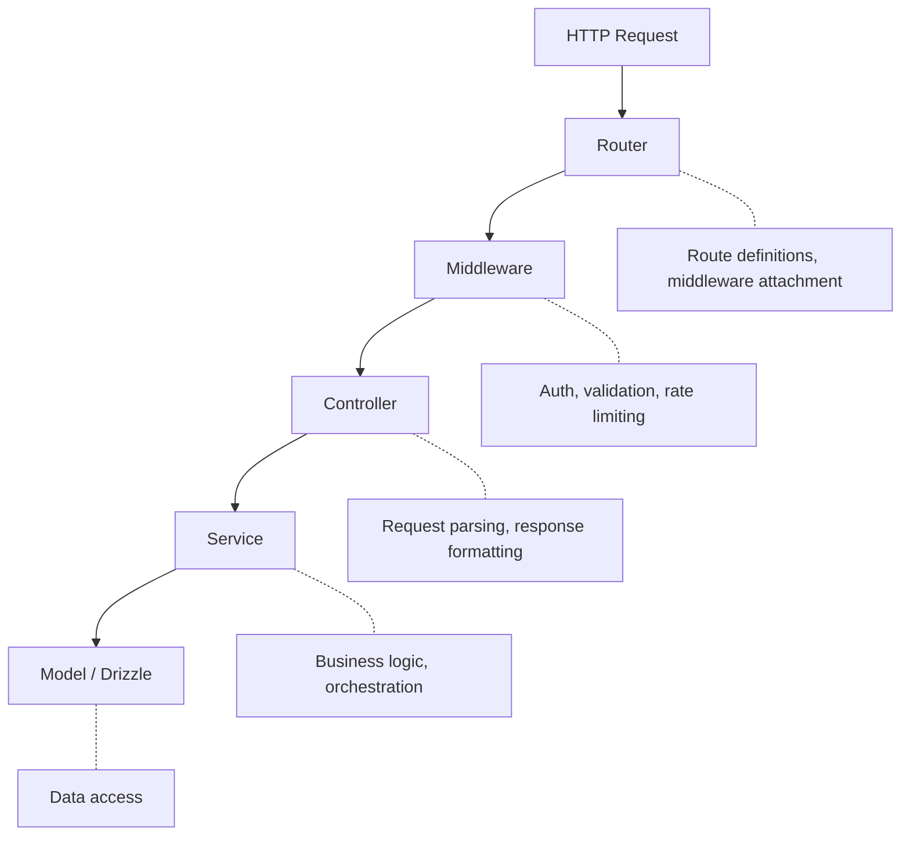
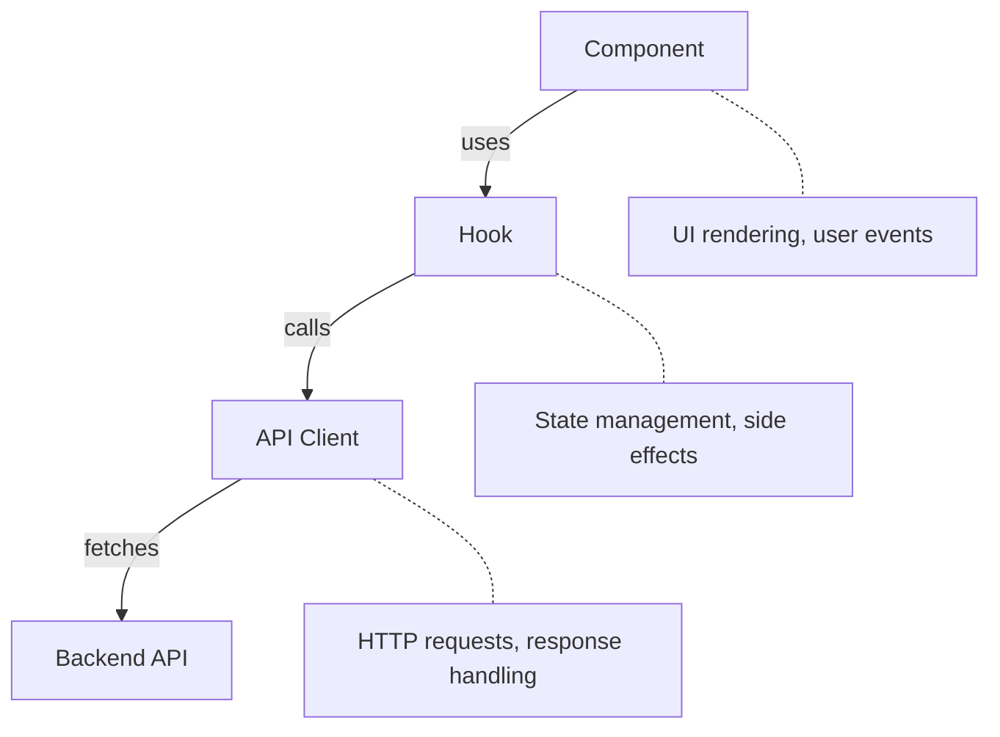

# Core Patterns

## Overview

This document defines the architectural patterns used throughout this project. Follow these patterns for consistency and maintainability.

---

## Backend Architecture

### Request Flow (4-Layer Pattern)



---

## Layer Responsibilities

### Router (`/src/routes/*.ts`)

- Define HTTP routes (GET, POST, PUT, DELETE)
- Attach middleware (auth, validation)
- Map routes to controller methods
- **No business logic**

```typescript
// src/routes/post.routes.ts
import { Router } from 'express';
import { PostController } from '../controllers/post.controller';
import { authenticate } from '../middleware/auth.middleware';
import { validate } from '../middleware/validate.middleware';
import { createPostSchema } from '../schemas/post.schema';

const router = Router();

router.use(authenticate);

router.get('/', PostController.list);
router.post('/', validate(createPostSchema), PostController.create);

export default router;
```

---

### Controller (`/src/controllers/*.ts`)

- Parse request data
- Call service methods (which return `Result<T>`)
- Format HTTP responses
- Handle HTTP concerns (status codes)
- **No direct database access**

```typescript
// src/controllers/post.controller.ts
import { Request, Response } from 'express';
import { z } from 'zod/v4';
import { PostService } from '../services/post.service';
import { createPostSchema } from '../schemas/post.schema';
import logger from '../lib/logger';

export class PostController {
  static async list(req: Request, res: Response): Promise<void> {
    const result = await PostService.listByUser(req.user!.id);

    if (!result.ok) {
      logger.error({ error: result.error.toString() }, 'Failed to list posts');
      return void res.status(500).json({ success: false, error: 'Internal error' });
    }

    res.json({ success: true, data: result.value });
  }

  static async create(req: Request, res: Response): Promise<void> {
    const parseResult = createPostSchema.safeParse(req.body);
    if (!parseResult.success) {
      return void res.status(400).json({
        success: false,
        error: z.prettifyError(parseResult.error),
      });
    }

    const result = await PostService.create(req.user!.id, parseResult.data);

    if (!result.ok) {
      logger.error({ error: result.error.toString() }, 'Failed to create post');
      return void res.status(500).json({ success: false, error: 'Internal error' });
    }

    res.status(201).json({ success: true, data: result.value });
  }
}
```

---

### Service (`/src/services/*.ts`)

- All business logic
- Return `Result<T>` using `tryCatch()`
- Orchestrate multiple operations
- Enforce business rules
- Handle transactions
- **No HTTP concerns (no req/res)**

```typescript
// src/services/post.service.ts
import { tryCatch, type Result } from 'stderr-lib';
import { db } from '../lib/db';
import { posts } from '../db/schema';
import { eq } from 'drizzle-orm';
import type { Post } from '../db/schema';

export class PostService {
  static async listByUser(userId: string): Promise<Result<Post[]>> {
    return tryCatch(async () => {
      return db.select().from(posts).where(eq(posts.authorId, userId));
    });
  }

  static async create(userId: string, data: { title: string; content?: string }): Promise<Result<Post>> {
    return tryCatch(async () => {
      const [post] = await db.insert(posts).values({
        title: data.title,
        content: data.content,
        authorId: userId,
      }).returning();

      return post;
    });
  }

  static async getById(userId: string, postId: string): Promise<Result<Post>> {
    return tryCatch(async () => {
      const [post] = await db.select().from(posts)
        .where(eq(posts.id, postId));

      if (!post || post.authorId !== userId) {
        throw new Error('Post not found');
      }

      return post;
    });
  }
}
```

---

### Model (`/src/db/schema.ts`)

- Drizzle schema definitions
- Type exports
- **No business logic**

```typescript
// src/db/schema/posts.ts
import { pgTable, uuid, varchar, text, timestamp } from 'drizzle-orm/pg-core';
import { users } from './users.js';

export const posts = pgTable('posts', {
  id: uuid('id').primaryKey().defaultRandom(),
  title: varchar('title', { length: 255 }).notNull(),
  content: text('content'),
  authorId: uuid('author_id')
    .notNull()
    .references(() => users.id, { onDelete: 'cascade' }),
  createdAt: timestamp('created_at').defaultNow().notNull(),
  updatedAt: timestamp('updated_at').defaultNow().notNull(),
});

export type Post = typeof posts.$inferSelect;
export type NewPost = typeof posts.$inferInsert;
```

---

### Transaction Patterns

Use `db.transaction()` when multiple tables must be written atomically — if one operation fails, all changes roll back.

**When to use:**
- Creating a parent record and related child records together
- Delete-then-insert operations (replacing permissions, roles)
- Any multi-table write where partial completion leaves invalid state

**Pattern:** Wrap `db.transaction()` inside the existing `tryCatch()`. Use `tx` instead of `db` within the callback. Keep external calls (email, cache invalidation) **outside** the transaction.

```typescript
static async register(email: string, password: string): Promise<Result<RegisterResult>> {
  return tryCatch(async () => {
    // Reads and CPU-bound work outside transaction
    const [existing] = await db.select().from(users).where(eq(users.email, email));
    if (existing) throw new Error('Email already exists');
    const passwordHash = await bcrypt.hash(password, SALT_ROUNDS);

    // Transaction: all writes that must succeed together
    const { user, verificationToken } = await db.transaction(async (tx) => {
      const [user] = await tx.insert(users).values({ email, passwordHash }).returning();
      if (!user) throw new Error('Failed to create user');

      const token = randomBytes(32).toString('hex');
      await tx.insert(emailVerificationTokens).values({ userId: user.id, token, expiresAt });

      return { user, verificationToken: token };
    });

    // External calls after transaction commits
    await EmailService.sendVerificationEmail(user.email, verificationToken);
    return { user, ...await this.createTokens(user.id) };
  });
}
```

**Rules:**
1. Keep transactions short — no `await` on external services inside them
2. Read-only queries and CPU-bound work (hashing) go outside the transaction
3. Cache invalidation and side effects happen after the transaction commits
4. If the transaction throws, `tryCatch` catches it and returns `Result.error`

---

## Non-Request Patterns

### Providers (`/src/providers/*.ts`)

External service integrations (APIs, storage, email).

```typescript
// src/providers/s3.provider.ts
import { S3Client, PutObjectCommand } from '@aws-sdk/client-s3';
import { tryCatch, type Result } from 'stderr-lib';
import { config } from '../config';

const s3 = new S3Client({ region: config.S3_REGION });

export async function uploadFile(
  key: string, 
  body: Buffer, 
  contentType: string
): Promise<Result<string>> {
  return tryCatch(async () => {
    await s3.send(new PutObjectCommand({
      Bucket: config.S3_BUCKET,
      Key: key,
      Body: body,
      ContentType: contentType,
    }));
    return `https://${config.S3_BUCKET}.s3.amazonaws.com/${key}`;
  });
}
```

---

### Jobs (`/src/jobs/*.ts`)

Background tasks, scheduled work, async processing.

```typescript
// src/jobs/cleanup.job.ts
import { db } from '../lib/db';
import { sessions } from '../db/schema';
import { lt } from 'drizzle-orm';
import { tryCatch } from 'stderr-lib';
import logger from '../lib/logger';

/**
 * Cleanup expired sessions.
 * Run via cron or task scheduler.
 */
export async function cleanupExpiredSessions(): Promise<void> {
  logger.info('Starting session cleanup job');

  const result = await tryCatch(async () => {
    const deleted = await db.delete(sessions)
      .where(lt(sessions.expiresAt, new Date()))
      .returning();

    return deleted.length;
  });

  if (!result.ok) {
    logger.error({ error: result.error.toString() }, 'Cleanup job failed');
    return;
  }

  logger.info({ deletedCount: result.value }, 'Cleanup job completed');
}
```

```typescript
// src/jobs/index.ts
import cron from 'node-cron';
import { cleanupExpiredSessions } from './cleanup.job';
import logger from '../lib/logger';

export function initializeJobs(): void {
  // Run cleanup daily at 3am
  cron.schedule('0 3 * * *', () => {
    void cleanupExpiredSessions();
  });

  logger.info('Background jobs initialized');
}
```

---

### Libs (`/src/lib/*.ts`)

Shared utilities, configured clients, helpers.

```typescript
// src/lib/logger.ts
import pino from 'pino';
import { config } from '../config';

const logger = pino({
  level: config.LOG_LEVEL,
  transport: config.NODE_ENV === 'development' 
    ? { target: 'pino-pretty' } 
    : undefined,
});

export default logger;
```

```typescript
// src/lib/db.ts
import { drizzle } from 'drizzle-orm/node-postgres';
import { Pool } from 'pg';
import { config } from '../config';
import * as schema from '../db/schema';

const pool = new Pool({ connectionString: config.DATABASE_URL });

export const db = drizzle(pool, { schema });
```

```typescript
// src/lib/jwt.ts
import jwt from 'jsonwebtoken';
import { config } from '../config';

interface TokenPayload {
  userId: string;
}

export function signAccessToken(payload: TokenPayload): string {
  return jwt.sign(payload, config.JWT_SECRET, { expiresIn: '15m' });
}

export function signRefreshToken(payload: TokenPayload): string {
  return jwt.sign(payload, config.JWT_SECRET, { expiresIn: config.JWT_EXPIRES_IN });
}

export function verifyToken(token: string): TokenPayload {
  return jwt.verify(token, config.JWT_SECRET) as TokenPayload;
}
```

---

## Backend File Organization

```
apps/api/src/
├── controllers/        # HTTP request handlers
│   ├── auth.controller.ts
│   ├── account.controller.ts
│   └── admin/
│
├── services/           # Business logic
│   ├── auth.service.ts
│   ├── account.service.ts
│   └── email.service.ts
│
├── routes/             # Route definitions
│   ├── index.ts
│   ├── auth.routes.ts
│   └── admin.routes.ts
│
├── middleware/         # Express middleware
│   ├── auth.middleware.ts
│   ├── validate.middleware.ts
│   └── error.middleware.ts
│
├── providers/          # External integrations
│   ├── s3.provider.ts
│   └── email.provider.ts
│
├── jobs/               # Background tasks
│   ├── index.ts
│   └── cleanup.job.ts
│
├── db/                 # Drizzle schema
│   ├── schema/
│   └── migrations/
│
├── schemas/            # Zod validation
│   └── auth.schema.ts
│
├── lib/                # Shared utilities
│   ├── db.ts
│   ├── logger.ts
│   └── jwt.ts
│
├── config/
│   └── index.ts
│
├── app.ts
└── server.ts
```

---

## Frontend Architecture

### Component Flow



---

### Component (`/src/components/*.tsx`)

- UI rendering
- Event handlers
- Uses hooks for data/state
- **No direct API calls**

```typescript
// src/components/PostList.tsx
import { usePosts } from '../hooks/usePosts';
import { CircularProgress, Alert, List, ListItem, ListItemText } from '@mui/material';

export function PostList() {
  const { data: posts, isLoading, error } = usePosts();

  if (isLoading) return <CircularProgress />;
  if (error) return <Alert severity="error">Error loading posts</Alert>;

  return (
    <List>
      {posts?.map((post) => (
        <ListItem key={post.id}>
          <ListItemText primary={post.title} secondary={post.content} />
        </ListItem>
      ))}
    </List>
  );
}
```

---

### Hook (`/src/hooks/*.ts`)

- Data fetching with TanStack Query
- Local state management
- Side effects
- **Reusable logic**

```typescript
// src/hooks/usePosts.ts
import { useQuery, useMutation, useQueryClient } from '@tanstack/react-query';
import { postsApi } from '../api/posts.api';
import type { Post, CreatePostInput } from '../types';

export function usePosts() {
  return useQuery({
    queryKey: ['posts'],
    queryFn: postsApi.list,
  });
}

export function useCreatePost() {
  const queryClient = useQueryClient();

  return useMutation({
    mutationFn: (data: CreatePostInput) => postsApi.create(data),
    onSuccess: () => {
      queryClient.invalidateQueries({ queryKey: ['posts'] });
    },
  });
}

export function usePost(id: string) {
  return useQuery({
    queryKey: ['posts', id],
    queryFn: () => postsApi.getById(id),
    enabled: !!id,
  });
}
```

---

### API Client (`/src/api/*.ts`)

- HTTP requests
- Request/response transformation
- Error handling
- **No UI concerns**

```typescript
// src/api/client.ts
import { useAuthStore } from '../stores/auth.store';

const API_URL = import.meta.env.VITE_API_URL || 'http://localhost:3000/api/v1';

export async function apiFetch<T>(
  path: string, 
  options: RequestInit = {}
): Promise<T> {
  const { accessToken } = useAuthStore.getState();

  const res = await fetch(`${API_URL}${path}`, {
    ...options,
    headers: {
      'Content-Type': 'application/json',
      ...(accessToken ? { Authorization: `Bearer ${accessToken}` } : {}),
      ...options.headers,
    },
  });

  if (!res.ok) {
    const error = await res.json().catch(() => ({ message: 'Request failed' }));
    throw new Error(error.message || `HTTP ${res.status}`);
  }

  const data = await res.json();
  return data.data as T;
}
```

```typescript
// src/api/posts.api.ts
import { apiFetch } from './client';
import type { Post, CreatePostInput } from '../types';

export const postsApi = {
  list: () => apiFetch<Post[]>('/posts'),

  getById: (id: string) => apiFetch<Post>(`/posts/${id}`),

  create: (data: CreatePostInput) =>
    apiFetch<Post>('/posts', {
      method: 'POST',
      body: JSON.stringify(data),
    }),

  update: (id: string, data: Partial<CreatePostInput>) =>
    apiFetch<Post>(`/posts/${id}`, {
      method: 'PUT',
      body: JSON.stringify(data),
    }),

  delete: (id: string) =>
    apiFetch<void>(`/posts/${id}`, { method: 'DELETE' }),
};
```

---

### Store (`/src/stores/*.ts`)

Global state with Zustand (auth, UI preferences).

```typescript
// src/stores/auth.store.ts
import { create } from 'zustand';
import { persist } from 'zustand/middleware';

interface AuthState {
  user: { id: string; email: string } | null;
  accessToken: string | null;
  refreshToken: string | null;
  setAuth: (user: AuthState['user'], accessToken: string, refreshToken: string) => void;
  clearAuth: () => void;
}

export const useAuthStore = create<AuthState>()(
  persist(
    (set) => ({
      user: null,
      accessToken: null,
      refreshToken: null,
      setAuth: (user, accessToken, refreshToken) => 
        set({ user, accessToken, refreshToken }),
      clearAuth: () => 
        set({ user: null, accessToken: null, refreshToken: null }),
    }),
    { name: 'auth-storage' }
  )
);
```

---

### Frontend File Organization

```
apps/web/src/
├── components/         # UI components
│   ├── ui/            # Reusable primitives
│   ├── layout/        # Layout components
│   │   ├── Header.tsx
│   │   └── Sidebar.tsx
│   └── features/      # Feature-specific
│
├── pages/              # Route pages
│   ├── HomePage.tsx
│   ├── LoginPage.tsx
│   └── ProfilePage.tsx
│
├── hooks/              # Custom hooks
│   └── useAuth.ts
│
├── api/                # API client
│   └── client.ts
│
├── stores/             # Zustand stores
│   ├── auth.store.ts
│   └── theme.store.ts
│
├── types/              # TypeScript types
│   └── index.ts
│
├── lib/                # Utilities
│   └── utils.ts
│
├── styles/             # Global styles
│   └── theme.ts
│
├── App.tsx
└── main.tsx
```

---

## Dark Mode Support

Use CSS variables with MUI theme for easy dark mode.

```typescript
// src/styles/theme.ts
import { createTheme } from '@mui/material/styles';

export const lightTheme = createTheme({
  palette: {
    mode: 'light',
    primary: { main: '#1976d2' },
    background: { default: '#f5f5f5', paper: '#ffffff' },
  },
});

export const darkTheme = createTheme({
  palette: {
    mode: 'dark',
    primary: { main: '#90caf9' },
    background: { default: '#121212', paper: '#1e1e1e' },
  },
});
```

```typescript
// src/stores/theme.store.ts
import { create } from 'zustand';
import { persist } from 'zustand/middleware';

type ThemeMode = 'light' | 'dark' | 'system';

interface ThemeState {
  mode: ThemeMode;
  setMode: (mode: ThemeMode) => void;
}

export const useThemeStore = create<ThemeState>()(
  persist(
    (set) => ({
      mode: 'system',
      setMode: (mode) => set({ mode }),
    }),
    { name: 'theme-storage' }
  )
);
```

```typescript
// src/App.tsx
import { ThemeProvider, CssBaseline } from '@mui/material';
import { useThemeStore } from './stores/theme.store';
import { lightTheme, darkTheme } from './styles/theme';

function App() {
  const { mode } = useThemeStore();
  
  const prefersDark = window.matchMedia('(prefers-color-scheme: dark)').matches;
  const isDark = mode === 'dark' || (mode === 'system' && prefersDark);

  return (
    <ThemeProvider theme={isDark ? darkTheme : lightTheme}>
      <CssBaseline />
      {/* Routes */}
    </ThemeProvider>
  );
}
```

---

## Naming Conventions

| Type             | Convention            | Example                |
|------------------|-----------------------|------------------------|
| Files (backend)  | kebab-case            | `post.controller.ts`   |
| Files (frontend) | PascalCase components | `PostList.tsx`         |
| Classes          | PascalCase            | `PostController`       |
| Functions        | camelCase             | `getPostById`          |
| Constants        | UPPER_SNAKE           | `MAX_RETRY_COUNT`      |
| Database tables  | snake_case            | `user_roles`           |
| API routes       | kebab-case            | `/api/v1/posts/:id`    |
| Types/Interfaces | PascalCase            | `CreatePostInput`      |

---

## API Response Format

```typescript
// Success
{
  "success": true,
  "data": { ... },
  "meta": { "page": 1, "total": 100 }
}

// Error
{
  "success": false,
  "error": "Error description"
}
```

