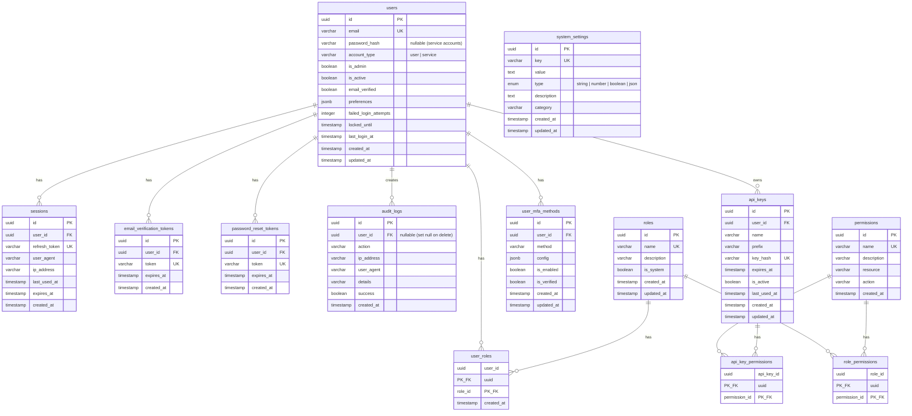

# Data Model

> Database schema documentation for the fullstack template.

## Overview

This template includes a core set of database tables for authentication, user management, and system configuration. All schemas use Drizzle ORM with PostgreSQL.

---

## Entity Relationship Diagram



---

## Core Tables

### Users

Primary user account table with authentication, preferences, and lockout support. Supports both human users and service accounts (nullable `passwordHash`).

```typescript
// src/db/schema/users.ts
export const users = pgTable('users', {
  id: uuid('id').primaryKey().defaultRandom(),
  email: varchar('email', { length: 255 }).notNull().unique(),
  passwordHash: varchar('password_hash', { length: 255 }),

  // Account type & Status
  accountType: varchar('account_type', { length: 20 }).default('user').notNull(),
  isAdmin: boolean('is_admin').default(false).notNull(),
  isActive: boolean('is_active').default(true).notNull(),
  emailVerified: boolean('email_verified').default(false).notNull(),

  // Preferences (JSONB for extensibility)
  preferences: jsonb('preferences').$type<UserPreferences>().default(defaultPreferences).notNull(),

  // Lockout
  failedLoginAttempts: integer('failed_login_attempts').default(0).notNull(),
  lockedUntil: timestamp('locked_until'),

  // Timestamps
  lastLoginAt: timestamp('last_login_at'),
  createdAt: timestamp('created_at').defaultNow().notNull(),
  updatedAt: timestamp('updated_at').defaultNow().notNull(),
}, (table) => [
  index('users_is_active_idx').on(table.isActive),
]);
```

### Sessions

JWT refresh token storage for authenticated sessions. Tracks user agent, IP, and last usage for session management UI.

```typescript
// src/db/schema/sessions.ts
export const sessions = pgTable('sessions', {
  id: uuid('id').primaryKey().defaultRandom(),
  userId: uuid('user_id')
    .notNull()
    .references(() => users.id, { onDelete: 'cascade' }),
  refreshToken: varchar('refresh_token', { length: 500 }).notNull().unique(),
  userAgent: varchar('user_agent', { length: 500 }),
  ipAddress: varchar('ip_address', { length: 45 }),
  lastUsedAt: timestamp('last_used_at'),
  expiresAt: timestamp('expires_at').notNull(),
  createdAt: timestamp('created_at').defaultNow().notNull(),
}, (table) => [
  index('sessions_user_id_idx').on(table.userId),
]);
```

### Email Verification Tokens

Tokens for verifying user email addresses.

```typescript
// src/db/schema/tokens.ts
export const emailVerificationTokens = pgTable('email_verification_tokens', {
  id: uuid('id').primaryKey().defaultRandom(),
  userId: uuid('user_id')
    .notNull()
    .references(() => users.id, { onDelete: 'cascade' }),
  token: varchar('token', { length: 255 }).notNull().unique(),
  expiresAt: timestamp('expires_at').notNull(),
  createdAt: timestamp('created_at').defaultNow().notNull(),
}, (table) => [
  index('email_verification_tokens_user_id_idx').on(table.userId),
]);
```

### Password Reset Tokens

Tokens for secure password reset flow.

```typescript
// src/db/schema/tokens.ts
export const passwordResetTokens = pgTable('password_reset_tokens', {
  id: uuid('id').primaryKey().defaultRandom(),
  userId: uuid('user_id')
    .notNull()
    .references(() => users.id, { onDelete: 'cascade' }),
  token: varchar('token', { length: 255 }).notNull().unique(),
  expiresAt: timestamp('expires_at').notNull(),
  createdAt: timestamp('created_at').defaultNow().notNull(),
}, (table) => [
  index('password_reset_tokens_user_id_idx').on(table.userId),
]);
```

### Audit Logs

Security event logging for compliance and debugging.

```typescript
// src/db/schema/audit.ts
export const auditLogs = pgTable('audit_logs', {
  id: uuid('id').primaryKey().defaultRandom(),
  userId: uuid('user_id').references(() => users.id, { onDelete: 'set null' }),
  action: varchar('action', { length: 50 }).notNull(),
  ipAddress: varchar('ip_address', { length: 45 }),
  userAgent: varchar('user_agent', { length: 500 }),
  details: varchar('details', { length: 1000 }),
  success: boolean('success').default(true).notNull(),
  createdAt: timestamp('created_at').defaultNow().notNull(),
}, (table) => [
  index('audit_logs_user_id_idx').on(table.userId),
  index('audit_logs_created_at_idx').on(table.createdAt),
]);
```

**Audit Actions:**
- Auth: `LOGIN_SUCCESS`, `LOGIN_FAILED`, `LOGOUT`, `REGISTER`
- Password: `PASSWORD_CHANGE`, `PASSWORD_RESET_REQUEST`, `PASSWORD_RESET_SUCCESS`
- Email: `EMAIL_VERIFICATION_SENT`, `EMAIL_VERIFIED`
- Admin: `USER_CREATED`, `USER_UPDATED`, `USER_DEACTIVATED`, `USER_ACTIVATED`, `USER_DELETED`, `ADMIN_GRANTED`, `ADMIN_REVOKED`

### System Settings

Runtime-configurable application settings.

```typescript
// src/db/schema/settings.ts
export const systemSettings = pgTable('system_settings', {
  id: uuid('id').primaryKey().defaultRandom(),
  key: varchar('key', { length: 255 }).notNull().unique(),
  value: text('value').notNull(),
  type: settingTypeEnum('type').notNull().default('string'),
  description: text('description'),
  category: varchar('category', { length: 100 }).default('general'),
  createdAt: timestamp('created_at').defaultNow().notNull(),
  updatedAt: timestamp('updated_at').defaultNow().notNull(),
});
```

**Setting Types:** `string`, `number`, `boolean`, `json`

---

### Permissions

Static permission definitions seeded at startup.

```typescript
// src/db/schema/permissions.ts
export const permissions = pgTable('permissions', {
  id: uuid('id').primaryKey().defaultRandom(),
  name: varchar('name', { length: 100 }).notNull().unique(),
  description: varchar('description', { length: 255 }).notNull(),
  resource: varchar('resource', { length: 50 }).notNull(),
  action: varchar('action', { length: 50 }).notNull(),
  createdAt: timestamp('created_at').defaultNow().notNull(),
});
```

### Roles

Named collections of permissions. System roles (e.g., Super Admin) cannot be modified or deleted.

```typescript
// src/db/schema/roles.ts
export const roles = pgTable('roles', {
  id: uuid('id').primaryKey().defaultRandom(),
  name: varchar('name', { length: 100 }).notNull().unique(),
  description: varchar('description', { length: 255 }),
  isSystem: boolean('is_system').default(false).notNull(),
  createdAt: timestamp('created_at').defaultNow().notNull(),
  updatedAt: timestamp('updated_at').defaultNow().notNull(),
});
```

### Role Permissions (Junction)

Maps roles to their granted permissions.

```typescript
// src/db/schema/roles.ts
export const rolePermissions = pgTable('role_permissions', {
  roleId: uuid('role_id').notNull().references(() => roles.id, { onDelete: 'cascade' }),
  permissionId: uuid('permission_id').notNull().references(() => permissions.id, { onDelete: 'cascade' }),
}, (table) => [
  primaryKey({ columns: [table.roleId, table.permissionId] }),
]);
```

### User Roles (Junction)

Assigns roles to users.

```typescript
// src/db/schema/user-roles.ts
export const userRoles = pgTable('user_roles', {
  userId: uuid('user_id').notNull().references(() => users.id, { onDelete: 'cascade' }),
  roleId: uuid('role_id').notNull().references(() => roles.id, { onDelete: 'cascade' }),
  createdAt: timestamp('created_at').defaultNow().notNull(),
}, (table) => [
  primaryKey({ columns: [table.userId, table.roleId] }),
  index('user_roles_user_id_idx').on(table.userId),
]);
```

### API Keys

Scoped API keys for programmatic access. Each key has a prefix for identification and a hashed secret.

```typescript
// src/db/schema/api-keys.ts
export const apiKeys = pgTable('api_keys', {
  id: uuid('id').primaryKey().defaultRandom(),
  userId: uuid('user_id').notNull().references(() => users.id, { onDelete: 'cascade' }),
  name: varchar('name', { length: 100 }).notNull(),
  prefix: varchar('prefix', { length: 8 }).notNull(),
  keyHash: varchar('key_hash', { length: 255 }).notNull().unique(),
  expiresAt: timestamp('expires_at'),
  isActive: boolean('is_active').default(true).notNull(),
  lastUsedAt: timestamp('last_used_at'),
  createdAt: timestamp('created_at').defaultNow().notNull(),
  updatedAt: timestamp('updated_at').defaultNow().notNull(),
}, (table) => [
  index('api_keys_user_id_idx').on(table.userId),
  index('api_keys_key_hash_idx').on(table.keyHash),
]);
```

### API Key Permissions (Junction)

Scopes API keys to specific permissions.

```typescript
// src/db/schema/api-keys.ts
export const apiKeyPermissions = pgTable('api_key_permissions', {
  apiKeyId: uuid('api_key_id').notNull().references(() => apiKeys.id, { onDelete: 'cascade' }),
  permissionId: uuid('permission_id').notNull().references(() => permissions.id, { onDelete: 'cascade' }),
}, (table) => [
  primaryKey({ columns: [table.apiKeyId, table.permissionId] }),
]);
```

### User MFA Methods

Stores MFA configuration per user. Supports extensible methods (currently TOTP with backup codes).

```typescript
// src/db/schema/user-mfa-methods.ts
export const userMfaMethods = pgTable('user_mfa_methods', {
  id: uuid('id').primaryKey().defaultRandom(),
  userId: uuid('user_id').notNull().references(() => users.id, { onDelete: 'cascade' }),
  method: varchar('method', { length: 50 }).notNull(),
  config: jsonb('config').$type<MfaMethodConfig>().notNull(),
  isEnabled: boolean('is_enabled').default(false).notNull(),
  isVerified: boolean('is_verified').default(false).notNull(),
  createdAt: timestamp('created_at').defaultNow().notNull(),
  updatedAt: timestamp('updated_at').defaultNow().notNull(),
}, (table) => [
  index('user_mfa_methods_user_id_idx').on(table.userId),
  unique('user_mfa_methods_user_method_unique').on(table.userId, table.method),
]);
```

---

## Indexes

### Implicit Indexes (from constraints)

Every `PRIMARY KEY` and `UNIQUE` constraint creates an implicit B-tree index. These do not need explicit `CREATE INDEX` statements.

| Table | Column(s) | Type |
|-------|-----------|------|
| All tables | `id` | PK |
| `users` | `email` | UNIQUE |
| `sessions` | `refresh_token` | UNIQUE |
| `email_verification_tokens` | `token` | UNIQUE |
| `password_reset_tokens` | `token` | UNIQUE |
| `system_settings` | `key` | UNIQUE |
| `permissions` | `name` | UNIQUE |
| `roles` | `name` | UNIQUE |
| `api_keys` | `key_hash` | UNIQUE |
| `role_permissions` | `(role_id, permission_id)` | Composite PK |
| `user_roles` | `(user_id, role_id)` | Composite PK |
| `api_key_permissions` | `(api_key_id, permission_id)` | Composite PK |
| `user_mfa_methods` | `(user_id, method)` | UNIQUE |

### Explicit Indexes

These indexes are defined in the schema for query performance.

| Table | Index Name | Column(s) | Purpose |
|-------|-----------|-----------|---------|
| `users` | `users_is_active_idx` | `is_active` | Filter active/inactive users in admin queries |
| `sessions` | `sessions_user_id_idx` | `user_id` | Look up sessions by user |
| `email_verification_tokens` | `email_verification_tokens_user_id_idx` | `user_id` | Look up tokens by user |
| `password_reset_tokens` | `password_reset_tokens_user_id_idx` | `user_id` | Look up tokens by user |
| `audit_logs` | `audit_logs_user_id_idx` | `user_id` | Filter audit logs by user |
| `audit_logs` | `audit_logs_created_at_idx` | `created_at` | Sort/filter audit logs by date |
| `user_roles` | `user_roles_user_id_idx` | `user_id` | Look up roles for a user |
| `api_keys` | `api_keys_user_id_idx` | `user_id` | Look up API keys by user |
| `api_keys` | `api_keys_key_hash_idx` | `key_hash` | Fast key validation on every API request |
| `user_mfa_methods` | `user_mfa_methods_user_id_idx` | `user_id` | Look up MFA methods by user |

---

## Cascade Behavior

Foreign key `ON DELETE` actions determine what happens when a referenced row is deleted.

| Parent Table | Child Table | On Delete | Effect |
|-------------|-------------|-----------|--------|
| `users` | `sessions` | CASCADE | All sessions deleted when user is deleted |
| `users` | `email_verification_tokens` | CASCADE | All tokens deleted when user is deleted |
| `users` | `password_reset_tokens` | CASCADE | All tokens deleted when user is deleted |
| `users` | `audit_logs` | SET NULL | Audit logs preserved with `user_id = NULL` |
| `users` | `user_roles` | CASCADE | Role assignments removed when user is deleted |
| `users` | `api_keys` | CASCADE | All API keys deleted when user is deleted |
| `users` | `user_mfa_methods` | CASCADE | MFA config deleted when user is deleted |
| `roles` | `user_roles` | CASCADE | User-role links removed when role is deleted |
| `roles` | `role_permissions` | CASCADE | Permission grants removed when role is deleted |
| `permissions` | `role_permissions` | CASCADE | Role-permission links removed when permission is deleted |
| `permissions` | `api_key_permissions` | CASCADE | Key-permission links removed when permission is deleted |
| `api_keys` | `api_key_permissions` | CASCADE | Permission scopes removed when key is deleted |

**Key design decision:** Audit logs use `SET NULL` instead of `CASCADE` so that security history is preserved even after a user account is deleted.

---

## Schema Index

All schemas are exported from a central index:

```typescript
// src/db/schema/index.ts
export * from './users.js';
export * from './sessions.js';
export * from './settings.js';
export * from './tokens.js';
export * from './audit.js';
export * from './permissions.js';
export * from './roles.js';
export * from './user-roles.js';
export * from './api-keys.js';
export * from './user-mfa-methods.js';
```

---

## Common Query Patterns

### Basic CRUD

```typescript
import { db } from '../lib/db';
import { users } from '../db/schema';
import { eq } from 'drizzle-orm';

// Select
const [user] = await db.select().from(users).where(eq(users.id, userId));

// Insert
const [newUser] = await db.insert(users)
  .values({ email, passwordHash })
  .returning();

// Update
const [updated] = await db.update(users)
  .set({ isActive: false })
  .where(eq(users.id, userId))
  .returning();

// Delete
await db.delete(users).where(eq(users.id, userId));
```

### Transactions

```typescript
const result = await db.transaction(async (tx) => {
  const [user] = await tx.insert(users)
    .values({ email, passwordHash })
    .returning();

  await tx.insert(auditLogs).values({
    userId: user.id,
    action: 'REGISTER',
  });

  return user;
});
```

---

## Adding New Tables

1. Create a new schema file in `src/db/schema/`
2. Export from `src/db/schema/index.ts`
3. Run `pnpm db:generate` to create migration
4. Run `pnpm db:migrate` to apply migration

See [GETTING_STARTED.md](../GETTING_STARTED.md) for detailed instructions.
