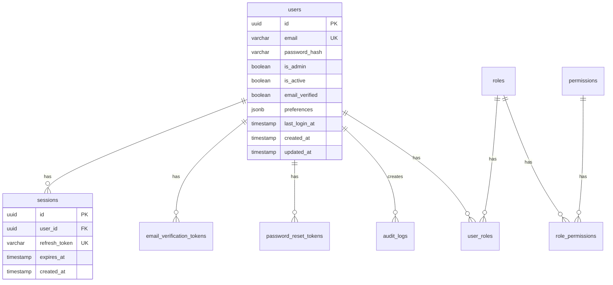

# Documentation

**Status:** Draft
**Priority:** High (Phases 1-2), Low (Phases 3-5)
**Created:** 2026-02-08
**Files:** See per-phase file lists

---

## Context

The project has strong architecture and coding standard docs but lacks operational documentation. API endpoints are scattered across 6 feature specification files with no centralized reference. There is no OpenAPI/Swagger spec (planned in `api-high-priority.md` Phase 4). No deployment guide, production checklist, or database schema diagram exists. The `DATA_MODEL.md` has a basic ASCII ERD but no visual diagram and no index/performance documentation.

**Current documentation state:**
- Architecture & patterns: 95% coverage (9 files in `docs/architecture/`)
- Feature specifications: complete (6 features in `docs/features/`)
- API endpoint reference: 0% (endpoints scattered across feature docs)
- Deployment & production: 0% (nothing exists)
- Database schema diagram: partial (ASCII art only in `DATA_MODEL.md`)

---

## Phases

### Phase 1: API Endpoint Reference (High Priority)

**Layer:** Documentation
**Files:**
- `docs/API_REFERENCE.md` (new)
- `docs/README.md`

**Create a centralized API endpoint catalog covering all routes.**

Source of truth: actual route files in `apps/api/src/routes/` (not feature docs).

**Structure per endpoint:**
```markdown
### POST /api/v1/auth/login

**Auth:** None (public)
**Rate Limit:** 5 requests / 15 minutes

**Request Body:**
| Field    | Type   | Required | Validation        |
|----------|--------|----------|-------------------|
| email    | string | yes      | Valid email        |
| password | string | yes      | Min 1 character    |

**Success Response (200):**
​```json
{
  "success": true,
  "data": {
    "user": { "id": "uuid", "email": "string", ... },
    "accessToken": "string",
    "refreshToken": "string"
  }
}
​```

**Error Responses:**
| Status | Condition             |
|--------|-----------------------|
| 400    | Invalid request body  |
| 401    | Invalid credentials   |
| 403    | Email not verified    |
| 429    | Rate limit exceeded   |
```

**Endpoints to document (from route files):**

Auth (`/api/v1/auth`):
- `POST /register` — public, rate limited
- `POST /login` — public, rate limited
- `POST /refresh` — public
- `POST /logout` — public
- `GET /me` — protected

Account (`/api/v1/account`):
- `POST /forgot-password` — public, rate limited
- `POST /reset-password` — public
- `POST /verify-email` — public
- `POST /resend-verification` — protected

Users (`/api/v1/users`):
- `GET /me` — protected
- `PATCH /me/password` — protected
- `GET /me/preferences` — protected
- `PATCH /me/preferences` — protected

Admin (`/api/v1/admin`):
- `GET /settings` — protected, requires `settings:read`
- `GET /settings/:key` — protected, requires `settings:read`
- `PATCH /settings/:key` — protected, requires `settings:update`
- `GET /users` — protected, requires `users:read` (paginated)
- `GET /users/:id` — protected, requires `users:read`
- `PATCH /users/:id` — protected, requires `users:update`
- `DELETE /users/:id` — protected, requires `users:delete`
- `GET /audit-logs` — protected, requires `audit:read` (paginated)

Roles (`/api/v1/roles`):
- `GET /permissions` — protected
- `GET /permissions/grouped` — protected
- `GET /` — protected
- `GET /:id` — protected
- `POST /` — protected, requires `roles:create`
- `PUT /:id` — protected, requires `roles:update`
- `DELETE /:id` — protected, requires `roles:delete`
- `PUT /:id/permissions` — protected, requires `roles:update`
- `GET /users/:userId` — protected
- `PUT /users/:userId` — protected, requires `roles:update`

Health:
- `GET /health` — public, no auth

**Also include sections for:**
- Authentication header format (`Authorization: Bearer <token>`)
- Standard response shapes (success and error)
- Pagination response shape
- Common HTTP status codes used

**Update `docs/README.md`:** add link to API Reference under Quick Links.

---

### Phase 2: OpenAPI/Swagger Spec (High Priority)

**Layer:** Backend + Documentation
**Files:** See `docs/tasks/api-high-priority.md` Phase 4

This phase is already fully defined in `api-high-priority.md` Phase 4. It depends on that task's Phases 2-3 (pagination/filtering helpers) being complete so the spec documents the finalized query parameter patterns.

**Summary:** Install `swagger-jsdoc` + `swagger-ui-express`, create OpenAPI 3.0 spec with JSDoc annotations on all routes, mount Swagger UI at `/api/docs`, raw spec at `/api/docs/json`. Gate behind `NODE_ENV !== 'production'`.

**Note:** Do not duplicate this task. Reference `api-high-priority.md` Phase 4 and execute it there.

---

### Phase 3: Database Schema Diagram (Low Priority)

**Layer:** Documentation
**Files:**
- `docs/architecture/DATA_MODEL.md`

**Add a Mermaid ERD diagram to `DATA_MODEL.md`.**

Mermaid renders natively in GitHub markdown — no external tools needed.



**Include all 10 tables** with columns, types, PK/FK/UK markers, and relationship cardinality.

**Also add to `DATA_MODEL.md`:**
- Section on indexes (existing implicit indexes from PK/UNIQUE, planned explicit indexes from `database-improvements.md`)
- Section on cascade behavior (what happens when a user is deleted)

---

### Phase 4: Deployment Guide (Low Priority)

**Layer:** Documentation
**Files:**
- `docs/DEPLOYMENT.md` (new)
- `docs/README.md`

**Sections:**

1. **Prerequisites**
   - Node.js 20+, pnpm 9+
   - PostgreSQL 17+ (managed service or self-hosted)
   - S3-compatible storage (AWS S3, MinIO, etc.)
   - SMTP server or SES for email

2. **Build**
   ```bash
   pnpm install --frozen-lockfile
   pnpm build
   ```
   - Backend output: `apps/api/dist/`
   - Frontend output: `apps/web/dist/` (static files, serve from CDN/nginx)

3. **Environment Variables (Production)**
   - Reference `docs/architecture/CONFIG.md` for full list
   - Highlight differences from development:
     - `NODE_ENV=production`
     - `JWT_SECRET` — must be a strong random secret (not `dev-secret`)
     - `DATABASE_URL` — production connection string with SSL
     - `FRONTEND_URL` — production domain (for CORS and email links)
     - `S3_ENDPOINT` — real S3 or provider URL

4. **Database Setup**
   ```bash
   pnpm db:migrate   # Apply all migrations
   pnpm db:seed      # Optional: seed default roles/permissions/settings
   ```

5. **Running the API**
   ```bash
   node apps/api/dist/index.js
   ```
   - Runs on `PORT` (default 3000)
   - Health check: `GET /health`

6. **Serving the Frontend**
   - `apps/web/dist/` contains static files
   - Serve with nginx, Caddy, S3+CloudFront, or any static host
   - Configure SPA fallback: all routes serve `index.html`
   - Set API proxy or `VITE_API_URL` environment variable at build time

7. **Reverse Proxy (nginx example)**
   - Proxy `/api` to backend
   - Serve `/` from frontend static files
   - SSL termination

**Update `docs/README.md`:** add link under Quick Links.

---

### Phase 5: Production Checklist (Low Priority)

**Layer:** Documentation
**Files:**
- `docs/PRODUCTION_CHECKLIST.md` (new)
- `docs/README.md`

**Checklist sections:**

1. **Security**
   - [ ] `JWT_SECRET` is a strong random value (min 32 chars)
   - [ ] `NODE_ENV=production` (disables Swagger UI, verbose errors, pretty logging)
   - [ ] CORS `FRONTEND_URL` is set to production domain (not `*`)
   - [ ] Database password is not the default `app_dev`
   - [ ] S3 credentials are scoped to the app bucket only
   - [ ] HTTPS enforced (SSL termination at load balancer or reverse proxy)
   - [ ] Rate limiting is active on auth endpoints
   - [ ] Helmet security headers are enabled (default in Express setup)

2. **Database**
   - [ ] All migrations applied (`pnpm db:migrate`)
   - [ ] Default roles and permissions seeded (`pnpm db:seed`)
   - [ ] Connection pool size tuned for expected load (default: 10)
   - [ ] Automated backups configured
   - [ ] SSL enabled for database connections

3. **Monitoring**
   - [ ] Health check endpoint (`/health`) monitored
   - [ ] Pino logs shipped to a log aggregation service (CloudWatch, Datadog, etc.)
   - [ ] Error tracking configured (Sentry or similar)
   - [ ] Database connection pool metrics monitored

4. **Performance**
   - [ ] Frontend served from CDN with caching
   - [ ] Gzip/Brotli compression enabled (at reverse proxy or via middleware)
   - [ ] Database indexes applied (see `database-improvements.md`)
   - [ ] Static assets have cache-busting hashes (Vite does this by default)

5. **Operations**
   - [ ] Admin user created with Super Admin role
   - [ ] System settings reviewed and configured (registration enabled, email verification, etc.)
   - [ ] Email sending configured and tested (SMTP or SES, not mock)
   - [ ] S3 bucket created and accessible
   - [ ] Graceful shutdown handles in-flight requests

**Update `docs/README.md`:** add link under Quick Links.

---

## Phase Dependency Order

```
Phase 1 (API Reference) — no dependencies, start first (highest value)
Phase 2 (OpenAPI/Swagger) — depends on api-high-priority.md Phases 2-3
Phase 3 (Schema Diagram) — no dependencies, can run anytime
Phase 4 (Deployment Guide) — no dependencies, can run anytime
Phase 5 (Production Checklist) — best done after Phase 4 (references deployment)
```

---

## Verification

### After Phase 1
```bash
# No code changes — documentation only
# Review: open docs/API_REFERENCE.md, verify every route from apps/api/src/routes/ is listed
# Cross-check: grep for router.get/post/patch/put/delete in route files, confirm all are documented
```

### After Phase 2
```bash
pnpm build && pnpm lint && pnpm test
# Manual: open http://localhost:3000/api/docs — verify Swagger UI loads
```

### After Phase 3
```bash
# No code changes — documentation only
# Review: open DATA_MODEL.md on GitHub, verify Mermaid diagram renders correctly
# Verify all 10 tables are in the diagram with correct relationships
```

### After Phases 4-5
```bash
# No code changes — documentation only
# Review: walk through deployment guide on a fresh machine or VM
# Review: production checklist against actual production environment
```
