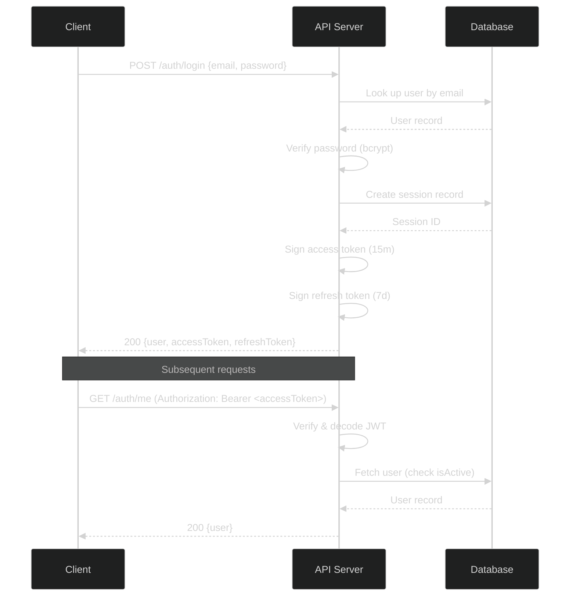
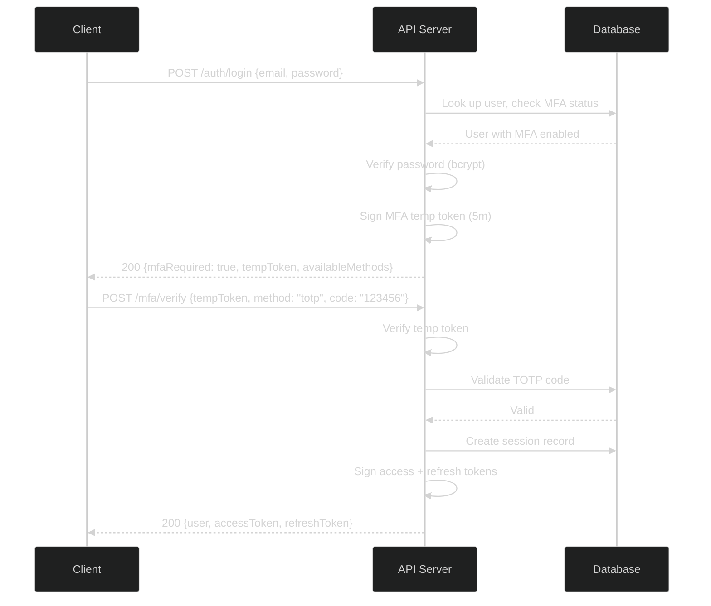
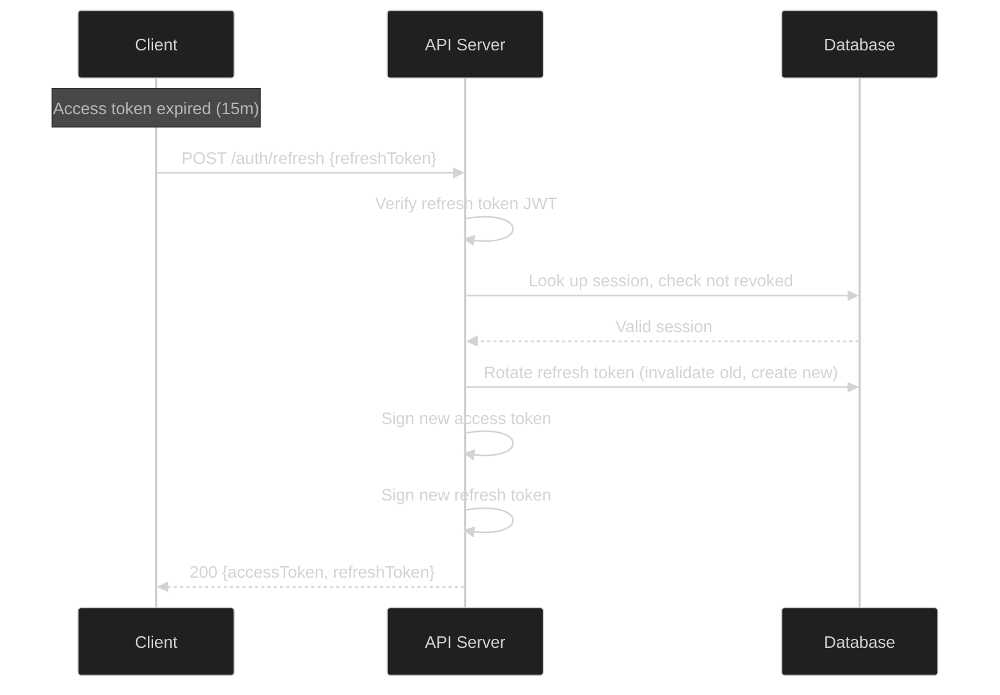
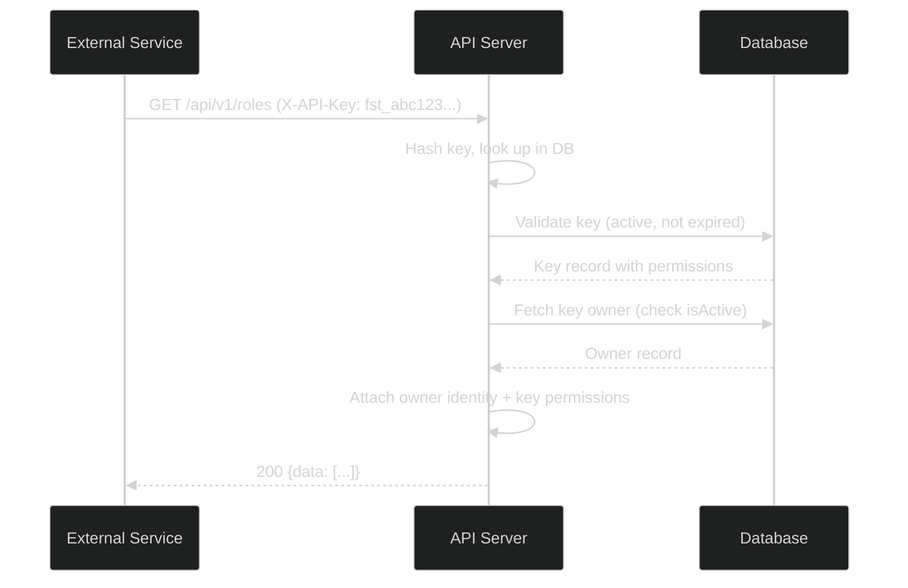
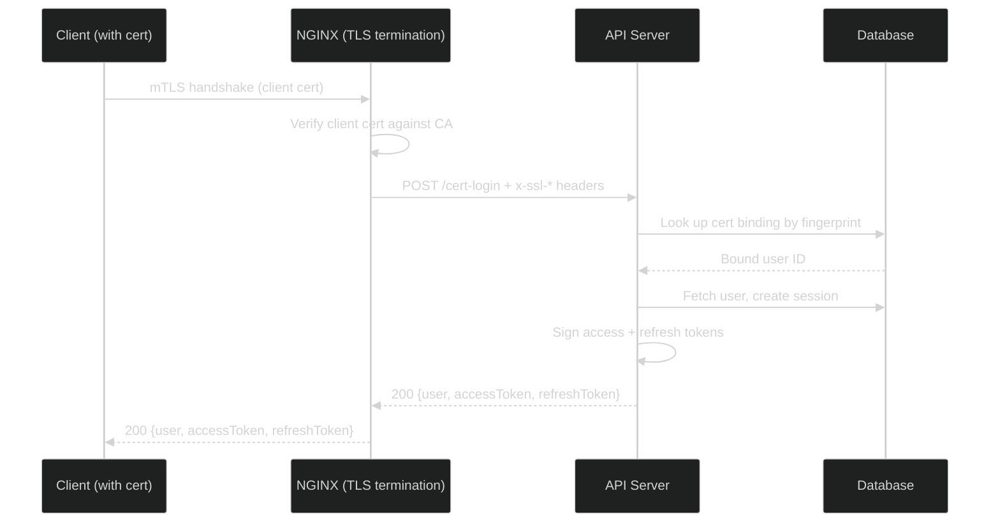
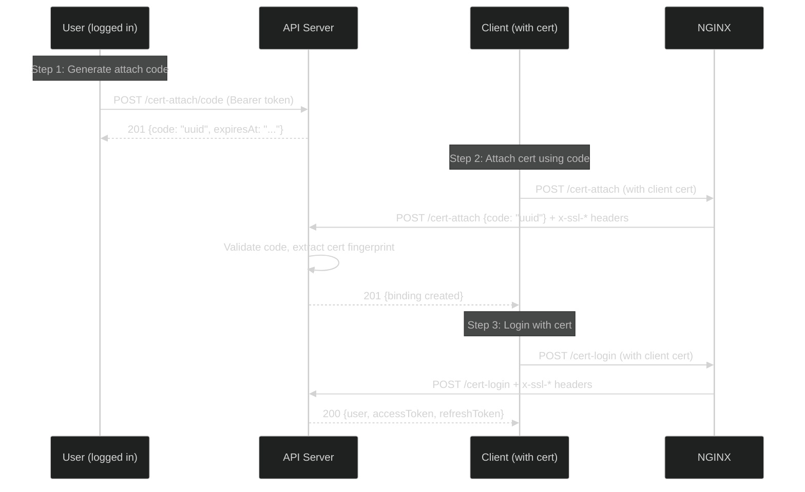

# Authentication Guide

> **[Template]** This covers the base template feature. Extend or modify for your project.

This document describes all authentication methods supported by the API, their flows, and token lifecycle management.

## Base URL

All endpoints are prefixed with `/api/v1`.

## Authentication Methods

The API supports three authentication methods:

| Method | Header | Use Case |
|--------|--------|----------|
| JWT Bearer Token | `Authorization: Bearer <token>` | User sessions (browser, mobile) |
| API Key | `X-API-Key: <key>` | Server-to-server, automation |
| Client Certificate (mTLS) | `x-ssl-*` headers via NGINX | Infrastructure, zero-trust environments |

When a request includes both an `X-API-Key` header and a `Bearer` token, the API key takes precedence.

---

## 1. JWT Authentication

### Overview

JWT authentication uses a two-token system:

- **Access Token**: Short-lived (15 minutes default), used for API requests.
- **Refresh Token**: Longer-lived (7 days default), used to obtain new access tokens.

Access tokens are stateless JWTs. Refresh tokens are tracked in the database and tied to a session record, enabling server-side revocation.

### Registration Flow

```
POST /api/v1/auth/register
Content-Type: application/json

{
  "email": "user@example.com",
  "password": "SecurePass123"
}
```

On success (201), the response includes the user object, access token, and refresh token. The user can begin making authenticated requests immediately. A verification email is sent asynchronously.

### Login Flow (No MFA)



### Login Flow (With MFA)

When a user has MFA enabled, the login endpoint returns a temporary token instead of full credentials. The client must complete a second verification step.



The temporary MFA token expires after 5 minutes. If it expires, the user must log in again.

### Token Refresh Flow



Important details:
- Refresh tokens are single-use. Each refresh operation issues a new refresh token and invalidates the old one.
- If a previously-used refresh token is presented, the entire session is revoked (replay detection).

### Logout Flow

```
POST /api/v1/auth/logout
Content-Type: application/json

{
  "refreshToken": "<refreshToken>"
}
```

This invalidates the refresh token and its associated session. The access token remains technically valid until it expires (up to 15 minutes), but the session is marked as revoked in the database.

### Token Lifecycle Summary

| Token | Default Lifetime | Storage | Revocable |
|-------|-----------------|---------|-----------|
| Access Token | 15 minutes | Client only (JWT) | No (expires naturally) |
| Refresh Token | 7 days | Client + DB session | Yes (logout, session revoke) |
| MFA Temp Token | 5 minutes | Client only (JWT) | No (expires naturally) |

---

## 2. API Key Authentication

API keys provide stateless authentication for server-to-server communication and automation workflows. They bypass MFA requirements.

### How It Works



### Key Characteristics

- API keys are prefixed (e.g., `fst_...`) for easy identification.
- The plaintext key is only returned once at creation time. Only a hash is stored.
- Each key has its own set of permissions, independent of the owner's role-based permissions.
- Keys can have an optional expiration date.
- Keys can be revoked without affecting the owner's account.

### Usage

```bash
curl -H "X-API-Key: fst_abc123def456..." \
     https://api.example.com/api/v1/roles
```

### Service Accounts

For fully automated systems, create a service account (a headless user) and assign API keys to it:

1. `POST /api/v1/api-keys/service-accounts` -- Create a service account user.
2. `POST /api/v1/api-keys` with `userId` set to the service account ID -- Create a key for it.
3. Use the key in the `X-API-Key` header for all requests.

---

## 3. Certificate-Based Authentication (mTLS)

Certificate-based login uses mutual TLS (mTLS) to authenticate users via client certificates. This is typically deployed behind an NGINX reverse proxy that handles TLS termination and forwards certificate details as HTTP headers.

### Architecture



### Certificate Binding Flow

Before a certificate can be used for login, it must be bound to a user account:



### SSL Headers

NGINX forwards these headers to the API:

| Header | Description |
|--------|-------------|
| `x-ssl-client-verify` | Verification result (`SUCCESS`, `NONE`, `FAILED:...`) |
| `x-ssl-client-s-dn` | Subject distinguished name |
| `x-ssl-client-fingerprint` | SHA-256 certificate fingerprint |
| `x-ssl-client-serial` | Certificate serial number |
| `x-ssl-client-cert` | URL-encoded PEM certificate |

### Endpoints

| Endpoint | Auth Required | Description |
|----------|---------------|-------------|
| `POST /cert-login` | No (uses client cert) | Log in with a bound certificate |
| `POST /cert-attach` | No (uses client cert + code) | Bind a certificate to an account |
| `POST /cert-attach/code` | Yes (JWT) | Generate a one-time attach code |
| `GET /cert-status` | Yes (JWT) | List certificate bindings |
| `DELETE /cert-binding/:id` | Yes (JWT) | Remove a certificate binding |

---

## Security Considerations

### Password Requirements

- Minimum 8 characters, maximum 128 characters.
- Passwords are hashed using bcrypt before storage.

### Rate Limiting

Authentication endpoints are protected by rate limiters to prevent brute-force attacks:

| Endpoint | Limit | Window |
|----------|-------|--------|
| `POST /auth/login` | 5 requests | 15 minutes |
| `POST /mfa/verify` | 5 requests | 15 minutes |
| `POST /auth/register` | 5 requests | 1 hour |
| `POST /account/forgot-password` | 3 requests | 1 hour |

See [Rate Limiting](../api/rate-limiting.md) for full details.

### Account Deactivation

When a user's account is deactivated (`isActive: false`):

- JWT-authenticated requests return `403 Forbidden` with "Account is deactivated".
- API key requests for that user also return `403 Forbidden`.
- Existing access tokens continue to be valid JWTs but are rejected by the middleware.
- All sessions should be revoked by an admin when deactivating an account.

### Email Enumeration Prevention

The `POST /account/forgot-password` endpoint always returns `200 OK` regardless of whether the email exists. This prevents attackers from using the endpoint to discover valid email addresses.
