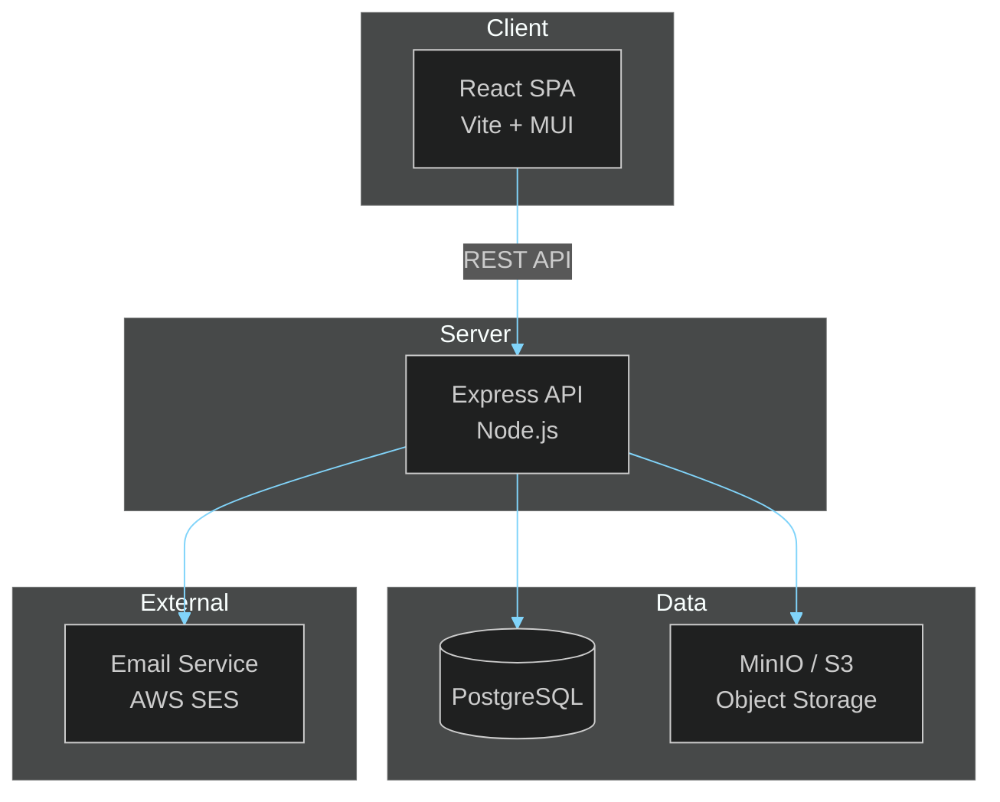

# Architecture Documentation

> **[Template]** This covers the base template feature. Extend or modify for your project.

> Architectural decisions, system diagrams, and design documents for the project.

---

## Overview

This section captures the architectural foundations of the project. It complements the template-level architecture docs in [`template-docs/architecture/`](../../template-docs/architecture/) with project-specific decisions, C4 model diagrams, and detailed design documents.

| Template Docs (patterns) | Project Docs (decisions) |
|--------------------------|--------------------------|
| [Core Patterns](../../template-docs/architecture/CORE_PATTERNS.md) | [ADRs](./adr/) - Why we chose those patterns |
| [Data Model](../../template-docs/architecture/DATA_MODEL.md) | [C4 Diagrams](./c4/) - Visual system models |
| [Tech Stack](../../template-docs/architecture/TECH_STACK.md) | [Design Docs](./design/) - Feature-level designs |

---

## Sections

### Architecture Decision Records (ADRs)

> [`adr/`](./adr/)

ADRs capture significant architectural decisions along with their context and consequences.

**Format:** Each ADR follows the standard template:
- **Title** - Short descriptive name
- **Status** - Proposed, Accepted, Deprecated, Superseded
- **Context** - What is the issue being decided?
- **Decision** - What was decided?
- **Consequences** - What are the trade-offs?

**Naming convention:** `NNN-short-description.md` (e.g., `001-use-drizzle-orm.md`)

---

### C4 Model Diagrams

> [`c4/`](./c4/)

System architecture visualized using the [C4 model](https://c4model.com/):

| Level | Diagram | Description |
|-------|---------|-------------|
| 1 | System Context | The system and its external actors |
| 2 | Container | Major deployable units (API, Web, DB, Storage) |
| 3 | Component | Internal structure of each container |
| 4 | Code | Class/module-level detail (as needed) |

All diagrams use Mermaid with the project dark theme:

```
%%{init: {'theme': 'dark', 'themeVariables': {'primaryColor': '#1e3a5f', 'primaryTextColor': '#e0e0e0', 'primaryBorderColor': '#4fc3f7', 'lineColor': '#81d4fa', 'secondaryColor': '#2e4057', 'tertiaryColor': '#1a2332', 'noteTextColor': '#e0e0e0', 'noteBkgColor': '#2e4057', 'noteBorderColor': '#4fc3f7'}}}%%
```

---

### Design Documents

> [`design/`](./design/)

Detailed design documents for complex features or subsystems. Each document covers:

- Problem statement and requirements
- Proposed architecture
- Data flow diagrams
- API contracts
- Security considerations
- Open questions and alternatives considered

**Existing design documents:**

| Document | Description |
|----------|-------------|
| [CA Management System](./design/ca-management-system.md) | Full-stack PKI certificate authority design |

---

## System Overview Diagram



---

## Related Documentation

- [Core Patterns](../../template-docs/architecture/CORE_PATTERNS.md) - Router, Controller, Service, Model layers
- [Coding Standard](../../template-docs/architecture/CODING_STANDARD.md) - TypeScript conventions
- [Data Model](../../template-docs/architecture/DATA_MODEL.md) - Database schema reference
- [Permissions](../../template-docs/architecture/PERMISSIONS.md) - RBAC and authorization model
- [Configuration](../../template-docs/architecture/CONFIG.md) - Environment variable reference
