# C4 Level 3 -- API Component Diagram

> **[Template]** This covers the base template feature. Extend or modify for your project.

## Purpose

The API Component diagram zooms into the Express API container to reveal its internal architecture. The backend follows a strict 4-layer pattern: **Router -> Middleware -> Controller -> Service -> Model**. Each layer has a well-defined responsibility and dependency direction.

## Diagram

```mermaid
%%{init: {'theme': 'dark', 'themeVariables': {'primaryColor': '#1e3a5f', 'primaryTextColor': '#e0e0e0', 'primaryBorderColor': '#4fc3f7', 'lineColor': '#81d4fa', 'secondaryColor': '#2e4057', 'tertiaryColor': '#1a2332', 'noteTextColor': '#e0e0e0', 'noteBkgColor': '#2e4057', 'noteBorderColor': '#4fc3f7'}}}%%

flowchart TB
    client["<b>HTTP Client</b><br/><i>React SPA / Service Account</i>"]

    subgraph api_container["Express API Server"]
        direction TB

        subgraph routes_layer["Routes Layer"]
            direction LR
            r_auth["auth.routes"]
            r_account["account.routes"]
            r_user["user.routes"]
            r_admin["admin.routes"]
            r_role["role.routes"]
            r_session["session.routes"]
            r_mfa["mfa.routes"]
            r_apikey["api-key.routes"]
            r_notification["notification.routes"]
            r_ca["ca.routes"]
            r_cert["certificate.routes"]
            r_certprofile["certificate-profile.routes"]
            r_csr["csr.routes"]
            r_certlogin["cert-login.routes"]
        end

        subgraph middleware_layer["Middleware Layer"]
            direction LR
            mw_auth["<b>auth</b><br/>JWT verification<br/>+ token refresh"]
            mw_admin["<b>admin</b><br/>isAdmin flag<br/>check"]
            mw_perm["<b>permission</b><br/>RBAC permission<br/>enforcement"]
            mw_validate["<b>validate</b><br/>Zod schema<br/>validation"]
            mw_rate["<b>rateLimit</b><br/>Configurable<br/>rate limiting"]
            mw_reqid["<b>request-id</b><br/>X-Request-ID<br/>generation"]
            mw_error["<b>error</b><br/>Global error<br/>handler"]
            mw_cache["<b>cache</b><br/>Response<br/>caching"]
            mw_maint["<b>maintenance</b><br/>Maintenance<br/>mode gate"]
            mw_ssl["<b>ssl-header</b><br/>Client cert<br/>extraction"]
            mw_socket["<b>socket-auth</b><br/>WebSocket<br/>auth"]
        end

        subgraph controller_layer["Controller Layer"]
            direction LR
            c_auth["AuthController"]
            c_account["AccountController"]
            c_user["UserController"]
            c_admin["AdminController"]
            c_role["RoleController"]
            c_session["SessionController"]
            c_mfa["MfaController"]
            c_apikey["ApiKeyController"]
            c_notification["NotificationController"]
            c_settings["SettingsController"]
            c_ca["CaController"]
            c_cert["CertificateController"]
            c_certprofile["CertProfileController"]
            c_csr["CsrController"]
            c_certlogin["CertLoginController"]
            c_crl["CrlController"]
            c_lifecycle["CertLifecycleController"]
        end

        subgraph service_layer["Service Layer"]
            direction LR
            s_auth["AuthService"]
            s_account["AccountService"]
            s_lockout["AccountLockoutService"]
            s_user["UserService"]
            s_admin["AdminService"]
            s_role["RoleService"]
            s_userrole["UserRoleService"]
            s_perm["PermissionService"]
            s_session["SessionService"]
            s_mfa["MfaService"]
            s_apikey["ApiKeyService"]
            s_notification["NotificationService"]
            s_settings["SettingsService"]
            s_email["EmailService"]
            s_storage["StorageService"]
            s_audit["AuditService"]
            s_svcacct["ServiceAccountService"]
            s_ca["CaService"]
            s_cert["CertificateService"]
            s_certprofile["CertProfileService"]
            s_csr["CsrService"]
            s_certlogin["CertLoginService"]
            s_certlife["CertLifecycleService"]
            s_crl["CrlService"]
            s_pkiaudit["PkiAuditService"]
        end

        subgraph data_layer["Data Access Layer"]
            direction LR
            drizzle["<b>Drizzle ORM</b><br/>Type-safe queries<br/>Schema definitions<br/>Migrations"]
            schema["<b>Schema Models</b><br/>21 tables defined in<br/>src/db/schema/"]
        end

        subgraph providers_layer["Providers"]
            direction LR
            p_email["<b>Email Provider</b><br/>Factory pattern:<br/>Mock | SMTP | SES"]
            p_s3["<b>S3 Provider</b><br/>AWS SDK v3<br/>(MinIO-compatible)"]
        end

        subgraph jobs_layer["Background Jobs (pg-boss)"]
            direction LR
            j_email["<b>Email Job</b><br/>Queued email delivery"]
            j_cleanup["<b>Cleanup Job</b><br/>Expired sessions<br/>and tokens"]
            j_notification["<b>Notification Job</b><br/>Push notification<br/>processing"]
            j_certexp["<b>Cert Expiration Job</b><br/>Certificate expiry<br/>monitoring & alerts"]
        end

        subgraph libs_layer["Shared Libraries"]
            direction LR
            l_db["<b>db</b><br/>Database connection"]
            l_logger["<b>logger</b><br/>Pino logger"]
            l_jwt["<b>jwt</b><br/>Token sign/verify"]
            l_config["<b>config</b><br/>Environment config"]
        end
    end

    subgraph external["External Systems"]
        direction LR
        pg[("PostgreSQL")]
        minio["MinIO / S3"]
        smtp["SMTP / SES"]
    end

    client --> routes_layer
    routes_layer --> middleware_layer
    middleware_layer --> controller_layer
    controller_layer --> service_layer
    service_layer --> data_layer
    service_layer --> providers_layer
    service_layer --> jobs_layer

    data_layer --> pg
    providers_layer --> minio
    providers_layer --> smtp
    jobs_layer --> pg

    drizzle --> schema

    style api_container fill:#1a2332,stroke:#4fc3f7,stroke-width:2px,color:#e0e0e0
    style routes_layer fill:#1e3a5f,stroke:#4fc3f7,stroke-width:1px,color:#e0e0e0
    style middleware_layer fill:#1e3a5f,stroke:#4fc3f7,stroke-width:1px,color:#e0e0e0
    style controller_layer fill:#1e3a5f,stroke:#4fc3f7,stroke-width:1px,color:#e0e0e0
    style service_layer fill:#1e3a5f,stroke:#4fc3f7,stroke-width:1px,color:#e0e0e0
    style data_layer fill:#2e4057,stroke:#4fc3f7,stroke-width:1px,color:#e0e0e0
    style providers_layer fill:#2e4057,stroke:#4fc3f7,stroke-width:1px,color:#e0e0e0
    style jobs_layer fill:#2e4057,stroke:#4fc3f7,stroke-width:1px,color:#e0e0e0
    style libs_layer fill:#2e4057,stroke:#4fc3f7,stroke-width:1px,color:#e0e0e0
    style external fill:#1a2332,stroke:#4fc3f7,stroke-width:1px,color:#e0e0e0
    style client fill:#2e4057,stroke:#4fc3f7,color:#e0e0e0
```



## Layer Responsibilities

### Routes Layer (`src/routes/`)

Defines URL patterns, attaches middleware, and maps to controller methods. Contains zero business logic.

| Route File | Base Path | Auth | Description |
|-----------|-----------|------|-------------|
| `auth.routes` | `/api/v1/auth` | Public + Protected | Login, register, refresh, logout, verify email, reset password |
| `account.routes` | `/api/v1/account` | Protected | Current user account operations (profile, password, preferences) |
| `user.routes` | `/api/v1/users` | Protected | User lookup and listing |
| `admin.routes` | `/api/v1/admin` | Admin | User management (CRUD, activate/deactivate, role assignment) |
| `role.routes` | `/api/v1/roles` | Admin | Role and permission management |
| `session.routes` | `/api/v1/sessions` | Protected | Session listing and revocation |
| `mfa.routes` | `/api/v1/mfa` | Protected | MFA setup, verification, backup codes |
| `api-key.routes` | `/api/v1/api-keys` | Protected | API key CRUD and permission management |
| `notification.routes` | `/api/v1/notifications` | Protected | Notification listing, read/unread, dismissal |
| `ca.routes` | `/api/v1/ca` | Admin | Certificate Authority CRUD and hierarchy |
| `certificate.routes` | `/api/v1/certificates` | Protected | Certificate listing, issuance, download |
| `certificate-profile.routes` | `/api/v1/certificate-profiles` | Admin | Certificate profile templates |
| `csr.routes` | `/api/v1/csr` | Protected | CSR submission, approval workflow |
| `cert-login.routes` | `/api/v1/cert-login` | Special | Certificate-based authentication (mTLS) |

### Middleware Layer (`src/middleware/`)

Cross-cutting concerns applied to requests before they reach controllers.

| Middleware | Purpose | Applied To |
|-----------|---------|-----------|
| `auth` | Validates JWT Bearer tokens, extracts user context, handles API key auth | All protected routes |
| `admin` | Checks `isAdmin` flag on authenticated user | Admin routes |
| `permission` | Evaluates RBAC permissions (`resource:action`) against user roles | Permission-gated routes |
| `validate` | Runs Zod v4 schema validation on `req.body`, `req.query`, or `req.params` | Routes with input schemas |
| `rateLimit` | Configurable rate limiting per endpoint group | Auth routes, API endpoints |
| `request-id` | Generates/propagates `X-Request-ID` header for tracing | All routes (global) |
| `error` | Global error handler; formats errors into standard JSON response | All routes (global) |
| `cache` | HTTP response caching with configurable TTL | Read-heavy endpoints |
| `maintenance` | Returns 503 when maintenance mode is enabled in settings | All routes (global) |
| `ssl-header` | Extracts client certificate DN from NGINX `X-SSL-Client-*` headers | Certificate auth routes |
| `socket-auth` | Validates JWT for WebSocket connections | Socket.IO handshake |

### Controller Layer (`src/controllers/`)

Parses HTTP requests, calls the appropriate service methods, and formats HTTP responses. Controllers never access the database directly.

| Controller | Service(s) Used | Key Responsibilities |
|-----------|----------------|---------------------|
| `AuthController` | AuthService, SessionService, MfaService | Login, register, token refresh, logout, email verification, password reset |
| `AccountController` | AccountService, AccountLockoutService | Profile updates, password changes, preference management |
| `UserController` | UserService | User lookup, listing with pagination/filtering |
| `AdminController` | AdminService, UserRoleService | User CRUD, activation/deactivation, role assignment, service accounts |
| `RoleController` | RoleService, PermissionService | Role CRUD, permission assignment |
| `SessionController` | SessionService | Session listing, individual/bulk revocation |
| `MfaController` | MfaService | TOTP setup, QR code generation, verification, backup codes |
| `ApiKeyController` | ApiKeyService | API key creation, listing, revocation, permission scoping |
| `NotificationController` | NotificationService | Notification listing, mark as read, dismiss |
| `SettingsController` | SettingsService | System settings CRUD (admin only) |
| `CaController` | CaService, PkiAuditService | CA creation, hierarchy management, status changes |
| `CertificateController` | CertificateService | Certificate issuance, listing, download |
| `CertProfileController` | CertProfileService | Certificate profile CRUD |
| `CsrController` | CsrService | CSR submission, approval/rejection workflow |
| `CertLoginController` | CertLoginService | Certificate-based login, cert-to-user binding |
| `CrlController` | CrlService | CRL generation and distribution |
| `CertLifecycleController` | CertLifecycleService | Certificate revocation, renewal, suspension |

### Service Layer (`src/services/`)

All business logic lives here. Services return `Result<T>` using `tryCatch()` from `stderr-lib` and never throw exceptions. Services do not handle HTTP concerns.

| Service | Tables Accessed | Description |
|---------|----------------|-------------|
| `AuthService` | users, sessions, tokens | Authentication flows (login, register, refresh, verify) |
| `AccountService` | users | Current user profile and password management |
| `AccountLockoutService` | users | Failed login tracking, account locking/unlocking |
| `UserService` | users | User querying with pagination and filtering |
| `AdminService` | users | Admin-level user management (CRUD, status changes) |
| `RoleService` | roles, rolePermissions | Role CRUD and permission assignment |
| `UserRoleService` | userRoles | User-to-role assignment and removal |
| `PermissionService` | permissions, rolePermissions, userRoles | Permission checking and listing |
| `SessionService` | sessions | Session management and revocation |
| `MfaService` | userMfaMethods | TOTP setup, verification, backup code management |
| `ApiKeyService` | apiKeys, apiKeyPermissions | API key lifecycle and permission scoping |
| `NotificationService` | notifications | Notification CRUD and real-time dispatch |
| `SettingsService` | systemSettings | System settings read/write with type parsing |
| `EmailService` | (none - uses provider) | Email composition and queued delivery |
| `StorageService` | (none - uses provider) | S3 file upload/download abstraction |
| `AuditService` | auditLogs | Security event logging |
| `ServiceAccountService` | users, apiKeys | Service account creation and management |
| `CaService` | certificateAuthorities, pkiPrivateKeys | CA lifecycle management and hierarchy |
| `CertificateService` | certificates, pkiPrivateKeys | Certificate issuance using X.509 crypto |
| `CertProfileService` | certificateProfiles | Certificate template management |
| `CsrService` | certificateRequests | CSR validation, storage, and approval workflow |
| `CertLoginService` | userCertificates, certAttachCodes | Certificate-to-user binding and cert auth |
| `CertLifecycleService` | certificates, revocations | Revocation, suspension, renewal |
| `CrlService` | crls, revocations | CRL generation and publishing |
| `PkiAuditService` | pkiAuditLogs | PKI-specific audit trail |

### Data Access Layer

| Component | Description |
|-----------|-------------|
| **Drizzle ORM** | Type-safe SQL query builder. All database access goes through Drizzle -- no raw SQL queries. |
| **Schema Models** | 21+ table definitions in `src/db/schema/` using `pgTable()`. Each schema file exports the table, inferred `Select`/`Insert` types, and related constants. |
| **Migrations** | Generated by `drizzle-kit generate` and applied with `drizzle-kit migrate`. Stored in `src/db/migrations/`. |

### Providers (`src/providers/`)

| Provider | Implementation | Description |
|----------|---------------|-------------|
| **Email Provider** | Factory pattern: `MockEmailProvider`, `SmtpEmailProvider`, `SesEmailProvider` | Pluggable email delivery. Selected at startup based on `EMAIL_PROVIDER` env var. All implement `EmailProviderInterface`. |
| **S3 Provider** | AWS SDK v3 (`@aws-sdk/client-s3`) | Object storage abstraction. Works with both AWS S3 and MinIO. Configured via `S3_ENDPOINT`, `S3_BUCKET` env vars. |

### Background Jobs (`src/jobs/`)

| Job | Schedule | Description |
|-----|----------|-------------|
| `email` | Queue-driven | Processes queued email delivery jobs asynchronously |
| `cleanup` | Periodic (cron) | Removes expired sessions, used tokens, and stale data |
| `notification` | Queue-driven | Processes notification delivery and Socket.IO broadcast |
| `cert-expiration` | Periodic (cron) | Monitors certificate expiry dates and sends alerts |

## Error Handling Pattern

All services use the Result pattern from `stderr-lib`:

```
Controller calls Service
  -> Service returns Result<T> (ok: true + value, or ok: false + error)
    -> Controller checks result.ok
      -> If true: res.json({ success: true, data: result.value })
      -> If false: res.status(4xx).json({ success: false, error: message })
```

No exceptions cross service boundaries. Controllers are the only layer that translates between business results and HTTP status codes.
