# C4 Level 3 -- Web Component Diagram

> **[Template]** This covers the base template feature. Extend or modify for your project.

## Purpose

The Web Component diagram zooms into the React SPA container to show how the frontend is organized internally. The frontend follows a layered pattern: **Pages -> Components -> Hooks -> API Client -> Backend**, with Zustand stores for global state management.

## Diagram

```mermaid
%%{init: {'theme': 'dark', 'themeVariables': {'primaryColor': '#1e3a5f', 'primaryTextColor': '#e0e0e0', 'primaryBorderColor': '#4fc3f7', 'lineColor': '#81d4fa', 'secondaryColor': '#2e4057', 'tertiaryColor': '#1a2332', 'noteTextColor': '#e0e0e0', 'noteBkgColor': '#2e4057', 'noteBorderColor': '#4fc3f7'}}}%%

flowchart TB
    browser["<b>Browser</b><br/><i>User interaction</i>"]

    subgraph spa_container["React SPA (apps/web)"]
        direction TB

        subgraph routing["Routing Layer"]
            direction LR
            router["<b>React Router</b><br/>Client-side routing<br/>Route definitions"]
            protected["<b>ProtectedRoute</b><br/>Auth guard<br/>Redirect to login"]
            adminRoute["<b>AdminRoute</b><br/>Admin guard<br/>Redirect if non-admin"]
        end

        subgraph pages_layer["Pages"]
            direction TB

            subgraph public_pages["Public Pages"]
                direction LR
                p_landing["LandingPage"]
                p_login["LoginPage"]
                p_register["RegisterPage"]
                p_forgot["ForgotPasswordPage"]
                p_reset["ResetPasswordPage"]
                p_verify["VerifyEmailPage"]
            end

            subgraph user_pages["Authenticated Pages"]
                direction LR
                p_home["HomePage<br/><i>Dashboard</i>"]
                p_profile["ProfilePage"]
                p_sessions["SessionsPage"]
            end

            subgraph admin_pages["Admin Pages"]
                direction LR
                p_users["UsersPage"]
                p_roles["RolesPage"]
                p_apikeys["ApiKeysPage"]
                p_svcaccts["ServiceAccountsPage"]
                p_audit["AuditLogsPage"]
                p_settings["SettingsPage"]
            end

            subgraph pki_pages["PKI Management Pages"]
                direction LR
                p_pkidash["PkiDashboardPage"]
                p_calist["CaListPage"]
                p_cadetail["CaDetailPage"]
                p_cacreate["CaCreatePage"]
                p_certlist["CertificateListPage"]
                p_certdetail["CertificateDetailPage"]
                p_certissue["CertificateIssuePage"]
                p_csrlist["CsrListPage"]
                p_csrdetail["CsrDetailPage"]
                p_profiles["ProfileListPage"]
                p_profileform["ProfileFormPage"]
                p_pkiaudit["PkiAuditPage"]
            end
        end

        subgraph components_layer["Shared Components"]
            direction LR

            subgraph layout_components["Layout"]
                direction TB
                c_applayout["AppLayout"]
                c_public_layout["PublicLayout"]
                c_topnav["TopNav"]
                c_sidebar["Sidebar"]
                c_footer["Footer"]
            end

            subgraph ui_components["UI Components"]
                direction TB
                c_theme["ThemeToggle"]
                c_notifbell["NotificationBell"]
                c_notifmenu["NotificationMenu"]
                c_spinner["LoadingSpinner"]
                c_errbound["ErrorBoundary"]
            end

            subgraph profile_components["Profile Components"]
                direction TB
                c_acctinfo["AccountInfoCard"]
                c_changepw["ChangePasswordCard"]
                c_prefs["PreferencesCard"]
                c_mfacard["MfaCard"]
                c_apikeyscard["ApiKeysCard"]
            end
        end

        subgraph hooks_layer["Hooks Layer"]
            direction LR

            subgraph auth_hooks["Auth & Session"]
                direction TB
                h_auth["useAuth"]
                h_sessions["useSessions"]
                h_permission["usePermission"]
            end

            subgraph data_hooks["Data Fetching"]
                direction TB
                h_notification["useNotification"]
                h_notifications["useNotifications"]
                h_apikeys["useApiKeys"]
                h_roles["useRoles"]
                h_mfa["useMfa"]
            end

            subgraph pki_hooks["PKI Hooks"]
                direction TB
                h_ca["useCa"]
                h_certs["useCertificates"]
                h_csr["useCsr"]
                h_certprofiles["useCertificateProfiles"]
                h_crl["useCrl"]
                h_pkiaudit["usePkiAudit"]
                h_certlogin["useCertLogin"]
            end

            subgraph util_hooks["Utilities"]
                direction TB
                h_socket["useSocket"]
                h_socketevent["useSocketEvent"]
                h_debounce["useDebouncedValue"]
                h_theme["useTheme"]
            end
        end

        subgraph stores_layer["State Stores (Zustand)"]
            direction LR
            st_auth["<b>authStore</b><br/>accessToken, user,<br/>isAuthenticated,<br/>login/logout actions"]
            st_theme["<b>themeStore</b><br/>mode (light/dark/system),<br/>persisted to localStorage"]
            st_notification["<b>notificationStore</b><br/>unread count,<br/>toast queue"]
            st_socket["<b>socketStore</b><br/>connection state,<br/>Socket.IO instance"]
        end

        subgraph api_layer["API Client Layer"]
            direction LR
            api_client["<b>apiFetch / api</b><br/>Fetch wrapper with:<br/>- JWT injection<br/>- Auto token refresh<br/>- Error normalization<br/>- ApiError class"]
        end
    end

    subgraph backend["Express API"]
        api_server["<b>/api/v1/*</b>"]
        ws_server["<b>/socket.io/</b>"]
    end

    browser --> routing
    routing --> pages_layer
    pages_layer --> components_layer
    pages_layer --> hooks_layer
    components_layer --> hooks_layer
    hooks_layer --> stores_layer
    hooks_layer --> api_layer
    stores_layer --> api_layer

    api_layer -- "HTTP REST" --> api_server
    st_socket -- "WebSocket" --> ws_server

    style spa_container fill:#1a2332,stroke:#4fc3f7,stroke-width:2px,color:#e0e0e0
    style routing fill:#1e3a5f,stroke:#4fc3f7,stroke-width:1px,color:#e0e0e0
    style pages_layer fill:#1e3a5f,stroke:#4fc3f7,stroke-width:1px,color:#e0e0e0
    style public_pages fill:#2e4057,stroke:#81d4fa,stroke-width:1px,color:#e0e0e0
    style user_pages fill:#2e4057,stroke:#81d4fa,stroke-width:1px,color:#e0e0e0
    style admin_pages fill:#2e4057,stroke:#81d4fa,stroke-width:1px,color:#e0e0e0
    style pki_pages fill:#2e4057,stroke:#81d4fa,stroke-width:1px,color:#e0e0e0
    style components_layer fill:#1e3a5f,stroke:#4fc3f7,stroke-width:1px,color:#e0e0e0
    style layout_components fill:#2e4057,stroke:#81d4fa,stroke-width:1px,color:#e0e0e0
    style ui_components fill:#2e4057,stroke:#81d4fa,stroke-width:1px,color:#e0e0e0
    style profile_components fill:#2e4057,stroke:#81d4fa,stroke-width:1px,color:#e0e0e0
    style hooks_layer fill:#1e3a5f,stroke:#4fc3f7,stroke-width:1px,color:#e0e0e0
    style auth_hooks fill:#2e4057,stroke:#81d4fa,stroke-width:1px,color:#e0e0e0
    style data_hooks fill:#2e4057,stroke:#81d4fa,stroke-width:1px,color:#e0e0e0
    style pki_hooks fill:#2e4057,stroke:#81d4fa,stroke-width:1px,color:#e0e0e0
    style util_hooks fill:#2e4057,stroke:#81d4fa,stroke-width:1px,color:#e0e0e0
    style stores_layer fill:#1e3a5f,stroke:#4fc3f7,stroke-width:1px,color:#e0e0e0
    style api_layer fill:#1e3a5f,stroke:#4fc3f7,stroke-width:1px,color:#e0e0e0
    style backend fill:#1a2332,stroke:#4fc3f7,stroke-width:1px,color:#e0e0e0
    style browser fill:#2e4057,stroke:#4fc3f7,color:#e0e0e0
```



## Layer Details

### Routing Layer

The application uses React Router for client-side routing with two guard components that wrap protected route trees.

| Component | Source | Description |
|-----------|--------|-------------|
| **React Router** | `src/App.tsx` | Root route definitions mapping URL paths to page components |
| **ProtectedRoute** | `src/components/ProtectedRoute.tsx` | Checks `authStore.isAuthenticated`. Redirects unauthenticated users to `/login`. |
| **AdminRoute** | `src/components/AdminRoute.tsx` | Checks `authStore.user.isAdmin`. Redirects non-admin users to the home page. |

### Pages

Pages are top-level route components. Each page composes shared components and uses hooks for data fetching.

#### Public Pages (No Authentication Required)

| Page | Route | Description |
|------|-------|-------------|
| `LandingPage` | `/` | Marketing/landing page for unauthenticated visitors |
| `LoginPage` | `/login` | Email/password login form with MFA support |
| `RegisterPage` | `/register` | New account registration form |
| `ForgotPasswordPage` | `/forgot-password` | Password reset request form |
| `ResetPasswordPage` | `/reset-password` | Password reset with token from email |
| `VerifyEmailPage` | `/verify-email` | Email verification with token from email |

#### Authenticated Pages

| Page | Route | Description |
|------|-------|-------------|
| `HomePage` | `/home` | Dashboard with overview stats and recent activity |
| `ProfilePage` | `/profile` | User profile with account info, password, MFA, API keys, preferences |
| `SessionsPage` | `/sessions` | Active session list with revocation controls |

#### Admin Pages

| Page | Route | Description |
|------|-------|-------------|
| `UsersPage` | `/admin/users` | User management table with search, filter, CRUD |
| `RolesPage` | `/admin/roles` | Role management with permission assignment |
| `ApiKeysPage` | `/admin/api-keys` | System-wide API key management |
| `ServiceAccountsPage` | `/admin/service-accounts` | Service account creation and management |
| `AuditLogsPage` | `/admin/audit` | Searchable audit log viewer with filters |
| `SettingsPage` | `/admin/settings` | System settings editor (feature flags, config) |

#### PKI Management Pages

| Page | Route | Description |
|------|-------|-------------|
| `PkiDashboardPage` | `/pki` | PKI overview with CA hierarchy and certificate stats |
| `CaListPage` | `/pki/ca` | Certificate Authority listing |
| `CaDetailPage` | `/pki/ca/:id` | CA detail view with issued certificates and CRL info |
| `CaCreatePage` | `/pki/ca/create` | Root/intermediate CA creation wizard |
| `CertificateListPage` | `/pki/certificates` | Certificate listing with status filters |
| `CertificateDetailPage` | `/pki/certificates/:id` | Certificate detail with revocation controls |
| `CertificateIssuePage` | `/pki/certificates/issue` | Certificate issuance form |
| `CsrListPage` | `/pki/csr` | CSR queue with approval/rejection workflow |
| `CsrDetailPage` | `/pki/csr/:id` | CSR detail with subject info and approval actions |
| `ProfileListPage` | `/pki/profiles` | Certificate profile template listing |
| `ProfileFormPage` | `/pki/profiles/create` | Certificate profile creation/editing form |
| `PkiAuditPage` | `/pki/audit` | PKI-specific audit log viewer |

### Shared Components

#### Layout Components

| Component | Source | Description |
|-----------|--------|-------------|
| `AppLayout` | `src/components/layout/AppLayout.tsx` | Main authenticated layout with TopNav, Sidebar, and content area |
| `PublicLayout` | `src/components/layout/PublicLayout.tsx` | Layout for public/unauthenticated pages |
| `TopNav` | `src/components/layout/TopNav.tsx` | Top navigation bar with user menu, notifications, theme toggle |
| `Sidebar` | `src/components/layout/Sidebar.tsx` | Collapsible sidebar navigation with route links |
| `Footer` | `src/components/layout/Footer.tsx` | Application footer |

#### UI Components

| Component | Source | Description |
|-----------|--------|-------------|
| `ThemeToggle` | `src/components/ui/ThemeToggle.tsx` | Light/dark/system theme switcher |
| `NotificationBell` | `src/components/ui/NotificationBell.tsx` | Notification icon with unread badge count |
| `NotificationMenu` | `src/components/ui/NotificationMenu.tsx` | Dropdown notification list |
| `LoadingSpinner` | `src/components/LoadingSpinner.tsx` | Centered loading indicator |
| `ErrorBoundary` | `src/components/ErrorBoundary.tsx` | React error boundary with fallback UI |

#### Profile Components

| Component | Source | Description |
|-----------|--------|-------------|
| `AccountInfoCard` | `src/components/profile/AccountInfoCard.tsx` | Display/edit email and account details |
| `ChangePasswordCard` | `src/components/profile/ChangePasswordCard.tsx` | Current/new password form |
| `PreferencesCard` | `src/components/profile/PreferencesCard.tsx` | Theme and UI preference settings |
| `MfaCard` | `src/components/profile/MfaCard.tsx` | MFA setup, QR code display, backup codes |
| `ApiKeysCard` | `src/components/profile/ApiKeysCard.tsx` | Personal API key management |

### Hooks Layer

Hooks encapsulate data fetching (via TanStack Query), mutations, and side effects. Pages and components consume hooks rather than calling the API client directly.

#### Auth and Session Hooks

| Hook | Source | Description |
|------|--------|-------------|
| `useAuth` | `src/hooks/useAuth.ts` | Login, register, logout mutations; reads from authStore |
| `useSessions` | `src/hooks/useSessions.ts` | Session list query, revoke mutation |
| `usePermission` | `src/hooks/usePermission.ts` | Permission checking helper for conditional UI rendering |

#### Data Fetching Hooks

| Hook | Source | Description |
|------|--------|-------------|
| `useNotification` | `src/hooks/useNotification.ts` | Single notification operations |
| `useNotifications` | `src/hooks/useNotifications.ts` | Notification list query with pagination, mark-as-read mutation |
| `useApiKeys` | `src/hooks/useApiKeys.ts` | API key CRUD queries and mutations |
| `useRoles` | `src/hooks/useRoles.ts` | Role list query, role CRUD mutations |
| `useMfa` | `src/hooks/useMfa.ts` | MFA setup, verify, disable mutations |

#### PKI Hooks

| Hook | Source | Description |
|------|--------|-------------|
| `useCa` | `src/hooks/useCa.ts` | CA list/detail queries, CA creation mutation |
| `useCertificates` | `src/hooks/useCertificates.ts` | Certificate list/detail queries, issuance mutation |
| `useCsr` | `src/hooks/useCsr.ts` | CSR list/detail queries, submit/approve/reject mutations |
| `useCertificateProfiles` | `src/hooks/useCertificateProfiles.ts` | Certificate profile CRUD |
| `useCrl` | `src/hooks/useCrl.ts` | CRL generation and download |
| `usePkiAudit` | `src/hooks/usePkiAudit.ts` | PKI audit log queries with filters |
| `useCertLogin` | `src/hooks/useCertLogin.ts` | Certificate authentication and binding |

#### Utility Hooks

| Hook | Source | Description |
|------|--------|-------------|
| `useSocket` | `src/hooks/useSocket.ts` | Socket.IO connection lifecycle management |
| `useSocketEvent` | `src/hooks/useSocketEvent.ts` | Subscribe to specific Socket.IO events |
| `useDebouncedValue` | `src/hooks/useDebouncedValue.ts` | Debounced value for search inputs |
| `useTheme` | `src/hooks/useTheme.ts` | Theme mode reading and toggling |

### State Stores (Zustand)

Global client-side state managed by Zustand. Each store is a standalone module with typed state and actions.

| Store | Source | Persisted | Description |
|-------|--------|-----------|-------------|
| `authStore` | `src/stores/auth.store.ts` | Partial (token in memory) | Access token, user object, `isAuthenticated` flag. Login sets token + user, logout clears both. Token refresh handled by API client. |
| `themeStore` | `src/stores/theme.store.ts` | localStorage | Theme mode (`light`, `dark`, `system`). Syncs with MUI `ThemeProvider`. |
| `notificationStore` | `src/stores/notification.store.ts` | No | Unread notification count, toast message queue for snackbar display. Updated via Socket.IO events. |
| `socketStore` | `src/stores/socket.store.ts` | No | Socket.IO client instance, connection status (`connected`, `disconnected`). Initialized on auth, torn down on logout. |

### API Client Layer

| Component | Source | Description |
|-----------|--------|-------------|
| `apiFetch` | `src/api/client.ts` | Core fetch wrapper. Injects JWT from `authStore`, auto-refreshes on 401 (with mutex to prevent concurrent refresh races), normalizes errors into `ApiError` instances. |
| `api` | `src/api/client.ts` | Convenience methods (`api.get`, `api.post`, `api.patch`, `api.put`, `api.delete`) that wrap `apiFetch` with proper HTTP methods. |

## Data Flow Patterns

### Query Pattern (Read)

```
Page mounts
  -> Hook calls useQuery (TanStack Query)
    -> Query function calls api.get('/endpoint')
      -> apiFetch injects Bearer token from authStore
        -> fetch() to /api/v1/endpoint
          -> Response parsed, cached by TanStack Query
            -> Component re-renders with data
```

### Mutation Pattern (Write)

```
User submits form
  -> Hook calls useMutation (TanStack Query)
    -> Mutation function calls api.post('/endpoint', body)
      -> apiFetch injects Bearer token from authStore
        -> fetch() to /api/v1/endpoint
          -> On success: invalidate related queries (auto-refetch)
          -> On error: throw ApiError (handled by component)
```

### Real-time Pattern (WebSocket)

```
User authenticates
  -> socketStore.connect() with JWT
    -> Socket.IO handshake with socket-auth middleware
      -> Server validates token
        -> Connection established

Server event occurs (e.g., new notification)
  -> Socket.IO emits event to user's room
    -> useSocketEvent callback fires
      -> notificationStore.incrementUnread()
      -> TanStack Query cache invalidated (auto-refetch)
```
