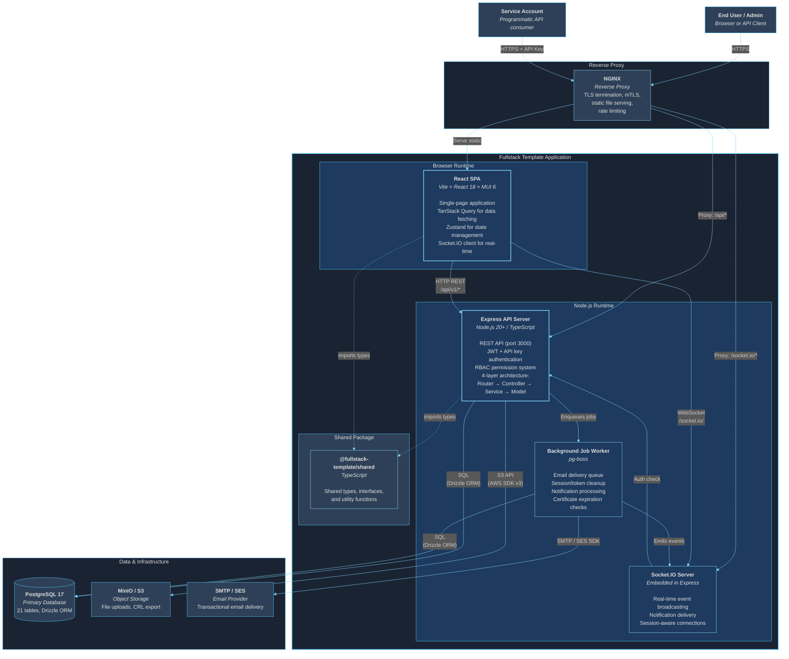

# C4 Level 2 -- Container Diagram

> **[Template]** This covers the base template feature. Extend or modify for your project.

## Purpose

The Container diagram zooms into the Fullstack Template system boundary to show the major deployable and runnable units. Each container is a separately running process or deployable artifact. This level reveals the high-level technology choices and how they communicate.

## Diagram

## Container Inventory

### Application Containers

| Container | Technology | Source | Description |
|-----------|-----------|--------|-------------|
| **React SPA** | React 18, Vite, MUI 6, TanStack Query, Zustand | `apps/web/` | Single-page application served as static files. Handles all UI rendering, client-side routing, state management, and API communication. |
| **Express API Server** | Express 4.x, TypeScript, Node.js 20+ | `apps/api/` | REST API server implementing a 4-layer architecture (Router, Controller, Service, Model). Handles authentication, authorization, business logic, and data persistence. |
| **Socket.IO Server** | Socket.IO (embedded in Express) | `apps/api/src/socket/` | Real-time WebSocket server sharing the same HTTP server as Express. Broadcasts notifications, session events, and other real-time updates to connected clients. |
| **Background Job Worker** | pg-boss | `apps/api/src/jobs/` | Asynchronous job processing backed by PostgreSQL (via pg-boss). Handles email delivery, session/token cleanup, notification dispatch, and certificate expiration monitoring. |
| **Shared Package** | TypeScript | `packages/shared/` | Shared types, interfaces, and utility functions consumed by both the API and Web packages. Published as `@fullstack-template/shared` within the monorepo. |

### Infrastructure Containers

| Container | Technology | Purpose | Ports |
|-----------|-----------|---------|-------|
| **NGINX** | NGINX | Reverse proxy, TLS/mTLS termination, static file serving, request routing | 80, 443 |
| **PostgreSQL** | PostgreSQL 17 (Docker) | Primary relational database for all application data | 5432 |
| **MinIO** | MinIO (Docker), S3-compatible | Object storage for file uploads and CRL distribution | 9000 (API), 9001 (Console) |
| **SMTP / SES** | Configurable provider | Transactional email delivery (pluggable: mock, smtp, ses) | 587 (SMTP) or AWS API |

## Communication Paths

### Synchronous (Request-Response)

| From | To | Protocol | Description |
|------|----|----------|-------------|
| Browser | NGINX | HTTPS | All user-initiated requests |
| NGINX | Express API | HTTP | Proxied API requests (`/api/*`) |
| NGINX | React SPA | HTTP | Static file serving (HTML, JS, CSS) |
| React SPA | Express API | HTTP REST | API calls via `apiFetch()` with JWT Bearer tokens |
| Express API | PostgreSQL | TCP (SQL) | Data queries and mutations via Drizzle ORM |
| Express API | MinIO | HTTP (S3) | File upload/download via AWS SDK v3 |

### Asynchronous (Event-Driven)

| From | To | Protocol | Description |
|------|----|----------|-------------|
| React SPA | Socket.IO Server | WebSocket | Real-time bidirectional events |
| Express API | pg-boss Worker | PostgreSQL Queue | Job enqueue (email, cleanup, notifications) |
| pg-boss Worker | Socket.IO Server | In-process | Emit events after job completion |
| pg-boss Worker | SMTP/SES | SMTP/HTTP | Deliver transactional emails |

## Development vs Production

| Concern | Development | Production |
|---------|------------|------------|
| **SPA Serving** | Vite dev server (port 5173) with HMR | NGINX serves built static files |
| **API Proxy** | Vite proxies `/api` to Express (port 3000) | NGINX proxies `/api` to Express |
| **TLS** | None (HTTP only) | NGINX handles TLS + optional mTLS |
| **Email** | Mock provider (logs to console) | SMTP server or AWS SES |
| **Database** | Docker Compose PostgreSQL | Managed PostgreSQL or Docker |
| **Object Storage** | Docker Compose MinIO | AWS S3 or MinIO cluster |
