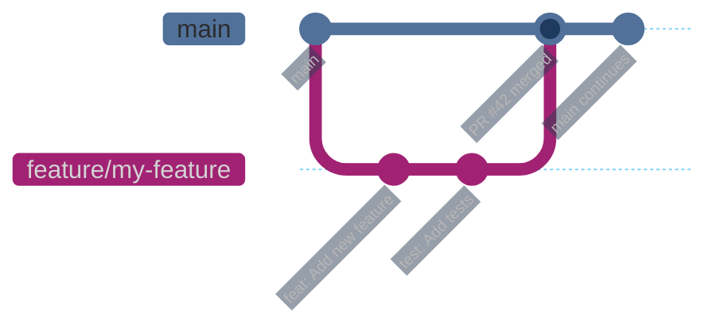

# Contributing Guide

> **[Template]** This covers the base template feature. Extend or modify for your project.

This document describes the workflow for contributing to the project, including branch naming, commit conventions, pull request process, and review expectations.

---

## Branch Naming

All branches must use a category prefix followed by a descriptive kebab-case name:

| Prefix     | Purpose                                | Example                          |
|------------|----------------------------------------|----------------------------------|
| `feature/` | New functionality                     | `feature/user-avatar-upload`     |
| `fix/`     | Bug fixes                             | `fix/login-redirect-loop`        |
| `docs/`    | Documentation changes                 | `docs/api-authentication-guide`  |
| `refactor/`| Code restructuring without behavior change | `refactor/extract-email-provider` |
| `test/`    | Adding or updating tests              | `test/role-service-coverage`     |
| `chore/`   | Tooling, dependencies, infrastructure | `chore/update-drizzle-orm`       |

Create branches from `main`:

```bash
git checkout main
git pull origin main
git checkout -b feature/my-new-feature
```

---

## Commit Message Conventions

Follow the conventional commit format:

```
<type>: <short description>

<optional body explaining the "why">
```

### Types

| Type       | Use For                                            |
|------------|----------------------------------------------------|
| `feat`     | A new feature                                      |
| `fix`      | A bug fix                                          |
| `docs`     | Documentation only changes                         |
| `refactor` | Code change that neither fixes a bug nor adds a feature |
| `test`     | Adding or correcting tests                         |
| `chore`    | Build process, dependency updates, tooling         |
| `style`    | Formatting, whitespace (no logic change)           |
| `perf`     | Performance improvements                           |

### Examples

```
feat: Add email verification flow with expiring tokens

fix: Prevent duplicate session creation on token refresh

test: Add unit tests for account lockout service

refactor: Extract cookie handling into dedicated utility

chore: Update Drizzle ORM to 0.38.x
```

### Guidelines

- Use imperative mood ("Add feature" not "Added feature")
- Keep the first line under 72 characters
- Reference issue numbers when applicable: `fix: Resolve login timeout (#42)`
- Separate subject from body with a blank line
- Use the body to explain **why**, not **what** (the diff shows what)

---

## Pull Request Process

### Before Opening a PR

1. **Ensure your branch is up to date** with `main`:

   ```bash
   git checkout main
   git pull origin main
   git checkout feature/my-branch
   git rebase main
   ```

2. **Run the full check suite** locally:

   ```bash
   pnpm lint
   pnpm build
   pnpm test
   ```

3. **Verify no unintended files** are included:

   ```bash
   git diff main --stat
   ```

### Creating a PR

- **Title**: Short, descriptive, under 72 characters
- **Description**: Use the PR template below
- **Labels**: Add appropriate labels (feature, bug, docs, etc.)
- **Reviewers**: Request at least one reviewer

### PR Description Template

```markdown
## Summary

Brief description of what this PR does and why.

## Changes

- Bullet point list of specific changes made
- Focus on the "what" here

## Testing

- [ ] Unit tests added/updated
- [ ] Integration tests added/updated (if applicable)
- [ ] E2E tests added/updated (if user-facing flow changed)
- [ ] Manual testing performed
- [ ] All existing tests pass (`pnpm test`)
- [ ] E2E tests pass (`pnpm test:e2e`)

## Checklist

- [ ] Code follows project coding standards
- [ ] No `console.log` statements (use Pino logger)
- [ ] No TypeScript `any` types (use `unknown`)
- [ ] Services return `Result<T>` (no throwing)
- [ ] Validation uses Zod v4
- [ ] Database migrations generated (if schema changed)
- [ ] Documentation updated (if applicable)
```

---

## Code Review Checklist

When reviewing a PR, check for:

### Architecture

- [ ] Follows the 4-layer pattern (Router, Controller, Service, Model)
- [ ] No business logic in controllers (belongs in services)
- [ ] No HTTP concerns in services (no `req`, `res`, status codes)
- [ ] No direct database access outside services

### Error Handling

- [ ] Services use `tryCatch()` and return `Result<T>`
- [ ] Controllers check `result.ok` before accessing `result.value`
- [ ] Error responses follow `{ success: false, error: "..." }` format
- [ ] No unhandled promise rejections

### Type Safety

- [ ] No `any` types (use `unknown` and narrow)
- [ ] No TypeScript enums (use const objects or union types)
- [ ] Strict null checks respected
- [ ] Zod schemas validate all external input

### Security

- [ ] No secrets or credentials in code
- [ ] Input validation on all endpoints
- [ ] Authorization checks on protected routes
- [ ] No SQL injection vectors (use Drizzle ORM, not raw SQL)

### Testing

- [ ] Unit tests cover the happy path and key error paths
- [ ] Test data uses factories (`createTestUser`, `createTestRole`, etc.)
- [ ] Mocks are properly reset in `beforeEach`
- [ ] No tests depend on execution order

### Code Quality

- [ ] No `console.log` (use Pino logger)
- [ ] Pino argument order is `(object, message)`
- [ ] File naming follows kebab-case conventions
- [ ] Imports use `.js` extensions and `node:` prefix
- [ ] Functions are under 50 lines
- [ ] No floating promises

---

## Running Tests Before PR

```bash
# Run the full suite
pnpm lint          # Check code style
pnpm build         # Verify compilation
pnpm test          # Run all unit and integration tests
pnpm test:e2e      # Run Playwright E2E tests (requires Docker)

# Run specific test suites
pnpm test:api      # Backend tests only
pnpm test:web      # Frontend tests only
pnpm test:e2e:headed  # E2E with visible browser

# Run tests in watch mode during development
pnpm --filter api test:watch
```

---

## Documentation Requirements

### When to Update Docs

- **New feature**: Add usage documentation
- **API changes**: Update relevant endpoint documentation
- **Schema changes**: Generate migration (`pnpm db:generate`)
- **Configuration changes**: Update `.env.example` with new variables and comments
- **Architecture changes**: Update `docs/architecture/` guides

### Where Documentation Lives

| Content                | Location                              |
|------------------------|---------------------------------------|
| Architecture decisions | `docs/architecture/`                  |
| Feature documentation  | `docs/features/`                      |
| Developer guides       | `project-docs/developer/`             |
| API configuration      | `.env.example` (with comments)        |
| Inline code docs       | JSDoc comments on public interfaces   |

---

## Workflow Diagram



---

## Tips for Contributors

1. **Keep PRs small** -- smaller PRs get reviewed faster and are less likely to introduce bugs
2. **One concern per PR** -- do not mix feature work with refactoring
3. **Write tests first** -- or at least alongside the implementation
4. **Use draft PRs** -- for work in progress that needs early feedback
5. **Respond to reviews promptly** -- keep the feedback loop tight
6. **Rebase, do not merge** -- keep a clean linear history when updating your branch
