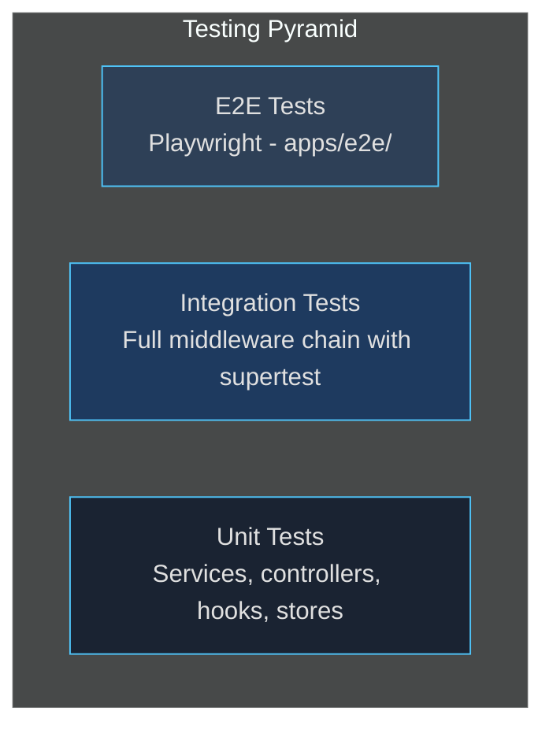

# Testing Strategy

> **[Template]** This covers the base template feature. Extend or modify for your project.

This document provides an overview of the testing strategy, tooling, and conventions used across the fullstack template.

---

## Testing Pyramid



| Level       | Scope                                          | Speed    | Coverage Target |
|-------------|-------------------------------------------------|----------|-----------------|
| **Unit**    | Individual services, controllers, hooks, stores | Fast     | 80%+ on business logic |
| **Integration** | Full HTTP request through middleware chain  | Medium   | Key API routes  |
| **E2E**     | Browser-based user flows (Playwright)          | Slow     | Critical paths  |

The majority of tests should be unit tests. Integration tests cover the middleware chain and request validation. E2E tests cover critical user flows through the full stack (browser, React frontend, Express API, PostgreSQL).

---

## Test Tooling

| Tool              | Purpose                          | Package          |
|-------------------|----------------------------------|------------------|
| Vitest            | Test runner and assertion library | `vitest`         |
| Playwright        | Browser E2E testing              | `@playwright/test` |
| supertest         | HTTP assertions for integration tests | `supertest`  |
| @testing-library/react | React component testing    | `@testing-library/react` |
| jsdom             | Browser environment for web tests | `vitest` env   |

### Vitest Configuration

The project has separate Vitest configs for API and web:

**API** (`apps/api/vitest.config.ts`):
- Environment: `node`
- Pool: `forks` (process isolation between test files)
- Includes: `src/**/*.test.ts`, `test/**/*.test.ts`
- Setup file: `test/setup.ts`

**Web** (`apps/web/vitest.config.ts`):
- Environment: `jsdom`
- Plugin: `@vitejs/plugin-react`
- Includes: `src/**/*.test.{ts,tsx}`, `test/**/*.test.{ts,tsx}`
- Setup file: `test/setup.ts`

Both configs use `globals: true` so `describe`, `it`, `expect`, `vi`, `beforeEach`, and `afterEach` are available without imports (though explicit imports from `vitest` are also fine).

---

## Test File Locations

### Co-located Unit Tests

Unit tests live next to the source files they test:

```
apps/api/src/services/
  auth.service.ts
  auth.service.test.ts          # Unit test for auth service
  account.service.ts
  account.service.test.ts       # Unit test for account service

apps/api/src/controllers/
  auth.controller.ts
  auth.controller.test.ts       # Unit test for auth controller

apps/web/src/stores/
  auth.store.ts
  auth.store.test.ts            # Unit test for auth store

apps/web/src/hooks/
  usePermission.ts
  usePermission.test.ts         # Unit test for permission hook
```

### Integration Tests

Integration tests live in a dedicated directory:

```
apps/api/test/
  integration/
    auth.integration.test.ts    # Auth endpoint integration tests
    admin.integration.test.ts   # Admin endpoint integration tests
    setup.ts                    # Shared supertest agent setup
  utils/
    mock-db.ts                  # DB mock chain helpers
    mock-express.ts             # Express req/res/next mocks
    factories.ts                # Test data factories
    index.ts                    # Barrel export
```

### E2E Tests

E2E tests live in a dedicated workspace package:

```
apps/e2e/
  playwright.config.ts          # Playwright configuration
  global-setup.ts               # DB migrate + seed before tests
  global-teardown.ts            # Cleanup after tests
  fixtures/
    test-fixtures.ts            # Custom fixtures (page objects)
  page-objects/
    login.page.ts               # Login page selectors and helpers
    register.page.ts            # Register page selectors and helpers
    home.page.ts                # Home page selectors
    nav.component.ts            # Navigation component helpers
  tests/
    auth.setup.ts               # Auth setup (login as admin, save storageState)
    smoke/
      landing.spec.ts           # Landing page smoke tests
      health.spec.ts            # API health endpoint test
    auth/
      register.spec.ts          # Registration flow tests
      login.spec.ts             # Login flow tests
      logout.spec.ts            # Logout flow tests
```

---

## Running Tests

```bash
# Run all tests across all packages
pnpm test

# Run API tests only
pnpm test:api

# Run web tests only
pnpm test:web

# Run tests in watch mode (during development)
pnpm --filter api test:watch

# Run tests with coverage report
pnpm test:coverage

# Run a specific test file
pnpm --filter api vitest run src/services/auth.service.test.ts

# Run Playwright E2E tests (requires Docker running)
pnpm test:e2e              # Headless (uses ports 3100/5174)
pnpm test:e2e:headed       # With visible browser
pnpm test:e2e:ui           # Playwright interactive UI mode

# Install Playwright browsers (first time only)
pnpm --filter e2e install-browsers
```

---

## Coverage Targets

| Area              | Target  | Rationale                                    |
|-------------------|---------|----------------------------------------------|
| Services          | 80%+    | Core business logic, most critical           |
| Controllers       | 70%+    | Request parsing and response formatting      |
| Middleware        | 70%+    | Auth, validation, error handling             |
| Hooks             | 80%+    | Reusable UI logic                            |
| Stores            | 80%+    | Global state management                      |
| Utilities         | 90%+    | Shared helpers should be well-tested         |
| UI Components     | 50%+    | Focus on complex interactive components      |

View the coverage report after running:

```bash
pnpm test:coverage
# HTML report at apps/api/coverage/index.html
# HTML report at apps/web/coverage/index.html
```

---

## Test Conventions

### File Naming

- Unit tests: `<source-name>.test.ts` (co-located)
- Integration tests: `<feature>.integration.test.ts` (in `test/integration/`)

### Test Structure

Use descriptive `describe` blocks and `it` statements:

```typescript
describe('AuthService', () => {
  describe('login()', () => {
    it('should return tokens for valid credentials', async () => {
      // Arrange, Act, Assert
    });

    it('should return error for invalid password', async () => {
      // ...
    });
  });
});
```

### Mock Lifecycle

Always clear mocks between tests:

```typescript
beforeEach(() => {
  vi.clearAllMocks();
});
```

### Test Data

Use factories from `test/utils/` instead of inline objects:

```typescript
import { createTestUser, createTestSession } from '../../test/utils/index.js';

const user = createTestUser({ email: 'specific@example.com' });
const session = createTestSession({ userId: user.id });
```

---

## Detailed Guides

| Guide                                              | Covers                                           |
|----------------------------------------------------|--------------------------------------------------|
| [Unit Testing](./unit-testing.md)                  | Service mocks, controller mocks, Result pattern  |
| [Integration Testing](./integration-testing.md)    | Supertest, logger mocks, auth helpers            |
| [Frontend Testing](./frontend-testing.md)          | Components, hooks, stores, API mocking           |
| [Test Utilities](./test-utilities.md)              | mock-db, mock-express, factories reference        |

### E2E Testing (Playwright)

E2E tests exercise the full stack: browser -> React frontend -> Express API -> PostgreSQL. They live in `apps/e2e/` and use:

- **Page Object pattern** for encapsulating selectors and actions
- **Custom fixtures** for injecting page objects into tests
- **3 Playwright projects**: `auth-setup` (login + save storageState), `chromium` (authenticated tests), `chromium-no-auth` (unauthenticated tests)
- **Dedicated ports** (API: 3100, Web: 5174) to avoid conflicts with dev servers
- **Global setup** that runs `db:migrate` + `db:seed` before tests

See `apps/e2e/playwright.config.ts` for full configuration.
