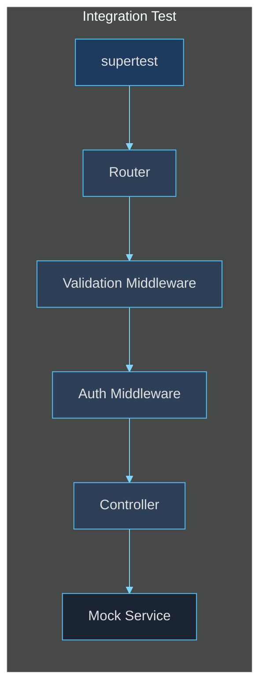

# Integration Testing Patterns

> **[Template]** This covers the base template feature. Extend or modify for your project.

Integration tests exercise the full HTTP middleware chain -- from routing through validation, authentication middleware, controller, and response formatting. They use supertest to make real HTTP requests against the Express app, while mocking the database and external services.

---

## Overview



Integration tests verify:
- Routes are mapped to the correct handlers
- Request validation rejects malformed input (Zod schemas)
- Authentication middleware blocks unauthenticated requests
- Controllers format responses correctly
- HTTP status codes are appropriate
- Response headers (e.g., `X-Request-ID`) are present
- Cookies are set and cleared properly

---

## File Structure

```
apps/api/test/
  integration/
    auth.integration.test.ts     # Auth endpoint tests
    admin.integration.test.ts    # Admin endpoint tests
    setup.ts                     # Shared supertest agent factory
```

### Setup Module (`setup.ts`)

The setup module provides a `createAgent()` function that lazily imports and caches the Express app:

```typescript
import request from 'supertest';
import type { Express } from 'express';

let appInstance: Express | null = null;

export async function createAgent() {
  if (!appInstance) {
    const mod = await import('../../src/app.js');
    appInstance = mod.default;
  }
  return request(appInstance);
}

export function resetApp() {
  appInstance = null;
}
```

> **Important**: The app is imported **after** `vi.mock` calls. Since `vi.mock` is hoisted, mocks are in place before the app initializes. Each test file must declare its own `vi.mock` calls -- they are not shared across files.

---

## Required Mocks

Integration tests must mock several infrastructure layers. These mocks go at the top of each integration test file, **before** any imports:

### Database Mock

```typescript
vi.mock('../../src/lib/db.js', () => {
  const mockSelect = vi.fn();
  const mockInsert = vi.fn();
  const mockUpdate = vi.fn();
  const mockDelete = vi.fn();
  const mockTransaction = vi.fn(
    async (cb: (tx: Record<string, unknown>) => Promise<unknown>) => {
      return cb({ select: mockSelect, insert: mockInsert, update: mockUpdate, delete: mockDelete });
    }
  );
  return {
    db: { select: mockSelect, insert: mockInsert, update: mockUpdate, delete: mockDelete, transaction: mockTransaction },
    __mocks: { mockSelect, mockInsert, mockUpdate, mockDelete, mockTransaction },
  };
});
```

### Logger Mock -- Real Pino Required

The logger mock is critical. Unlike unit tests (which use plain `vi.fn()` mocks), integration tests must use a **real Pino instance** because `pino-http` middleware accesses internal Pino properties (`levels.values`, `[stringifySym]`) that plain mocks do not have:

```typescript
// WRONG -- will crash with pino-http
vi.mock('../../src/lib/logger.js', () => ({
  default: { info: vi.fn(), error: vi.fn(), warn: vi.fn() },
}));

// CORRECT -- use real pino with silent level
vi.mock('../../src/lib/logger.js', async () => {
  const pino = await import('pino');
  return { default: pino.default({ level: 'silent' }) };
});
```

### Rate Limiter Mock

Rate limiters must be bypassed in tests to avoid 429 responses:

```typescript
vi.mock('../../src/middleware/rateLimit.middleware.js', () => {
  const passThrough = (_req: unknown, _res: unknown, next: () => void) => next();
  return {
    authRateLimiter: passThrough,
    registrationRateLimiter: passThrough,
    passwordResetRateLimiter: passThrough,
    apiRateLimiter: passThrough,
    apiKeyRateLimiter: passThrough,
  };
});
```

### pino-http Mock

If the app uses `pino-http` middleware, mock it as a pass-through:

```typescript
vi.mock('pino-http', () => ({
  default: () => (_req: unknown, _res: unknown, next: () => void) => next(),
}));
```

### Service Mocks

Mock the services that controllers call. This is the boundary between integration and unit tests -- integration tests exercise the middleware chain but not the service layer:

```typescript
vi.mock('../../src/services/auth.service.js', () => ({
  AuthService: {
    register: vi.fn(),
    login: vi.fn(),
    refresh: vi.fn(),
    logout: vi.fn(),
    getUser: vi.fn(),
    verifyMfaAndLogin: vi.fn(),
  },
}));
```

---

## Writing Integration Tests

### Basic Structure

```typescript
import { describe, it, expect, vi, beforeAll, beforeEach } from 'vitest';

// ... all vi.mock() calls above ...

import { createAgent } from './setup.js';
import { AuthService } from '../../src/services/auth.service.js';

describe('Auth Integration Tests', () => {
  let agent: Awaited<ReturnType<typeof createAgent>>;

  beforeAll(async () => {
    agent = await createAgent();
  });

  beforeEach(() => {
    vi.clearAllMocks();
  });

  it('POST /api/v1/auth/register -> 201', async () => {
    const data = {
      user: { id: 'u1', email: 'a@b.com', permissions: [] },
      accessToken: 'at',
      refreshToken: 'rt',
    };
    (AuthService.register as ReturnType<typeof vi.fn>)
      .mockResolvedValue({ ok: true, value: data });

    const res = await agent
      .post('/api/v1/auth/register')
      .send({ email: 'a@b.com', password: 'Password123!' });

    expect(res.status).toBe(201);
    expect(res.body.success).toBe(true);
    expect(res.body.data.user.email).toBe('a@b.com');
  });
});
```

### Testing Validation (Zod)

Integration tests naturally verify Zod validation because requests pass through the validation middleware:

```typescript
it('POST /api/v1/auth/register -> 400 invalid body', async () => {
  const res = await agent
    .post('/api/v1/auth/register')
    .send({ email: 'not-an-email', password: '123' });

  expect(res.status).toBe(400);
  expect(res.body.success).toBe(false);
  // The error message comes from z.prettifyError()
});
```

### Testing Authenticated Endpoints

For endpoints that require authentication, mock the JWT verification and the user lookup:

```typescript
import { verifyAccessToken } from '../../src/lib/jwt.js';
import { db } from '../../src/lib/db.js';
import { mockSelectChain } from '../utils/index.js';

it('GET /api/v1/auth/me -> 200 with valid token', async () => {
  // 1. Mock JWT verification to return a valid payload
  (verifyAccessToken as ReturnType<typeof vi.fn>)
    .mockReturnValue({ userId: 'u1', sessionId: 's1' });

  // 2. Mock the user lookup in auth middleware
  const mockUser = {
    id: 'u1',
    email: 'a@b.com',
    isAdmin: false,
    isActive: true,
    emailVerified: true,
  };
  mockSelectChain(db.select as ReturnType<typeof vi.fn>, [mockUser]);

  // 3. Mock the service response
  (AuthService.getUser as ReturnType<typeof vi.fn>)
    .mockResolvedValue({
      ok: true,
      value: { id: 'u1', email: 'a@b.com', permissions: ['users:read'] },
    });

  // 4. Make the request with Authorization header
  const res = await agent
    .get('/api/v1/auth/me')
    .set('Authorization', 'Bearer mock-token');

  expect(res.status).toBe(200);
  expect(res.body.success).toBe(true);
  expect(res.body.data.email).toBe('a@b.com');
});

it('GET /api/v1/auth/me -> 401 without token', async () => {
  const res = await agent.get('/api/v1/auth/me');

  expect(res.status).toBe(401);
});
```

### Testing Cookie Handling

supertest supports cookie assertions:

```typescript
it('POST /api/v1/auth/refresh -> 200 with cookie', async () => {
  const tokens = { accessToken: 'at2', refreshToken: 'rt2' };
  (AuthService.refresh as ReturnType<typeof vi.fn>)
    .mockResolvedValue({ ok: true, value: tokens });

  const res = await agent
    .post('/api/v1/auth/refresh')
    .set('Cookie', 'refreshToken=old-token');

  expect(res.status).toBe(200);
  expect(res.body.success).toBe(true);
  expect(res.body.data.accessToken).toBe('at2');
});
```

### Testing 404 Routes

```typescript
it('Unknown route returns 404', async () => {
  const res = await agent.get('/api/v1/nonexistent');

  expect(res.status).toBe(404);
  expect(res.body.success).toBe(false);
});
```

### Testing Response Headers

```typescript
it('Response includes X-Request-ID header', async () => {
  (AuthService.logout as ReturnType<typeof vi.fn>)
    .mockResolvedValue({ ok: true });

  const res = await agent
    .post('/api/v1/auth/logout')
    .set('Cookie', 'refreshToken=token');

  expect(res.headers['x-request-id']).toBeDefined();
});
```

---

## Testing Permission-Gated Endpoints

For endpoints that require specific permissions, you need to mock both the auth middleware and the permission check:

```typescript
// Mock PermissionService (used by auth middleware)
vi.mock('../../src/services/permission.service.js', () => ({
  PermissionService: {
    getUserPermissions: vi.fn().mockResolvedValue(new Set(['users:read'])),
    userHasPermission: vi.fn().mockResolvedValue(true),
    userHasAnyPermission: vi.fn().mockResolvedValue(true),
    userHasAllPermissions: vi.fn().mockResolvedValue(true),
  },
}));

// In the test, to simulate a user WITHOUT the required permission:
import { PermissionService } from '../../src/services/permission.service.js';

it('should return 403 when user lacks permission', async () => {
  (verifyAccessToken as ReturnType<typeof vi.fn>)
    .mockReturnValue({ userId: 'u1', sessionId: 's1' });
  mockSelectChain(db.select as ReturnType<typeof vi.fn>, [
    { id: 'u1', isAdmin: false, isActive: true, emailVerified: true },
  ]);

  // Override permission check to deny
  (PermissionService.userHasPermission as ReturnType<typeof vi.fn>)
    .mockResolvedValue(false);

  const res = await agent
    .delete('/api/v1/admin/users/u2')
    .set('Authorization', 'Bearer mock-token');

  expect(res.status).toBe(403);
});
```

---

## Testing Paginated Endpoints

```typescript
it('GET /api/v1/admin/users -> 200 with pagination', async () => {
  const users = [
    { id: 'u1', email: 'a@b.com' },
    { id: 'u2', email: 'c@d.com' },
  ];
  (AdminService.listUsers as ReturnType<typeof vi.fn>)
    .mockResolvedValue({
      ok: true,
      value: { data: users, total: 50, page: 1, limit: 20 },
    });

  // ... auth mocks ...

  const res = await agent
    .get('/api/v1/admin/users?page=1&limit=20')
    .set('Authorization', 'Bearer mock-token');

  expect(res.status).toBe(200);
  expect(res.body.success).toBe(true);
  expect(res.body.data).toHaveLength(2);
  expect(res.body.pagination).toEqual({
    page: 1,
    limit: 20,
    total: 50,
    totalPages: 3,
  });
});
```

---

## Complete Integration Test File Template

```typescript
// ===========================================
// Feature Integration Tests
// ===========================================

import { describe, it, expect, vi, beforeAll, beforeEach } from 'vitest';

// ----- Infrastructure mocks -----

vi.mock('../../src/lib/db.js', () => {
  const mockSelect = vi.fn();
  const mockInsert = vi.fn();
  const mockUpdate = vi.fn();
  const mockDelete = vi.fn();
  const mockTransaction = vi.fn(async (cb: (tx: Record<string, unknown>) => Promise<unknown>) => {
    return cb({ select: mockSelect, insert: mockInsert, update: mockUpdate, delete: mockDelete });
  });
  return {
    db: { select: mockSelect, insert: mockInsert, update: mockUpdate, delete: mockDelete, transaction: mockTransaction },
    __mocks: { mockSelect, mockInsert, mockUpdate, mockDelete, mockTransaction },
  };
});

vi.mock('../../src/middleware/rateLimit.middleware.js', () => {
  const passThrough = (_req: unknown, _res: unknown, next: () => void) => next();
  return {
    authRateLimiter: passThrough,
    registrationRateLimiter: passThrough,
    passwordResetRateLimiter: passThrough,
    apiRateLimiter: passThrough,
    apiKeyRateLimiter: passThrough,
  };
});

vi.mock('pino-http', () => ({
  default: () => (_req: unknown, _res: unknown, next: () => void) => next(),
}));

vi.mock('../../src/lib/logger.js', async () => {
  const pino = await import('pino');
  return { default: pino.default({ level: 'silent' }) };
});

// ----- Service mocks -----

vi.mock('../../src/services/my-feature.service.js', () => ({
  MyFeatureService: {
    list: vi.fn(),
    getById: vi.fn(),
    create: vi.fn(),
  },
}));

vi.mock('../../src/services/permission.service.js', () => ({
  PermissionService: {
    getUserPermissions: vi.fn().mockResolvedValue(new Set()),
    userHasPermission: vi.fn().mockResolvedValue(true),
    userHasAnyPermission: vi.fn().mockResolvedValue(true),
    userHasAllPermissions: vi.fn().mockResolvedValue(true),
  },
}));

vi.mock('../../src/services/audit.service.js', () => ({
  AuditService: {
    log: vi.fn().mockResolvedValue(undefined),
    getContextFromRequest: vi.fn().mockReturnValue({
      userId: undefined,
      ipAddress: '127.0.0.1',
      userAgent: 'test',
    }),
  },
}));

vi.mock('../../src/lib/jwt.js', () => ({
  signAccessToken: vi.fn().mockReturnValue('mock-access'),
  signRefreshToken: vi.fn().mockReturnValue('mock-refresh'),
  verifyAccessToken: vi.fn(),
  verifyRefreshToken: vi.fn(),
}));

vi.mock('../../src/services/api-key.service.js', () => ({
  ApiKeyService: {
    validateKey: vi.fn().mockResolvedValue({ ok: false, error: new Error('Invalid') }),
  },
}));

// ----- Imports -----

import { createAgent } from './setup.js';
import { MyFeatureService } from '../../src/services/my-feature.service.js';
import { verifyAccessToken } from '../../src/lib/jwt.js';
import { db } from '../../src/lib/db.js';
import { mockSelectChain } from '../utils/index.js';

// ----- Tests -----

describe('My Feature Integration Tests', () => {
  let agent: Awaited<ReturnType<typeof createAgent>>;

  beforeAll(async () => {
    agent = await createAgent();
  });

  beforeEach(() => {
    vi.clearAllMocks();
  });

  // Helper: set up authenticated request
  function mockAuth(userId = 'u1') {
    (verifyAccessToken as ReturnType<typeof vi.fn>)
      .mockReturnValue({ userId, sessionId: 's1' });
    mockSelectChain(db.select as ReturnType<typeof vi.fn>, [
      { id: userId, isAdmin: false, isActive: true, emailVerified: true },
    ]);
  }

  it('GET /api/v1/my-feature -> 200', async () => {
    mockAuth();
    (MyFeatureService.list as ReturnType<typeof vi.fn>)
      .mockResolvedValue({ ok: true, value: [] });

    const res = await agent
      .get('/api/v1/my-feature')
      .set('Authorization', 'Bearer mock-token');

    expect(res.status).toBe(200);
    expect(res.body.success).toBe(true);
  });

  it('GET /api/v1/my-feature -> 401 without auth', async () => {
    const res = await agent.get('/api/v1/my-feature');
    expect(res.status).toBe(401);
  });
});
```

---

## Common Pitfalls

### 1. Logger Mock Crashes

If you see errors about `levels.values` or `stringifySym`, you are using a plain `vi.fn()` mock for the logger. Use a real `pino({ level: 'silent' })` instance instead.

### 2. Rate Limiter Returning 429

If tests fail with 429 status codes, ensure the rate limiter middleware is mocked as a pass-through.

### 3. Mock Hoisting Order

`vi.mock()` calls are hoisted to the top of the file. All mocks must be declared before any `import` statements that load the modules being mocked. The actual `import` statements can appear after the `vi.mock()` declarations.

### 4. Auth Middleware User Lookup

The auth middleware does its own `db.select()` to look up the user after JWT verification. You must mock this select in addition to the JWT verification function. If you forget, the middleware will reject the request with 401.
