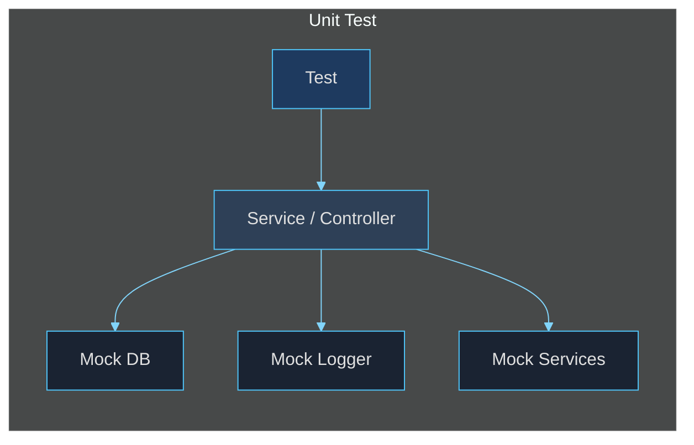

# Unit Testing Patterns

> **[Template]** This covers the base template feature. Extend or modify for your project.

This guide covers unit testing patterns for the API backend, including service testing with mock databases, controller testing with mock request/response objects, and the Result pattern.

---

## Overview

Unit tests mock all external dependencies (database, external services, logger) and test a single module in isolation. They verify business logic in services and request handling in controllers.



---

## Service Testing

### Setting Up the DB Mock

Every service test must mock `../lib/db.js`. The mock must be inlined in the `vi.mock()` factory because `vi.mock` calls are hoisted to the top of the file:

```typescript
import { describe, it, expect, vi, beforeEach } from 'vitest';

// Mock database -- must be inlined, not imported
vi.mock('../lib/db.js', () => {
  const mockSelect = vi.fn();
  const mockInsert = vi.fn();
  const mockUpdate = vi.fn();
  const mockDelete = vi.fn();
  const mockTransaction = vi.fn(
    async (cb: (tx: Record<string, unknown>) => Promise<unknown>) => {
      return cb({
        select: mockSelect,
        insert: mockInsert,
        update: mockUpdate,
        delete: mockDelete,
      });
    }
  );

  return {
    db: {
      select: mockSelect,
      insert: mockInsert,
      update: mockUpdate,
      delete: mockDelete,
      transaction: mockTransaction,
    },
    __mocks: { mockSelect, mockInsert, mockUpdate, mockDelete, mockTransaction },
  };
});

// Mock logger
vi.mock('../lib/logger.js', () => ({
  default: { info: vi.fn(), error: vi.fn(), warn: vi.fn() },
}));
```

> **Critical**: The `transaction` mock must pass the same mock functions (`select`, `insert`, `update`, `delete`) to the callback as `tx`. This ensures that operations inside `db.transaction(async (tx) => { ... })` use the same mocks you configure in your tests.

### Using Chain Helpers

After the mock is set up, use the chain helpers from `test/utils/` to configure return values:

```typescript
import { db } from '../lib/db.js';
import {
  mockSelectChain,
  mockInsertChain,
  mockUpdateChain,
  mockUpdateSetWhereChain,
  mockDeleteChain,
  createTestUser,
} from '../../test/utils/index.js';

describe('MyService', () => {
  beforeEach(() => {
    vi.clearAllMocks();
  });

  it('should find a user by ID', async () => {
    const user = createTestUser({ id: 'user-1', email: 'test@example.com' });

    // Configure: db.select().from().where() returns [user]
    mockSelectChain(db.select as ReturnType<typeof vi.fn>, [user]);

    const result = await MyService.getById('user-1');

    expect(result.ok).toBe(true);
    if (result.ok) {
      expect(result.value.email).toBe('test@example.com');
    }
  });

  it('should return error when user not found', async () => {
    // Configure: db.select().from().where() returns []
    mockSelectChain(db.select as ReturnType<typeof vi.fn>, []);

    const result = await MyService.getById('nonexistent');

    expect(result.ok).toBe(false);
    if (!result.ok) {
      expect(result.error.message).toContain('not found');
    }
  });
});
```

### Available Chain Helpers

| Helper                    | Mocks                                | Returns          |
|---------------------------|--------------------------------------|------------------|
| `mockSelectChain`         | `select().from().where()`            | `data[]`         |
| `mockSelectWithJoinChain` | `select().from().innerJoin().where()`| `data[]`         |
| `mockInsertChain`         | `insert().values().returning()`      | `data[]`         |
| `mockUpdateChain`         | `update().set().where().returning()` | `data[]`         |
| `mockUpdateSetWhereChain` | `update().set().where()`             | `void`           |
| `mockDeleteChain`         | `delete().where()`                   | `void`           |

### Testing Transactions

When the service uses `db.transaction()`, you may need to override the default transaction mock to control multiple operations inside the transaction:

```typescript
it('should create user and verification token in transaction', async () => {
  const mockUser = { id: 'user-1', email: 'test@example.com' };

  // Override the transaction mock for this test
  (db.transaction as ReturnType<typeof vi.fn>).mockImplementation(async (cb) => {
    const txInsert = vi.fn();
    // First insert: user
    txInsert.mockReturnValueOnce({
      values: vi.fn().mockReturnValue({
        returning: vi.fn().mockResolvedValue([mockUser]),
      }),
    });
    // Second insert: verification token
    txInsert.mockReturnValueOnce({
      values: vi.fn().mockResolvedValue(undefined),
    });

    return cb({
      insert: txInsert,
      select: vi.fn(),
      update: vi.fn(),
      delete: vi.fn(),
    });
  });

  const result = await AuthService.register('test@example.com', 'Password123!');

  expect(result.ok).toBe(true);
});
```

### Mocking Other Services

When a service depends on other services, mock them at the module level:

```typescript
// Mock PermissionService
vi.mock('./permission.service.js', () => ({
  PermissionService: {
    getUserPermissions: vi.fn().mockResolvedValue(new Set(['users:read'])),
  },
}));

// Mock bcrypt
vi.mock('bcrypt', () => ({
  default: {
    hash: vi.fn().mockResolvedValue('$2b$12$hashed'),
    compare: vi.fn().mockResolvedValue(true),
  },
}));

// Mock JWT
vi.mock('../lib/jwt.js', () => ({
  signAccessToken: vi.fn().mockReturnValue('mock-access-token'),
  signRefreshToken: vi.fn().mockReturnValue('mock-refresh-token'),
  verifyRefreshToken: vi.fn().mockReturnValue({ userId: 'user-1' }),
}));

// Mock job queue
vi.mock('../jobs/index.js', () => ({
  enqueue: vi.fn().mockResolvedValue(undefined),
  EMAIL_QUEUES: { VERIFICATION: 'email.verification' },
}));
```

To override a mock for a specific test, cast and reconfigure it:

```typescript
it('should return error for incorrect password', async () => {
  (bcrypt.compare as ReturnType<typeof vi.fn>).mockResolvedValue(false);

  const result = await AuthService.login('test@example.com', 'wrong');

  expect(result.ok).toBe(false);
});
```

---

## Controller Testing

Controllers are tested with mock `Request`, `Response`, and `NextFunction` objects from `test/utils/mock-express.ts`.

### Basic Controller Test Structure

```typescript
import { describe, it, expect, vi, beforeEach } from 'vitest';

// Mock the service (controllers call services, not DB directly)
vi.mock('../services/item.service.js', () => ({
  ItemService: {
    getById: vi.fn(),
    create: vi.fn(),
    update: vi.fn(),
    delete: vi.fn(),
  },
}));

vi.mock('../lib/logger.js', () => ({
  default: { info: vi.fn(), error: vi.fn(), warn: vi.fn() },
}));

import { ItemController } from './item.controller.js';
import { ItemService } from '../services/item.service.js';
import { createMockRequest, createMockResponse } from '../../test/utils/index.js';

describe('ItemController', () => {
  beforeEach(() => {
    vi.clearAllMocks();
  });

  describe('getById()', () => {
    it('should return 200 with item data on success', async () => {
      const item = { id: 'item-1', name: 'Test Item' };
      (ItemService.getById as ReturnType<typeof vi.fn>)
        .mockResolvedValue({ ok: true, value: item });

      const req = createMockRequest({ params: { id: 'item-1' } });
      const res = createMockResponse();

      await ItemController.getById(req, res as any);

      expect(res._status).toBe(200);
      expect(res._json).toEqual({ success: true, data: item });
    });

    it('should return 404 when item not found', async () => {
      (ItemService.getById as ReturnType<typeof vi.fn>)
        .mockResolvedValue({ ok: false, error: new Error('Not found') });

      const req = createMockRequest({ params: { id: 'nonexistent' } });
      const res = createMockResponse();

      await ItemController.getById(req, res as any);

      expect(res._status).toBe(404);
      expect(res._json).toEqual({ success: false, error: 'Item not found' });
    });
  });
});
```

### Mock Request Overrides

The `createMockRequest` function accepts these overrides:

```typescript
const req = createMockRequest({
  headers: { 'content-type': 'application/json' },
  body: { email: 'test@example.com', password: 'Password123!' },
  params: { id: 'user-1' },
  query: { page: '1', limit: '20' },
  cookies: { refreshToken: 'some-token' },
  ip: '192.168.1.1',
  user: { id: 'user-1', email: 'test@example.com', isAdmin: false },
  sessionId: 'session-1',
});
```

### Mock Response Inspection

The mock response tracks state internally for assertions:

```typescript
const res = createMockResponse();

// After calling the controller:
expect(res._status).toBe(201);           // HTTP status code
expect(res._json).toEqual({ ... });      // JSON response body
expect(res._headers['X-Custom']).toBe('value');  // Response headers
expect(res._cookies['token']).toBeDefined();     // Set cookies
expect(res._clearedCookies).toContain('token');  // Cleared cookies

// You can also use spy-style assertions:
expect(res.status).toHaveBeenCalledWith(201);
expect(res.json).toHaveBeenCalledWith({ success: true, data: { ... } });
```

---

## Testing the Result Pattern

Services return `Result<T>`, which is a discriminated union. Always check `result.ok` before accessing `result.value` or `result.error`:

### Testing Success

```typescript
it('should return the user on success', async () => {
  const user = createTestUser({ email: 'test@example.com' });
  mockSelectChain(db.select as ReturnType<typeof vi.fn>, [user]);

  const result = await UserService.getById(user.id);

  // Check success
  expect(result.ok).toBe(true);

  // TypeScript narrows the type after the check
  if (result.ok) {
    expect(result.value.email).toBe('test@example.com');
    expect(result.value.id).toBe(user.id);
  }
});
```

### Testing Errors

```typescript
it('should return error when user not found', async () => {
  mockSelectChain(db.select as ReturnType<typeof vi.fn>, []);

  const result = await UserService.getById('nonexistent');

  // Check failure
  expect(result.ok).toBe(false);

  // TypeScript narrows to the error branch
  if (!result.ok) {
    expect(result.error.message).toContain('not found');
  }
});
```

### Testing ServiceError Codes

When services throw `ServiceError` with specific codes:

```typescript
it('should return ALREADY_EXISTS error for duplicate email', async () => {
  const existingUser = createTestUser({ email: 'taken@example.com' });
  mockSelectChain(db.select as ReturnType<typeof vi.fn>, [existingUser]);

  const result = await AuthService.register('taken@example.com', 'Password123!');

  expect(result.ok).toBe(false);
  if (!result.ok) {
    expect(result.error).toHaveProperty('code', 'ALREADY_EXISTS');
    expect(result.error.message).toContain('already exists');
  }
});
```

### Testing ServiceError with Details

```typescript
it('should include remaining attempts in error details', async () => {
  // ... setup mocks ...

  const result = await AuthService.login('test@example.com', 'wrong');

  expect(result.ok).toBe(false);
  if (!result.ok) {
    expect(result.error).toHaveProperty('code', 'INVALID_CREDENTIALS');
    expect((result.error as any).details?.attemptsRemaining).toBe(3);
  }
});
```

---

## Using Data Factories

Always use factories from `test/utils/factories.ts` to create test data. Factories produce complete objects matching the Drizzle `$inferSelect` types:

```typescript
import {
  createTestUser,
  createTestSession,
  createTestRole,
  createTestPermission,
  createTestApiKey,
} from '../../test/utils/index.js';

// Default values
const user = createTestUser();
// { id: <uuid>, email: 'user-<timestamp>@example.com', isAdmin: false, ... }

// Override specific fields
const admin = createTestUser({
  email: 'admin@example.com',
  isAdmin: true,
});

// Related objects
const session = createTestSession({ userId: admin.id });
const role = createTestRole({ name: 'editor', isSystem: true });
const permission = createTestPermission({
  name: 'posts:write',
  resource: 'posts',
  action: 'write',
});
const apiKey = createTestApiKey({ userId: admin.id, name: 'CI Key' });
```

---

## Complete Service Test Example

Here is a full example showing the structure of a service test file:

```typescript
// ===========================================
// Item Service Tests
// ===========================================

import { describe, it, expect, vi, beforeEach } from 'vitest';

// ----- Mocks (hoisted to top) -----

vi.mock('../lib/db.js', () => {
  const mockSelect = vi.fn();
  const mockInsert = vi.fn();
  const mockUpdate = vi.fn();
  const mockDelete = vi.fn();
  const mockTransaction = vi.fn(
    async (cb: (tx: Record<string, unknown>) => Promise<unknown>) => {
      return cb({ select: mockSelect, insert: mockInsert, update: mockUpdate, delete: mockDelete });
    }
  );
  return {
    db: { select: mockSelect, insert: mockInsert, update: mockUpdate, delete: mockDelete, transaction: mockTransaction },
    __mocks: { mockSelect, mockInsert, mockUpdate, mockDelete, mockTransaction },
  };
});

vi.mock('../lib/logger.js', () => ({
  default: { info: vi.fn(), error: vi.fn(), warn: vi.fn() },
}));

// ----- Imports (after mocks) -----

import { ItemService } from './item.service.js';
import { db } from '../lib/db.js';
import {
  mockSelectChain,
  mockInsertChain,
  mockUpdateChain,
  mockDeleteChain,
} from '../../test/utils/index.js';

// ----- Tests -----

describe('ItemService', () => {
  beforeEach(() => {
    vi.clearAllMocks();
  });

  describe('getById()', () => {
    it('should return item when found', async () => {
      const item = { id: 'item-1', name: 'Widget', createdAt: new Date() };
      mockSelectChain(db.select as ReturnType<typeof vi.fn>, [item]);

      const result = await ItemService.getById('item-1');

      expect(result.ok).toBe(true);
      if (result.ok) {
        expect(result.value.name).toBe('Widget');
      }
    });

    it('should return error when not found', async () => {
      mockSelectChain(db.select as ReturnType<typeof vi.fn>, []);

      const result = await ItemService.getById('nonexistent');

      expect(result.ok).toBe(false);
    });
  });

  describe('create()', () => {
    it('should insert and return the new item', async () => {
      const newItem = { id: 'item-2', name: 'Gadget', createdAt: new Date() };
      mockInsertChain(db.insert as ReturnType<typeof vi.fn>, [newItem]);

      const result = await ItemService.create({ name: 'Gadget' });

      expect(result.ok).toBe(true);
      if (result.ok) {
        expect(result.value.name).toBe('Gadget');
      }
      expect(db.insert).toHaveBeenCalled();
    });
  });

  describe('delete()', () => {
    it('should delete the item', async () => {
      mockDeleteChain(db.delete as ReturnType<typeof vi.fn>);

      const result = await ItemService.delete('item-1');

      expect(result.ok).toBe(true);
      expect(db.delete).toHaveBeenCalled();
    });
  });
});
```

---

## Common Pitfalls

### 1. Forgetting `vi.clearAllMocks()` in `beforeEach`

Mock return values from one test bleed into the next. Always clear:

```typescript
beforeEach(() => {
  vi.clearAllMocks();
});
```

### 2. Missing Transaction Mock

If a service uses `db.transaction()` and the mock does not include it, the test will throw `db.transaction is not a function`. Always include `transaction` in the DB mock.

### 3. Incorrect Mock Chain Order

Each chain helper configures the mock for **one call**. If the service calls `db.select()` twice, you need to configure the mock twice, or use `mockReturnValueOnce`:

```typescript
// First select: find existing user -> none
mockSelectChain(db.select as ReturnType<typeof vi.fn>, []);

// But if there is a second select in the same service call,
// you need mockReturnValueOnce for proper sequencing
```

### 4. Not Narrowing Result Type

Always check `result.ok` before accessing `result.value` or `result.error`. Direct access without the check will not compile under strict TypeScript.
