# Database Backup & Restore

> **[Template]** This covers the base template feature. Extend or modify for your project.

> Backup procedures, automated schedules, restore operations, and point-in-time recovery.

---

## Overview

Regular database backups are critical for disaster recovery and operational safety. This document covers logical backup procedures using `pg_dump`, automated scheduling, restore workflows, and point-in-time recovery using WAL archiving. All examples target PostgreSQL 17 as used by this project.

---

## Backup Types

| Type | Tool | Use Case | Speed | Size |
|------|------|----------|-------|------|
| **Logical (full)** | `pg_dump` | Full database export, cross-version portability | Slower | Larger |
| **Logical (schema only)** | `pg_dump --schema-only` | Schema documentation, migration verification | Fast | Small |
| **Physical** | `pg_basebackup` | Bit-for-bit copy, PITR base | Fast | Full disk size |
| **WAL archiving** | Continuous | Point-in-time recovery, minimal data loss | Continuous | Incremental |

---

## Logical Backups with pg_dump

### Full Database Backup

```bash
# Custom format (compressed, supports parallel restore)
pg_dump -h localhost -p 5433 -U app -d app \
  -F c -Z 9 \
  -f backup-$(date +%Y%m%d-%H%M%S).dump

# Plain SQL format (human-readable, larger)
pg_dump -h localhost -p 5433 -U app -d app \
  -F p \
  -f backup-$(date +%Y%m%d-%H%M%S).sql
```

### Schema-Only Backup

```bash
pg_dump -h localhost -p 5433 -U app -d app \
  --schema-only \
  -f schema-$(date +%Y%m%d-%H%M%S).sql
```

### Data-Only Backup

```bash
pg_dump -h localhost -p 5433 -U app -d app \
  --data-only \
  -F c \
  -f data-$(date +%Y%m%d-%H%M%S).dump
```

### Exclude Specific Tables

For large tables that can be regenerated (e.g., audit logs, PKI audit logs):

```bash
pg_dump -h localhost -p 5433 -U app -d app \
  -F c -Z 9 \
  --exclude-table=audit_logs \
  --exclude-table=pki_audit_logs \
  -f backup-no-audit-$(date +%Y%m%d-%H%M%S).dump
```

---

## Automated Backup Schedule

### Recommended Schedule

| Frequency | Type | Retention | Storage |
|-----------|------|-----------|---------|
| **Hourly** | WAL archiving (continuous) | 7 days | S3 / object storage |
| **Daily** | Full logical backup (pg_dump) | 30 days | S3 / object storage |
| **Weekly** | Full logical backup (pg_dump) | 90 days | S3 / object storage |
| **Monthly** | Full logical backup (pg_dump) | 1 year | S3 / cold storage |

### Backup Script

```bash
#!/bin/bash
# backup-database.sh
# Run via cron: 0 2 * * * /opt/scripts/backup-database.sh

set -euo pipefail

DB_HOST="${DB_HOST:-localhost}"
DB_PORT="${DB_PORT:-5432}"
DB_USER="${DB_USER:-app}"
DB_NAME="${DB_NAME:-app}"
BACKUP_DIR="/var/backups/postgresql"
S3_BUCKET="${S3_BACKUP_BUCKET:-my-backup-bucket}"
RETENTION_DAYS=30
DATE=$(date +%Y%m%d-%H%M%S)
FILENAME="backup-${DB_NAME}-${DATE}.dump"

# Create backup directory
mkdir -p "${BACKUP_DIR}"

# Create backup
echo "Starting backup: ${FILENAME}"
pg_dump -h "${DB_HOST}" -p "${DB_PORT}" -U "${DB_USER}" -d "${DB_NAME}" \
  -F c -Z 9 \
  -f "${BACKUP_DIR}/${FILENAME}"

# Get file size
SIZE=$(du -h "${BACKUP_DIR}/${FILENAME}" | cut -f1)
echo "Backup completed: ${FILENAME} (${SIZE})"

# Upload to S3
echo "Uploading to S3..."
aws s3 cp "${BACKUP_DIR}/${FILENAME}" "s3://${S3_BUCKET}/database/${FILENAME}"
echo "Upload complete"

# Clean up old local backups
find "${BACKUP_DIR}" -name "backup-*.dump" -mtime +${RETENTION_DAYS} -delete
echo "Cleaned up local backups older than ${RETENTION_DAYS} days"

# Clean up old S3 backups (using lifecycle policies is preferred)
echo "Backup script finished successfully"
```

### Cron Configuration

```bash
# Daily full backup at 2:00 AM UTC
0 2 * * * /opt/scripts/backup-database.sh >> /var/log/backup.log 2>&1

# Weekly full backup (Sundays at 1:00 AM UTC) with extended retention
0 1 * * 0 RETENTION_DAYS=90 /opt/scripts/backup-database.sh >> /var/log/backup.log 2>&1
```

---

## Restore Procedures

### Restore from Custom Format (.dump)

```bash
# Drop and recreate the database (DESTRUCTIVE)
dropdb -h localhost -p 5433 -U app app
createdb -h localhost -p 5433 -U app app

# Restore
pg_restore -h localhost -p 5433 -U app -d app \
  --no-owner --no-privileges \
  backup-20260228-020000.dump
```

### Restore from SQL Format

```bash
# Drop and recreate the database (DESTRUCTIVE)
dropdb -h localhost -p 5433 -U app app
createdb -h localhost -p 5433 -U app app

# Restore
psql -h localhost -p 5433 -U app -d app -f backup-20260228-020000.sql
```

### Restore Specific Tables

```bash
# List tables in the backup
pg_restore --list backup.dump | grep TABLE

# Restore only specific tables
pg_restore -h localhost -p 5433 -U app -d app \
  --table=users --table=sessions --table=roles \
  --data-only \
  backup.dump
```

### Restore from S3

```bash
# Download from S3
aws s3 cp s3://my-backup-bucket/database/backup-20260228-020000.dump ./

# Then restore as above
pg_restore -h localhost -p 5433 -U app -d app \
  --no-owner --no-privileges \
  backup-20260228-020000.dump
```

---

## Point-in-Time Recovery (PITR)

### Overview

PITR allows restoring the database to any point in time by replaying Write-Ahead Log (WAL) segments on top of a base backup. This minimizes data loss in disaster scenarios.

```mermaid
%%{init: {'theme': 'dark', 'themeVariables': {'primaryColor': '#1e3a5f', 'primaryTextColor': '#e0e0e0', 'primaryBorderColor': '#4fc3f7', 'lineColor': '#81d4fa', 'secondaryColor': '#2e4057', 'tertiaryColor': '#1a2332', 'noteTextColor': '#e0e0e0', 'noteBkgColor': '#2e4057', 'noteBorderColor': '#4fc3f7'}}}%%
graph LR
    A[Base Backup<br/>pg_basebackup] --> B[WAL Segment 1]
    B --> C[WAL Segment 2]
    C --> D[WAL Segment N]
    D --> E[Target Time<br/>Recovery Point]

    style E fill:#1e3a5f,stroke:#4fc3f7,stroke-width:2px
```



### PostgreSQL Configuration for WAL Archiving

Add to `postgresql.conf`:

```ini
wal_level = replica
archive_mode = on
archive_command = 'aws s3 cp %p s3://my-backup-bucket/wal/%f'
archive_timeout = 60
```

### Taking a Base Backup

```bash
pg_basebackup -h localhost -p 5432 -U app \
  -D /var/backups/basebackup \
  -Ft -z -P
```

### Performing PITR

1. Stop PostgreSQL
2. Restore the base backup to the data directory
3. Create a `recovery.conf` (PostgreSQL < 12) or `postgresql.auto.conf` entry:
   ```ini
   restore_command = 'aws s3 cp s3://my-backup-bucket/wal/%f %p'
   recovery_target_time = '2026-02-28 14:30:00 UTC'
   recovery_target_action = 'promote'
   ```
4. Start PostgreSQL -- it will replay WAL segments up to the target time
5. Verify the data and promote to primary

### Managed Database PITR

Most managed PostgreSQL services (AWS RDS, GCP Cloud SQL, Azure Database) include built-in PITR:

| Provider | PITR Retention | Recovery Granularity |
|----------|---------------|---------------------|
| AWS RDS | Up to 35 days | 5-minute granularity |
| GCP Cloud SQL | Up to 7 days | Per-transaction |
| Azure Database | Up to 35 days | Per-transaction |

Use the managed PITR in production rather than self-managing WAL archiving.

---

## Testing Backups

### Monthly Backup Verification Procedure

1. Download the latest backup from S3
2. Restore to a temporary database instance
3. Run verification queries:

```sql
-- Verify row counts match expectations
SELECT 'users' AS table_name, count(*) FROM users
UNION ALL
SELECT 'roles', count(*) FROM roles
UNION ALL
SELECT 'permissions', count(*) FROM permissions
UNION ALL
SELECT 'sessions', count(*) FROM sessions
UNION ALL
SELECT 'audit_logs', count(*) FROM audit_logs;

-- Verify latest data timestamp
SELECT max(created_at) AS latest_user FROM users;
SELECT max(created_at) AS latest_audit FROM audit_logs;

-- Verify referential integrity
SELECT count(*) AS orphaned_sessions
FROM sessions s
LEFT JOIN users u ON s.user_id = u.id
WHERE u.id IS NULL;
```

4. Verify the application can connect and serve requests against the restored database
5. Document the results and destroy the temporary instance

### Backup Health Checks

Add these to your monitoring:

| Check | Frequency | Alert If |
|-------|-----------|----------|
| Backup file exists | Daily | No backup in last 26 hours |
| Backup file size | Daily | Size < 50% of previous backup |
| Backup age | Hourly | Newest backup > 24 hours old |
| Restore test | Monthly | Restore fails |

---

## S3 Backup Storage

### Bucket Configuration

```bash
# Create backup bucket
aws s3 mb s3://my-backup-bucket

# Enable versioning (protection against accidental deletion)
aws s3api put-bucket-versioning \
  --bucket my-backup-bucket \
  --versioning-configuration Status=Enabled

# Set lifecycle policy for automatic cleanup
aws s3api put-bucket-lifecycle-configuration \
  --bucket my-backup-bucket \
  --lifecycle-configuration '{
    "Rules": [
      {
        "ID": "TransitionToGlacier",
        "Filter": {"Prefix": "database/"},
        "Status": "Enabled",
        "Transitions": [
          {"Days": 90, "StorageClass": "GLACIER"}
        ],
        "Expiration": {"Days": 365}
      }
    ]
  }'
```

### Encryption

- Enable SSE-S3 or SSE-KMS encryption on the backup bucket
- Use a separate KMS key for backup encryption
- Ensure backup credentials are separate from application credentials

---

## Related Documentation

- [Database Operations Index](./README.md) - Overview of database documentation
- [Migrations](./migrations.md) - Pre-migration backup requirements
- [Incidents](../incidents.md) - Database failure recovery procedures
- [Data Protection](../../security/data-protection.md) - Encryption requirements
