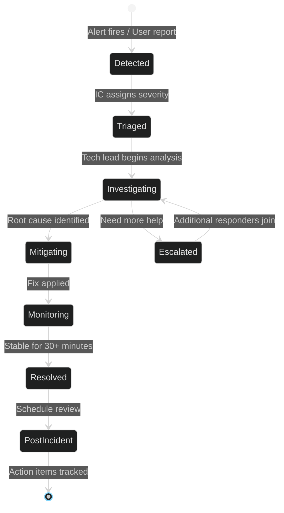

# Incident Response Runbook

> **[Template]** This covers the base template feature. Extend or modify for your project.

> Severity levels, response procedures, common incidents, and post-incident review templates.

---

## Overview

This document defines the incident response process, severity classifications, roles, and playbooks for common failure scenarios. It provides a structured framework for handling production incidents, from initial detection through resolution and post-incident review.

---

## Severity Levels

| Severity | Description | Response Time | Update Cadence | Examples |
|----------|-------------|---------------|----------------|----------|
| **SEV1** | Complete outage, data loss risk, security breach | Immediate (< 15 min) | Every 30 minutes | Database down, auth system failure, data breach |
| **SEV2** | Major feature degraded, significant user impact | < 30 minutes | Every 1 hour | Login failures for subset of users, slow API (> 5s p95), email delivery failure |
| **SEV3** | Minor feature degraded, limited user impact | < 2 hours | Every 4 hours | Non-critical endpoint errors, UI rendering issues, background job delays |
| **SEV4** | Cosmetic issue, no functional impact | Next business day | Daily | Typos, minor UI inconsistencies, log formatting |

---

## Incident Roles

### Incident Commander (IC)

- Declares the incident and assigns severity
- Coordinates communication between responders
- Owns the timeline and status updates
- Decides when to escalate or de-escalate
- Calls the post-incident review meeting

### Technical Lead

- Investigates root cause
- Implements the fix or coordinates with the appropriate team
- Communicates technical details to the IC
- Documents technical findings

### Communications Lead

- Posts status updates to the status page
- Notifies affected users/stakeholders
- Manages internal communication channels
- Sends post-incident summary to stakeholders

---

## Incident Lifecycle



---

## Communication Plan

### Internal Communication

| Severity | Channel | Stakeholders |
|----------|---------|-------------|
| SEV1 | Dedicated incident channel + phone/SMS | All engineering, management, on-call |
| SEV2 | Dedicated incident channel | Engineering team, team lead |
| SEV3 | Team channel | Relevant engineers |
| SEV4 | Ticket/issue tracker | Assigned engineer |

### External Communication (SEV1/SEV2)

| Timing | Action |
|--------|--------|
| Detection + 15 min | Post initial status update: "We are investigating an issue with [service]" |
| Every 30-60 min | Update with progress: "We have identified the cause and are working on a fix" |
| Resolution | Post resolution notice: "The issue has been resolved. [Brief summary]" |
| Post-incident + 48h | Publish post-incident report (for SEV1) |

### Status Page Template

```
Title: [Service] - [Impact Description]
Status: Investigating | Identified | Monitoring | Resolved

[Timestamp] - We are aware of an issue affecting [description of user impact].
Our team is actively investigating.

[Timestamp] - We have identified the root cause as [brief technical summary].
A fix is being deployed.

[Timestamp] - The fix has been deployed and we are monitoring the situation.

[Timestamp] - This incident has been resolved. [Summary of what happened and what was done].
```

---

## Common Incident Playbooks

### 1. Database Connection Failures

**Symptoms:** 5xx errors across all endpoints, health check passing but API calls failing, connection timeout errors in logs.

**Diagnosis:**
```bash
# Check database container
docker ps | grep app-db
docker logs app-db --tail 50

# Check connection from API container
docker exec app-api pg_isready -h db -U app -d app

# Check active connections
docker exec app-db psql -U app -d app -c "SELECT count(*) FROM pg_stat_activity;"

# Check for connection pool exhaustion in API logs
# Look for: "connection pool exhausted" or "timeout expired"
```

**Resolution:**
1. Verify database container is running and healthy
2. Check `DATABASE_URL` is correct in the environment
3. If pool exhausted: restart application to reset connections
4. If database crashed: restart the container, check disk space, check for OOM kill
5. If persistent: check for long-running queries holding connections

---

### 2. Authentication Failures Spike

**Symptoms:** Increase in 401/403 responses, user reports of inability to log in, lockout count rising.

**Diagnosis:**
```bash
# Check for brute force patterns in logs
# Look for repeated failed login attempts from same IP

# Check account lockout status
docker exec app-db psql -U app -d app -c \
  "SELECT email, failed_login_attempts, locked_until FROM users WHERE locked_until > NOW();"

# Check rate limiter state
# Look for 429 responses in logs

# Verify JWT_SECRET hasn't changed
# If it changed, all existing tokens become invalid
```

**Resolution:**
1. If brute force: verify rate limiting is active, consider IP blocking at the load balancer
2. If mass lockouts: check if `JWT_SECRET` was rotated (all sessions invalidated)
3. If JWT validation fails: verify secret matches across all instances
4. To unlock specific users:
   ```sql
   UPDATE users SET failed_login_attempts = 0, locked_until = NULL WHERE email = 'user@example.com';
   ```

---

### 3. Certificate Expiry (PKI)

**Symptoms:** Certificate-based authentication failures, browser TLS warnings, PKI audit log entries for expired certificates.

**Diagnosis:**
```bash
# Check for expiring certificates
docker exec app-db psql -U app -d app -c \
  "SELECT serial_number, subject_cn, not_after FROM certificates WHERE not_after < NOW() + interval '7 days' AND status = 'active';"

# Check CA certificate expiry
docker exec app-db psql -U app -d app -c \
  "SELECT name, status FROM certificate_authorities WHERE id IN (SELECT ca_id FROM certificates WHERE not_after < NOW());"
```

**Resolution:**
1. For server/client certificates: issue a replacement via the Admin UI or API
2. For CA certificates: follow the CA renewal procedure (requires careful planning)
3. Generate a fresh CRL after any revocations
4. Notify certificate holders of upcoming expirations proactively (30-day warning)

---

### 4. High Error Rate (5xx Spike)

**Symptoms:** Monitoring alerts for 5xx rate > threshold, user reports of errors, Sentry flood.

**Diagnosis:**
```bash
# Check recent deployment
git log --oneline -5

# Check application logs for error patterns
# Filter for level >= 50 (error)

# Check resource utilization
docker stats app-api

# Check external dependencies (database, S3, email)
curl -s http://localhost:3000/health | jq .
```

**Resolution:**
1. If correlated with a deployment: rollback to the previous version
2. If resource exhaustion: scale horizontally or vertically
3. If external dependency failure: check that dependency, implement circuit breaker
4. If code bug: hotfix, test, deploy

---

### 5. Memory Leak

**Symptoms:** RSS memory growing steadily over time, eventual OOM kill, Node.js heap warnings.

**Diagnosis:**
```bash
# Monitor memory over time
docker stats app-api --no-stream

# Check Node.js heap usage
# If --inspect is enabled, connect Chrome DevTools for heap snapshot
# Look for growing arrays, unclosed connections, event listener leaks

# Check for common causes:
# - Unclosed database connections
# - Growing in-memory caches (settings service has a 1-minute TTL cache)
# - Event listeners accumulating
# - Large request bodies not being garbage collected
```

**Resolution:**
1. Short-term: restart the process (rolling restart to maintain availability)
2. Long-term: capture heap snapshots, identify growing objects
3. Check for known patterns: unclosed streams, accumulating timers, growing Maps/Sets
4. Add memory monitoring alerts to catch early

---

### 6. S3/MinIO Unavailable

**Symptoms:** File upload/download failures, storage-related 500 errors.

**Diagnosis:**
```bash
# Check MinIO container
docker ps | grep app-minio
docker logs app-minio --tail 50

# Test S3 connectivity
aws --endpoint-url http://localhost:9000 s3 ls s3://app-uploads/

# Check S3 credentials in environment
echo $S3_ENDPOINT $S3_ACCESS_KEY
```

**Resolution:**
1. Restart MinIO container if crashed
2. Check disk space on MinIO data volume
3. Verify credentials have not expired or been rotated
4. For production S3: check AWS service health dashboard

---

## Post-Incident Review Template

### Required for: SEV1 and SEV2 incidents
### Recommended for: Repeated SEV3 incidents
### Timing: Within 5 business days of resolution

---

```markdown
# Post-Incident Review: [Incident Title]

## Summary
- **Date/Time:** [Start time] -- [Resolution time]
- **Duration:** [Total duration]
- **Severity:** SEV[1-4]
- **Incident Commander:** [Name]
- **Impact:** [Description of user impact, number of users affected]

## Timeline
| Time (UTC) | Event |
|------------|-------|
| HH:MM | Alert fired / Issue reported |
| HH:MM | IC declared, severity assigned |
| HH:MM | Root cause identified |
| HH:MM | Fix deployed |
| HH:MM | Monitoring confirmed stable |
| HH:MM | Incident resolved |

## Root Cause
[Detailed technical explanation of what went wrong and why]

## Impact
- **Users affected:** [Number or percentage]
- **Duration of impact:** [Time]
- **Data loss:** [Yes/No, details]
- **SLO impact:** [Which SLOs were breached, error budget consumed]

## What Went Well
- [List things that worked during the response]

## What Could Be Improved
- [List areas for improvement]

## Action Items
| Action | Owner | Priority | Due Date | Status |
|--------|-------|----------|----------|--------|
| [Description] | [Name] | P1/P2/P3 | [Date] | Open |

## Lessons Learned
[Key takeaways that should inform future development and operations]
```

---

## Escalation Contacts

| Role | Contact | When to Contact |
|------|---------|----------------|
| On-call engineer | [Configure in PagerDuty/OpsGenie] | First responder for all alerts |
| Engineering lead | [Name/contact] | SEV1/SEV2, or when on-call needs help |
| Security lead | [Name/contact] | Security incidents, data breaches |
| Database admin | [Name/contact] | Database-related SEV1/SEV2 |
| Management | [Name/contact] | SEV1 with user impact, data loss |

---

## Related Documentation

- [Monitoring Guide](./monitoring.md) - Alerting and metrics
- [Database Operations](./database/README.md) - Database troubleshooting
- [Deployment Guide](./deployment.md) - Rollback procedures
- [SLA/SLO](../project/sla-slo.md) - Service level targets
