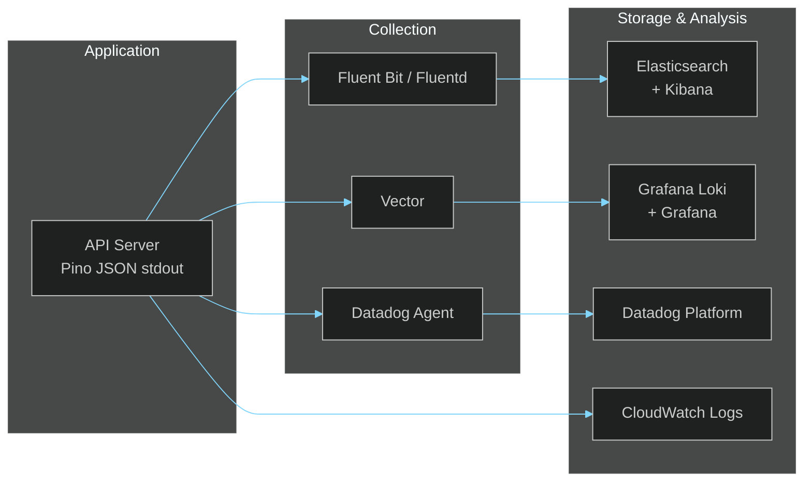

# Monitoring Guide

> **[Template]** This covers the base template feature. Extend or modify for your project.

> Health checks, structured logging, metrics, and alerting recommendations.

---

## Overview

The application is designed for observability from the ground up. Structured JSON logging via Pino, a built-in health endpoint, request ID tracking, and Sentry integration provide a solid monitoring foundation. This guide covers how to leverage these capabilities and recommendations for production monitoring infrastructure.

---

## Health Check Endpoint

### `GET /health`

Returns the application health status. This endpoint is excluded from request logging to prevent log noise from load balancer probes.

**Response:**
```json
{
  "status": "ok",
  "timestamp": "2026-02-28T12:00:00.000Z",
  "uptime": 86400.123
}
```

**Fields:**
| Field | Type | Description |
|-------|------|-------------|
| `status` | `string` | Always `"ok"` when the process is running |
| `timestamp` | `string` | ISO 8601 timestamp of the response |
| `uptime` | `number` | Process uptime in seconds |

### Health Check Configuration

| Platform | Configuration |
|----------|--------------|
| Docker Compose | `healthcheck: { test: ["CMD", "curl", "-f", "http://localhost:3000/health"], interval: 30s }` |
| Kubernetes | `livenessProbe: { httpGet: { path: /health, port: 3000 }, initialDelaySeconds: 10, periodSeconds: 30 }` |
| AWS ALB | Target group health check path: `/health`, interval: `30s`, healthy threshold: `2` |
| NGINX upstream | `proxy_pass http://backend/health;` in upstream health check |

### Extending the Health Check

For production, consider extending the health endpoint to include dependency checks:

```typescript
// Example: deep health check
app.get('/health/deep', async (_req, res) => {
  const checks = {
    database: await checkDatabase(),
    storage: await checkS3(),
    email: await checkEmailProvider(),
  };
  const healthy = Object.values(checks).every(c => c.status === 'ok');
  res.status(healthy ? 200 : 503).json({
    status: healthy ? 'ok' : 'degraded',
    timestamp: new Date().toISOString(),
    checks,
  });
});
```

---

## Structured Logging (Pino)

### Log Configuration

The application uses Pino for all logging. Configuration is defined in `apps/api/src/lib/logger.ts`:

- **Development:** Pretty-printed with colors via `pino-pretty`
- **Production:** JSON format to stdout (no transport overhead)
- **Log level:** Controlled by `LOG_LEVEL` environment variable

### Log Levels

| Level | Value | Usage |
|-------|-------|-------|
| `fatal` | 60 | Unrecoverable errors, process about to exit |
| `error` | 50 | Operation failures, caught exceptions |
| `warn` | 40 | Deprecations, approaching limits, recoverable issues |
| `info` | 30 | Request lifecycle, significant events, startup/shutdown |
| `debug` | 20 | Detailed flow information (development only) |
| `trace` | 10 | Extremely detailed tracing (rarely used) |

**Production recommendation:** `LOG_LEVEL=info` or `LOG_LEVEL=warn`

### Log Format (Production)

```json
{
  "level": 30,
  "time": 1709136000000,
  "pid": 1,
  "hostname": "app-api-7f8b9c",
  "requestId": "req-abc123",
  "msg": "Request completed",
  "req": { "method": "POST", "url": "/api/v1/auth/login" },
  "res": { "statusCode": 200 },
  "responseTime": 42
}
```

### Request Logging

All HTTP requests are logged automatically via `pino-http` middleware with:
- **Request ID:** Generated per-request via `requestId` middleware, included in all log lines
- **Timing:** Response time measured automatically
- **Exclusions:** `GET /health` is excluded from request logging to reduce noise
- **Sentry correlation:** Request ID is tagged on the Sentry scope for error correlation

### Logging Best Practices

```typescript
// Correct: object first, message second (Pino argument order)
logger.info({ userId, action: 'login' }, 'User logged in');

// Correct: error logging
logger.error({ error: result.error.toString(), userId }, 'Failed to update user');

// NEVER use console.log -- Pino is the only logger
// NEVER log sensitive data (passwords, tokens, full keys)
```

---

## Log Aggregation

### Recommended Stacks



| Stack | Best For | Cost |
|-------|----------|------|
| **ELK** (Elasticsearch + Logstash + Kibana) | Full-text search, complex queries | Self-hosted or Elastic Cloud |
| **Grafana Loki** + Grafana | Label-based querying, Kubernetes native | Open source / Grafana Cloud |
| **Datadog** | All-in-one (logs, metrics, APM, traces) | Per-host pricing |
| **AWS CloudWatch** | AWS-native deployments | Pay-per-use |

### Pino Transport Integration

For direct log shipping (alternative to file/stdout collection):

```typescript
// pino-datadog-transport
import pino from 'pino';

const logger = pino({
  transport: {
    target: 'pino-datadog-transport',
    options: { apiKey: process.env.DD_API_KEY }
  }
});
```

---

## Database Monitoring

### Connection Pool

Monitor the Drizzle/pg connection pool for:

| Metric | Warning | Critical | Description |
|--------|---------|----------|-------------|
| Active connections | > 80% of pool | > 95% of pool | Connections currently in use |
| Idle connections | -- | 0 for > 30s | No idle connections available |
| Wait time | > 100ms | > 1000ms | Time waiting for available connection |
| Connection errors | > 0/min | > 5/min | Failed connection attempts |

### PostgreSQL Queries

```sql
-- Active connections by state
SELECT state, count(*) FROM pg_stat_activity
WHERE datname = 'app' GROUP BY state;

-- Long-running queries (> 5s)
SELECT pid, now() - pg_stat_activity.query_start AS duration, query
FROM pg_stat_activity
WHERE state != 'idle' AND now() - pg_stat_activity.query_start > interval '5 seconds';

-- Table sizes
SELECT relname, pg_size_pretty(pg_total_relation_size(relid))
FROM pg_catalog.pg_statio_user_tables ORDER BY pg_total_relation_size(relid) DESC;

-- Index usage
SELECT relname, indexrelname, idx_scan, idx_tup_read, idx_tup_fetch
FROM pg_stat_user_indexes ORDER BY idx_scan DESC;
```

### Recommended Tools

- **pgAdmin** for ad-hoc database inspection
- **pg_stat_statements** extension for query performance tracking
- **Drizzle Studio** (`pnpm db:studio`) for development schema browsing

---

## Application Metrics

### Key Metrics to Track

| Category | Metric | Type | Description |
|----------|--------|------|-------------|
| **HTTP** | Request rate | Counter | Requests per second by endpoint |
| **HTTP** | Response time (p50, p95, p99) | Histogram | Latency distribution |
| **HTTP** | Error rate (4xx, 5xx) | Counter | Client and server errors |
| **Auth** | Login attempts | Counter | Total and failed login counts |
| **Auth** | Account lockouts | Counter | Lockout events triggered |
| **Auth** | Active sessions | Gauge | Current session count |
| **Auth** | Token refreshes | Counter | Refresh token usage rate |
| **PKI** | Certificates issued | Counter | New certificates created |
| **PKI** | Certificates revoked | Counter | Revocations processed |
| **PKI** | Certificates expiring (30d) | Gauge | Upcoming expirations |
| **Email** | Emails sent | Counter | By type (verification, reset, etc.) |
| **Email** | Email failures | Counter | Failed delivery attempts |
| **Storage** | Upload/download count | Counter | S3 operations |
| **System** | Memory usage | Gauge | RSS and heap usage |
| **System** | Event loop lag | Gauge | Node.js event loop delay |
| **System** | CPU usage | Gauge | Process CPU utilization |

### Sentry Integration

The application includes optional Sentry integration for error tracking and performance monitoring:

- **Error tracking:** Unhandled exceptions and rejected promises
- **Performance:** Transaction tracing with configurable sample rate (`SENTRY_TRACES_SAMPLE_RATE`)
- **Request correlation:** Request IDs are tagged on the Sentry scope
- **Configuration:** Set `SENTRY_DSN` to enable

---

## Alerting Recommendations

### Critical Alerts (Page Immediately)

| Alert | Condition | Action |
|-------|-----------|--------|
| Health check failure | `/health` returns non-200 for > 2 minutes | Check process, restart if needed |
| Error rate spike | 5xx rate > 5% for > 5 minutes | Check logs, recent deployments |
| Database unreachable | Connection failures > 0 for > 1 minute | Check database, network, credentials |
| Certificate expiry | CA or critical cert expires within 7 days | Renew certificate immediately |
| Disk space | > 90% usage | Expand storage, clean old data |

### Warning Alerts (Business Hours)

| Alert | Condition | Action |
|-------|-----------|--------|
| High latency | p95 > 2s for > 10 minutes | Investigate slow queries, load |
| Account lockout spike | > 10 lockouts in 15 minutes | Possible brute force, check IPs |
| Memory growth | RSS increasing steadily over 24h | Investigate memory leaks |
| Queue backlog | Pending jobs > 100 for > 30 minutes | Check job processors, scale |
| Certificate expiry warning | Any cert expires within 30 days | Plan renewal |

### Informational (Dashboard / Weekly Review)

| Metric | Review For |
|--------|-----------|
| User registration rate | Growth trends |
| API usage by endpoint | Feature adoption |
| Error budget consumption | SLO compliance |
| Dependency vulnerabilities | Security posture |

---

## Dashboard Template

### Recommended Dashboard Panels

1. **Overview Row:** Request rate, error rate, p95 latency, active users
2. **Authentication Row:** Login success/failure ratio, MFA usage, lockout events
3. **Infrastructure Row:** CPU, memory, database connections, S3 operations
4. **PKI Row:** Certificates issued/revoked, expiring certificates, CRL generation
5. **Errors Row:** Top errors by type, Sentry issues, 5xx endpoints

---

## Related Documentation

- [Incidents](./incidents.md) - Incident response procedures
- [Environment Configuration](./environment-config.md) - LOG_LEVEL and Sentry configuration
- [SLA/SLO](../project/sla-slo.md) - Service level targets
- [Production Checklist](./production-checklist.md) - Pre-launch monitoring verification
