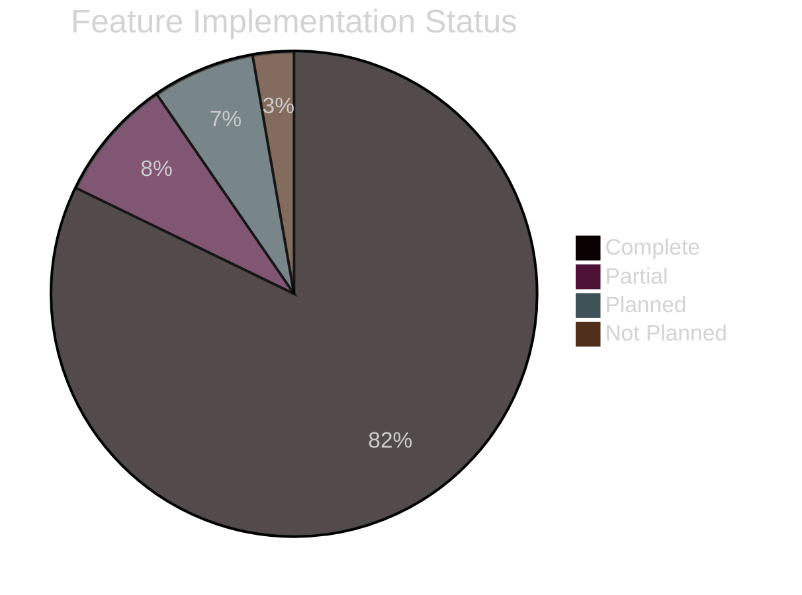

# Product Documentation

> **[Template]** This covers the base template feature. Extend or modify for your project.

> Feature tracking, release history, and administration guides.

---

## Overview

This section provides product-level documentation for stakeholders, product managers, and administrators. It tracks feature status, documents releases, and provides guides for administering the application.

---

## Sections

### Feature Tracker

> [`feature-tracker.md`](./feature-tracker.md)

Comprehensive feature status tracker:
- 146 features across 16 categories
- Status tracking (Complete, Partial, Planned, Not Planned)
- Categories: Infrastructure, Authentication, MFA, Sessions, RBAC, API Keys, PKI, Email, Storage, Frontend, Admin, System Settings, API Quality, Testing, Security, Deployment
- Feature-by-feature implementation notes

---

### Changelog

> [`changelog.md`](./changelog.md)

Release history and change log:
- Version-by-version changes
- Breaking changes highlighted
- Migration guides for major versions
- Follows [Keep a Changelog](https://keepachangelog.com/) format

---

### Admin Guide

> [`admin-guide.md`](./admin-guide.md)

Guide for application administrators:
- User management (create, update, disable, delete)
- Role and permission management
- System settings configuration
- Feature flag management
- Audit log review
- API key administration
- Session monitoring and revocation
- PKI/CA management (if enabled)

---

## Feature Status Summary

---

## Related Documentation

- [Template Features](../../template-docs/features/README.md) - Base template feature specifications
- [Roadmap](../project/roadmap.md) - Future development plans
- [User Stories](../stories/README.md) - Detailed user stories for all features
- [QA Test Cases](../qa/README.md) - Test coverage for all features
