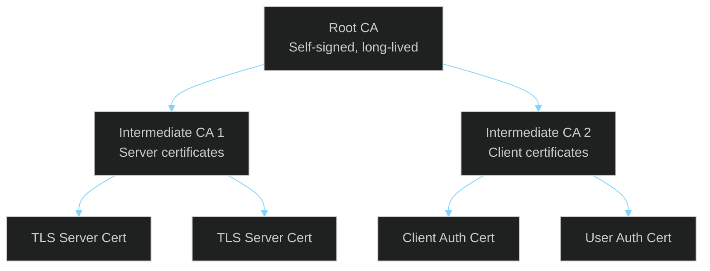

# Admin Guide

> **[Template]** This covers the base template feature. Extend or modify for your project.

> Comprehensive guide for application administrators covering all admin features and workflows.

---

## Overview

This guide covers the administration capabilities available to users with the **Admin** or **Super Admin** role. Administrators can manage users, roles, permissions, system settings, audit logs, API keys, service accounts, notifications, and PKI infrastructure through the Admin UI and API.

---

## Getting Started

### First Login

After running the seed script (`pnpm db:seed`), log in with the default admin credentials:

| Field | Value |
|-------|-------|
| **Email** | `admin@app.local` |
| **Password** | `Admin123!` |
| **Role** | Super Admin |

**IMPORTANT:** Change the default password immediately after first login.

### Admin Access Levels

| Role | Scope | Description |
|------|-------|-------------|
| **Super Admin** | All permissions (35) | Full system access. Cannot be deleted. Has every permission |
| **Admin** | User/system management (16 permissions) | User management, system settings, audit logs, API keys, service accounts |
| **PKI Admin** | Full PKI management (17 permissions) | CA hierarchy, certificates, CSR approval, CRL generation, profiles |
| **PKI Operator** | Day-to-day PKI (11 permissions) | Issue/revoke/renew certificates, approve CSRs, read-only CA and profiles |

---

## Dashboard

The admin dashboard provides an at-a-glance view of system health and activity:

- **User Statistics:** Total users, active users, recently registered
- **Session Statistics:** Active sessions, sessions by device type
- **System Health:** Database connection status, recent errors
- **Quick Actions:** Common admin tasks

---

## User Management

### Viewing Users

Navigate to **Admin > Users** to see the user list with:
- Email address
- Account type (user or service)
- Status (active/inactive)
- Roles assigned
- Last login time
- Created date

**Required permission:** `users:read`

### Searching Users

Use the search bar to filter users by:
- Email address (partial match)
- Status (active, inactive, locked)
- Role assignment

### Activating / Deactivating Users

1. Select the user from the list
2. Toggle the **Active** status
3. Deactivated users cannot log in; their existing sessions remain valid until expiry

**Required permission:** `users:update`

### Unlocking Accounts

If a user has been locked out due to failed login attempts:

1. Navigate to the user's detail page
2. Click **Unlock Account**
3. This resets `failed_login_attempts` to 0 and clears `locked_until`

**Required permission:** `users:update`

### Assigning Roles

1. Navigate to the user's detail page
2. Click **Manage Roles**
3. Select roles to assign or remove
4. Users can have multiple roles; permissions are the union of all role permissions

**Required permission:** `users:update`

### Deleting Users

1. Navigate to the user's detail page
2. Click **Delete User**
3. This is a permanent action. All associated data (sessions, API keys, audit references) will be cascade-deleted

**Required permission:** `users:delete`

---

## Role Management

### Viewing Roles

Navigate to **Admin > Roles** to see all roles with their permission counts and system status.

**Required permission:** `roles:read`

### Creating Roles

1. Click **Create Role**
2. Enter a role name and description
3. Select permissions from the available permission list
4. Save

Permissions follow the `resource:action` convention (e.g., `users:read`, `certificates:issue`).

**Required permission:** `roles:create`

### Editing Roles

1. Select the role from the list
2. Modify the name, description, or permission assignments
3. Save changes
4. Changes take effect on the next request for users with this role

**Note:** The **Super Admin** role is a system role and cannot be modified.

**Required permission:** `roles:update`

### Deleting Roles

1. Select the role from the list
2. Click **Delete**
3. System roles (`isSystem: true`) cannot be deleted
4. Users assigned to the deleted role will lose those permissions

**Required permission:** `roles:delete`

### Available Permissions

Permissions are organized by resource:

| Resource | Actions | Description |
|----------|---------|-------------|
| **users** | read, create, update, delete | User account management |
| **roles** | read, create, update, delete | Role management |
| **settings** | read, update | System settings and feature flags |
| **audit** | read | View audit logs |
| **api_keys** | read, create, update, delete | API key management |
| **service_accounts** | read, create, update, delete | Service account management |
| **ca** | read, create, update | Certificate Authority management |
| **certificates** | read, issue, revoke, renew, download | Certificate lifecycle |
| **csr** | read, submit, approve | Certificate signing requests |
| **crl** | read, generate | Certificate revocation lists |
| **profiles** | read, create, update, delete | Certificate profiles |
| **pki_audit** | read | PKI audit trail |

---

## System Settings

### Viewing Settings

Navigate to **Admin > Settings** to see all runtime configuration values.

**Required permission:** `settings:read`

### Editing Settings

1. Select the setting to modify
2. Enter the new value
3. Save

Settings are cached for 1 minute in the application. Changes may take up to 60 seconds to take effect across all instances.

**Required permission:** `settings:update`

### Available Settings

| Key | Type | Default | Description |
|-----|------|---------|-------------|
| `feature.registration_enabled` | boolean | `true` | Allow new user registrations |
| `feature.email_verification_required` | boolean | `false` | Require email verification before login |
| `email.from_name` | string | `App Name` | Sender name for system emails |
| `security.max_login_attempts` | number | `5` | Failed attempts before account lockout |
| `security.lockout_duration_minutes` | number | `15` | Lockout duration in minutes |
| `app.maintenance_mode` | boolean | `false` | Block non-admin access to the application |
| `app.max_items_per_user` | number | `100` | Maximum items per user |

### Maintenance Mode

When `app.maintenance_mode` is set to `true`:
- Non-admin users receive a maintenance page / 503 response
- Admin users can still access all functionality
- Useful for planned maintenance windows

---

## Audit Logs

### Viewing Audit Logs

Navigate to **Admin > Audit Logs** to view the application audit trail.

**Required permission:** `audit:read`

### Searching Audit Logs

Filter audit logs by:
- **User:** Filter by the actor who performed the action
- **Action:** Filter by action type (login, create, update, delete, etc.)
- **Resource:** Filter by target resource type
- **Date range:** Filter by time period
- **IP address:** Filter by source IP

### Audit Log Entry Fields

| Field | Description |
|-------|-------------|
| Timestamp | When the action occurred |
| Actor | User who performed the action (email, ID) |
| Action | What was done (create, update, delete, login, etc.) |
| Resource | Target resource type and ID |
| Details | Additional context (what changed) |
| IP Address | Source IP of the request |
| Request ID | Correlation ID for log tracing |

---

## API Key Management

### Creating API Keys

1. Navigate to **Admin > API Keys** (or user can manage their own)
2. Click **Create API Key**
3. Enter a name for the key
4. Select permissions (cannot exceed the creating user's permissions)
5. Optionally set an expiration date
6. Click **Create**
7. **Copy the full API key immediately** -- it will never be shown again

**Required permission:** `api_keys:create`

### Viewing API Keys

The API key list shows:
- Key name
- Key prefix (8 characters for identification)
- Assigned permissions
- Creation date
- Last used date
- Expiration date (if set)
- Active status

**Required permission:** `api_keys:read`

### Revoking API Keys

1. Select the API key from the list
2. Click **Revoke** (sets `isActive` to false)
3. The key is immediately invalidated

**Required permission:** `api_keys:delete`

### Using API Keys

Include the API key in the `Authorization` header:

```
Authorization: Bearer <api-key>
```

API keys have their own rate limit: 60 requests per minute.

---

## Service Accounts

### Overview

Service accounts are non-interactive accounts (account type: `service`) designed for automated systems and integrations. They do not have passwords and authenticate via API keys or certificates.

### Creating Service Accounts

1. Navigate to **Admin > Service Accounts**
2. Click **Create Service Account**
3. Enter an email/identifier and description
4. Assign roles or individual permissions
5. Create an API key for the service account

**Required permission:** `service_accounts:create`

### Managing Service Accounts

- View all service accounts and their assigned permissions
- Update role assignments
- Monitor activity via audit logs
- Deactivate service accounts that are no longer needed

**Required permission:** `service_accounts:read`, `service_accounts:update`

---

## PKI Management

### Certificate Authority Hierarchy



### Creating a Certificate Authority

1. Navigate to **Admin > PKI > Certificate Authorities**
2. Click **Create CA**
3. Choose CA type: Root CA or Intermediate CA
4. Configure:
   - Common Name (CN)
   - Organization details
   - Key algorithm (RSA or ECDSA)
   - Key size (minimum 2048 for RSA)
   - Validity period
5. For Intermediate CAs, select the parent (issuing) CA
6. Click **Create** -- the CA key pair is generated and the private key is encrypted

**Required permission:** `ca:create`

### Issuing Certificates

1. Navigate to **Admin > PKI > Certificates**
2. Click **Issue Certificate**
3. Select the issuing CA
4. Select a certificate profile (TLS Server, Client Auth, User Auth, etc.)
5. Enter subject details (CN, SANs, organization)
6. Configure validity period (bounded by profile maximum)
7. Click **Issue**
8. Download the certificate and (optionally) the private key

**Required permission:** `certificates:issue`

### Certificate Profiles

Built-in profiles define constraints for certificate issuance:

| Profile | Type | Max Validity | Key Usage |
|---------|------|-------------|-----------|
| TLS Server | server | 398 days | digitalSignature, keyEncipherment |
| Client Authentication | client | 365 days | digitalSignature |
| User Authentication | user | 365 days | digitalSignature, keyEncipherment |
| Intermediate CA | ca | 3650 days | keyCertSign, cRLSign |
| S/MIME Email | smime | 365 days | digitalSignature, keyEncipherment |

Custom profiles can be created through **Admin > PKI > Profiles**.

**Required permission:** `profiles:read` (view), `profiles:create` (create)

### Certificate Signing Requests (CSRs)

1. Users submit CSRs via the API (`POST /api/v1/certificates/requests`)
2. Navigate to **Admin > PKI > CSR Queue**
3. Review the pending CSR details
4. Approve or reject the request
5. Approved CSRs result in certificate issuance

**Required permission:** `csr:approve`

### Revoking Certificates

1. Navigate to the certificate's detail page
2. Click **Revoke**
3. Select a revocation reason (key compromise, CA compromise, affiliation changed, etc.)
4. Confirm revocation
5. The certificate is marked as revoked in the database

**Required permission:** `certificates:revoke`

### CRL Generation

After revoking certificates, generate an updated Certificate Revocation List:

1. Navigate to **Admin > PKI > CRLs**
2. Select the CA
3. Click **Generate CRL**
4. The CRL includes all revoked certificates for that CA
5. Distribute the CRL to relying parties

**Required permission:** `crl:generate`

### PKI Audit Trail

All PKI operations are logged in a dedicated audit trail (`pki_audit_logs`):
- CA creation, suspension, retirement
- Certificate issuance, revocation, renewal
- CSR submission, approval, rejection
- CRL generation
- Profile changes

Navigate to **Admin > PKI > Audit** to view PKI-specific audit logs.

**Required permission:** `pki_audit:read`

---

## Notification Management

### Viewing Notifications

Navigate to **Admin > Notifications** to manage system-wide notifications:

- View all notifications across users
- Filter by read/unread status
- Filter by notification type

---

## Common Administrative Tasks

### Checklist: New User Onboarding

1. User registers (or admin creates the account)
2. Assign appropriate role(s) to the user
3. If email verification is enabled, ensure the user verifies their email
4. Recommend the user enable MFA

### Checklist: Employee Offboarding

1. Deactivate the user account (prevents new logins)
2. Revoke all active sessions (forces immediate logout)
3. Revoke all API keys associated with the user
4. Review and reassign any service accounts they managed
5. Revoke any certificates bound to the user
6. Document in audit log

### Checklist: Security Incident Response

1. Enable maintenance mode if widespread impact
2. Review audit logs for the affected timeframe
3. Lock compromised accounts
4. Revoke compromised sessions, API keys, or certificates
5. Generate updated CRLs if certificates were compromised
6. Review and update system settings (lockout thresholds, rate limits)
7. Disable maintenance mode when resolved

---

## Related Documentation

- [Feature Tracker](./feature-tracker.md) - Complete feature status
- [Seed Data](../operations/database/seed-data.md) - Default roles, permissions, and settings
- [Authentication Security](../security/authentication-security.md) - Auth implementation details
- [Incident Response](../operations/incidents.md) - Incident procedures
