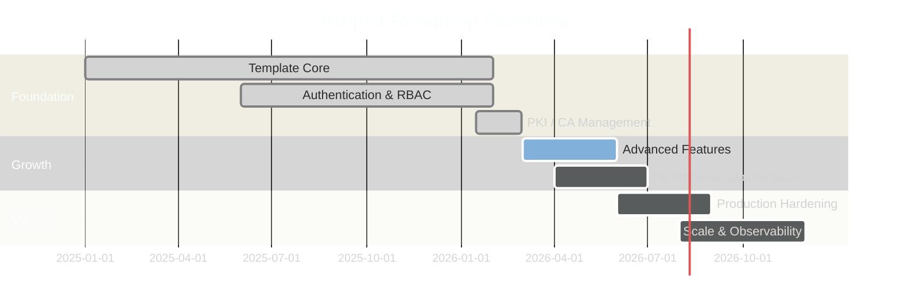

# Project Management

> **[Template]** This covers the base template feature. Extend or modify for your project.

> Roadmap, service level objectives, and project planning documentation.

---

## Overview

This section contains project management artifacts that guide the development trajectory and operational commitments. Use these documents to understand where the project is headed and what service levels are targeted.

---

## Sections

### Roadmap

> [`roadmap.md`](./roadmap.md)

Project development roadmap:
- Current milestone and progress
- Upcoming milestones with target dates
- Feature prioritization
- Technical debt items
- Long-term vision

---

### SLA / SLO

> [`sla-slo.md`](./sla-slo.md)

Service Level Agreements and Objectives:
- Availability targets (e.g., 99.9% uptime)
- Response time objectives (p50, p95, p99)
- Error rate budgets
- Recovery time objectives (RTO)
- Recovery point objectives (RPO)
- Measurement and reporting methodology

---

## Project Timeline

---

## Related Documentation

- [Feature Tracker](../product/feature-tracker.md) - Current feature status
- [Changelog](../product/changelog.md) - Release history
- [Operations](../operations/README.md) - Deployment and infrastructure
- [Security](../security/README.md) - Security posture and policies
