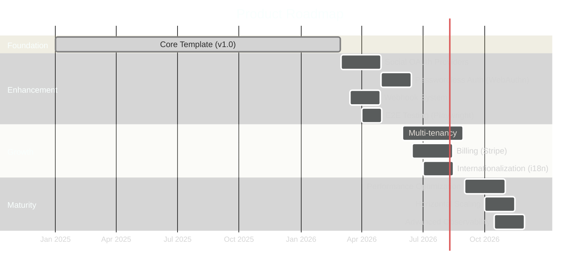

# Product Roadmap

> **[Template]** This covers the base template feature. Extend or modify for your project.

> Development roadmap, current status, future considerations, and prioritization framework.

---

## Overview

This roadmap outlines the development trajectory from the template's current foundation through future enhancements. It serves as a living document that should be updated as priorities shift and features are delivered.

---

## Current Phase: Foundation (v1.0)

**Status:** Complete

The foundation phase established the core infrastructure, authentication, authorization, and PKI capabilities that form the base template.

### Delivered Features

| Category | Features | Status |
|----------|----------|--------|
| **Infrastructure** | Express API, React SPA, PostgreSQL, Docker Compose, Pino logging, Zod validation | Complete |
| **Authentication** | Registration, login, JWT tokens, refresh rotation, email verification, password reset | Complete |
| **MFA** | TOTP setup/verify, backup codes, encrypted secret storage | Complete |
| **Session Management** | DB-backed sessions, multi-device, revocation, IP/UA tracking | Complete |
| **RBAC** | 35 permissions, 5 default roles, system role protection, permission middleware | Complete |
| **API Keys** | SHA-256 hashed storage, scoped permissions, expiration, per-key rate limiting | Complete |
| **Service Accounts** | Non-interactive accounts, dedicated permissions, audit logging | Complete |
| **PKI / CA** | CA hierarchy, certificate issuance/revocation/renewal, CSR workflow, CRL generation, mTLS login, encrypted keys (AES-256-GCM + Argon2id) | Complete |
| **Admin UI** | User management, role management, system settings, audit logs, API key admin | Complete |
| **Email** | Pluggable providers (mock, SMTP, SES), verification and reset templates | Complete |
| **Storage** | S3-compatible object storage, upload/download services | Complete |
| **Rate Limiting** | Tiered rate limiting (auth, registration, reset, general, API key) | Complete |
| **Testing** | Vitest, unit tests for services/controllers, test utilities | Complete |
| **Security** | Helmet, CORS, compression, request ID tracking, Sentry integration | Complete |

---

## Roadmap Timeline



---

## Future Considerations

### Enhancement Phase (v1.x)

| Feature | Priority | Complexity | Description |
|---------|----------|-----------|-------------|
| **Social OAuth** | High | Medium | Google, GitHub, Microsoft login via OAuth 2.0 / OIDC. Requires account linking strategy |
| **Passwordless Auth** | Medium | High | WebAuthn/FIDO2 support for passkey-based authentication |
| **Webhook System** | High | Medium | Event-driven webhooks for key system events (user created, cert issued, etc.) |
| **E2E Testing** | High | Medium | Playwright test suite covering critical user flows |
| **Email Templates** | Medium | Low | Rich HTML email templates with branding support |
| **File Management UI** | Medium | Low | Frontend UI for S3 file browsing, upload, download |
| **Batch Operations** | Medium | Medium | Bulk user management, batch certificate issuance |

### Growth Phase (v2.x)

| Feature | Priority | Complexity | Description |
|---------|----------|-----------|-------------|
| **Multi-tenancy** | High | High | Tenant isolation, per-tenant settings, data segregation |
| **Billing Integration** | High | High | Stripe integration for subscriptions, usage-based billing |
| **Internationalization (i18n)** | Medium | Medium | Multi-language support for UI and emails |
| **Advanced Search** | Medium | Medium | Full-text search with PostgreSQL tsvector or Elasticsearch |
| **User Groups** | Medium | Medium | Organizational groups for team-based access control |
| **Notification Channels** | Medium | Medium | Push notifications, Slack, Microsoft Teams integration |

### Maturity Phase (v3.x)

| Feature | Priority | Complexity | Description |
|---------|----------|-----------|-------------|
| **Performance Optimization** | High | Medium | Query optimization, caching layer (Redis), CDN integration |
| **Horizontal Scaling** | High | High | Stateless architecture validation, session store extraction, job queue scaling |
| **Advanced Observability** | Medium | Medium | OpenTelemetry tracing, custom Grafana dashboards, SLO automation |
| **GraphQL API** | Low | High | Alternative API layer alongside REST |
| **Compliance Automation** | Medium | Medium | SOC 2 / ISO 27001 evidence collection, automated compliance reporting |
| **Data Export / GDPR** | Medium | Medium | User data export, right to deletion, consent management |

---

## Prioritization Framework

### Evaluation Criteria

When evaluating new features for the roadmap, score each on these dimensions:

| Criterion | Weight | Description |
|-----------|--------|-------------|
| **User Impact** | 30% | How many users benefit? How significant is the improvement? |
| **Security Impact** | 25% | Does this address a security gap or reduce risk? |
| **Effort** | 20% | Development time, complexity, testing requirements |
| **Strategic Alignment** | 15% | Does this align with the project's direction? |
| **Dependency** | 10% | Is this a prerequisite for other features? |

### Priority Levels

| Level | Criteria | Timeline |
|-------|----------|----------|
| **P0 - Critical** | Security vulnerabilities, data loss risk | Immediate |
| **P1 - High** | Blocking user needs, significant user impact | Next sprint |
| **P2 - Medium** | Important improvements, moderate user impact | Next quarter |
| **P3 - Low** | Nice-to-have, limited user impact | Backlog |

---

## Adding to the Roadmap

### Proposal Template

When proposing a new roadmap item, include:

```markdown
### [Feature Name]

**Priority:** P1 / P2 / P3
**Complexity:** Low / Medium / High
**Target Phase:** Enhancement / Growth / Maturity

#### Problem Statement
[What problem does this solve? Who is affected?]

#### Proposed Solution
[High-level approach]

#### Impact Assessment
- Users affected: [scope]
- Security implications: [any]
- Dependencies: [prerequisites]
- Estimated effort: [days/weeks]

#### Success Criteria
- [Measurable outcomes]
```

### Review Process

1. Proposals added to the backlog via issue or discussion
2. Monthly roadmap review meeting
3. Prioritization scoring using the framework above
4. Approved items scheduled into the timeline
5. Roadmap document updated

---

## Technical Debt

Items that should be addressed but are not feature work:

| Item | Priority | Description |
|------|----------|-------------|
| Database query optimization | P2 | Add database indexes based on query patterns, optimize N+1 queries |
| Refresh token rotation | P2 | Implement token rotation (new refresh token on each use) |
| Expired session cleanup | P3 | Scheduled job to purge expired sessions |
| Log redaction | P2 | Add Pino redact paths for sensitive fields in production |
| Integration test coverage | P2 | Expand integration tests for all API endpoints |

---

## Related Documentation

- [Feature Tracker](../product/feature-tracker.md) - Current feature implementation status
- [Changelog](../product/changelog.md) - Release history
- [SLA/SLO](./sla-slo.md) - Service level targets
- [Architecture Decision Records](../architecture/adr/README.md) - Technical decisions
