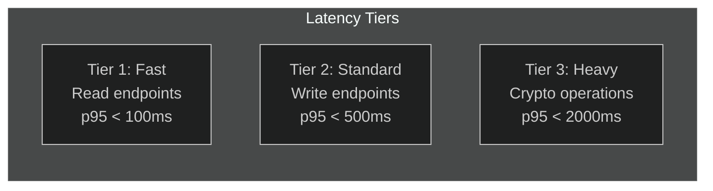
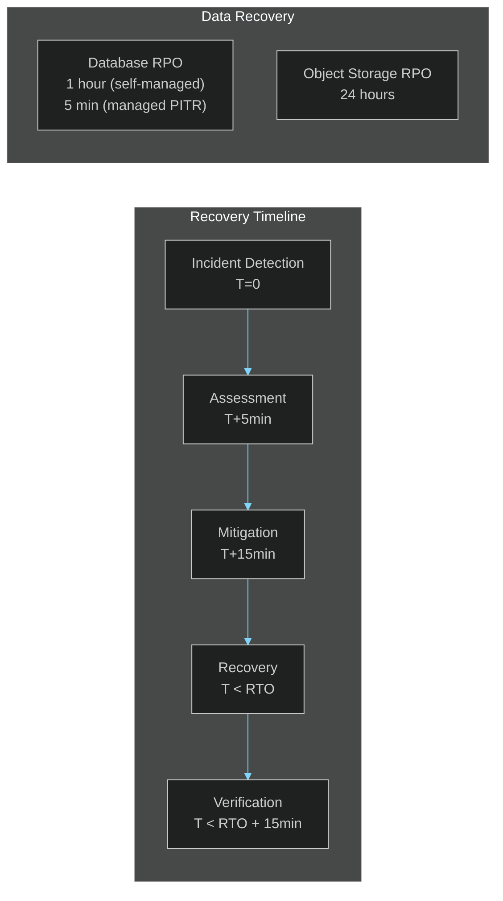

# SLA / SLO Definitions

> **[Template]** This covers the base template feature. Extend or modify for your project.

> Service Level Agreements, Service Level Objectives, error budgets, recovery targets, and measurement methodology.

---

## Overview

This document defines the Service Level Objectives (SLOs) that the application targets and the Service Level Agreements (SLAs) that may be offered to users. SLOs are internal engineering targets; SLAs are external commitments. Start by establishing SLOs, then formalize SLAs once the system has a track record of meeting them.

---

## Terminology

| Term | Definition |
|------|-----------|
| **SLI** (Service Level Indicator) | A quantitative measure of a service attribute (e.g., latency, error rate) |
| **SLO** (Service Level Objective) | A target value for an SLI (e.g., 99.9% availability) |
| **SLA** (Service Level Agreement) | A contractual commitment based on SLOs, with consequences for violation |
| **Error Budget** | The amount of allowed downtime or errors within the SLO (e.g., 0.1% = 43.8 min/month) |

---

## Availability

### Target: 99.9% Uptime (Monthly)

| SLO Level | Uptime | Allowed Downtime (Monthly) | Allowed Downtime (Annual) |
|-----------|--------|---------------------------|--------------------------|
| 99.0% | "Two nines" | 7.3 hours | 3.65 days |
| **99.9%** | **"Three nines"** | **43.8 minutes** | **8.77 hours** |
| 99.95% | "Three and a half nines" | 21.9 minutes | 4.38 hours |
| 99.99% | "Four nines" | 4.38 minutes | 52.6 minutes |

### Measurement

- **SLI:** Percentage of successful health check probes over the measurement window
- **Probe:** `GET /health` returning HTTP 200 within 5 seconds
- **Frequency:** Every 30 seconds from multiple locations
- **Exclusions:** Scheduled maintenance windows (announced 48 hours in advance)

### Error Budget Calculation

```
Monthly error budget = (1 - SLO) * total minutes in month
                     = (1 - 0.999) * 43,200
                     = 43.2 minutes

Remaining budget = budget - actual downtime
```

When the error budget is consumed:
1. Halt all non-critical deployments
2. Focus engineering effort on reliability
3. Conduct a review to identify systemic issues

---

## Response Time SLOs

### API Endpoint Categories



### Tier 1: Fast (Read-Heavy Endpoints)

Endpoints that primarily read from the database or cache.

| SLI | Target | Description |
|-----|--------|-------------|
| **p50** | < 25ms | Median response time |
| **p95** | < 100ms | 95th percentile response time |
| **p99** | < 250ms | 99th percentile response time |

**Endpoints:** `GET /health`, `GET /api/v1/users`, `GET /api/v1/roles`, `GET /api/v1/settings`, `GET /api/v1/notifications`, `GET /api/v1/sessions`

### Tier 2: Standard (Write and Auth Endpoints)

Endpoints that perform database writes, validation, and business logic.

| SLI | Target | Description |
|-----|--------|-------------|
| **p50** | < 100ms | Median response time |
| **p95** | < 500ms | 95th percentile response time |
| **p99** | < 1000ms | 99th percentile response time |

**Endpoints:** `POST /api/v1/auth/login`, `POST /api/v1/auth/register`, `POST /api/v1/auth/refresh`, `POST /api/v1/mfa/verify`, `PUT /api/v1/users/:id`, `POST /api/v1/roles`, `PUT /api/v1/settings/:key`

**Note:** Login includes bcrypt password verification (12 rounds, ~50ms). This is an intentional security cost.

### Tier 3: Heavy (Cryptographic Operations)

Endpoints that perform intensive cryptographic operations (key generation, certificate signing).

| SLI | Target | Description |
|-----|--------|-------------|
| **p50** | < 500ms | Median response time |
| **p95** | < 2000ms | 95th percentile response time |
| **p99** | < 5000ms | 99th percentile response time |

**Endpoints:** `POST /api/v1/ca` (CA creation with key generation), `POST /api/v1/certificates` (certificate issuance), `POST /api/v1/ca/:id/crl` (CRL generation)

---

## Error Rate Targets

### HTTP Error Rate SLOs

| Metric | SLO | Measurement |
|--------|-----|-------------|
| **Server error rate (5xx)** | < 0.1% of total requests | Measured over 5-minute windows |
| **Client error rate (4xx)** | < 5% of total requests | Informational (not an SLO violation) |
| **Auth failure rate** | Context-dependent | Expected to be higher than general (failed logins are normal) |

### Error Budget for Error Rate

```
Monthly request error budget = total requests * 0.001
Example: 1,000,000 requests/month * 0.001 = 1,000 allowed 5xx errors
```

---

## Recovery Objectives

### Recovery Time Objective (RTO)

The maximum acceptable time from incident detection to service restoration.

| Severity | RTO | Description |
|----------|-----|-------------|
| **SEV1** (Total outage) | 1 hour | Complete service unavailability |
| **SEV2** (Major degradation) | 4 hours | Key features unavailable |
| **SEV3** (Minor degradation) | 24 hours | Non-critical features affected |
| **SEV4** (Cosmetic) | Next business day | No functional impact |

### Recovery Point Objective (RPO)

The maximum acceptable data loss measured in time.

| Component | RPO | Backup Method |
|-----------|-----|---------------|
| **Database (primary data)** | 1 hour | Continuous WAL archiving + hourly checkpoints |
| **Database (with managed PITR)** | 5 minutes | Cloud provider PITR |
| **Object storage (S3)** | 24 hours | Daily replication (or cross-region replication for 0 RPO) |
| **Application logs** | 24 hours | Log aggregation with daily backup |
| **Configuration** | 0 (code-managed) | Version controlled in Git |



---

## Monitoring and Measurement

### SLI Data Sources

| SLI | Source | Collection Method |
|-----|--------|-------------------|
| Availability | Health check probes | External uptime monitor (Pingdom, UptimeRobot, Datadog) |
| Latency | pino-http response times | Log aggregation (p50/p95/p99 calculations) |
| Error rate | HTTP status codes | Log aggregation or reverse proxy metrics |
| Database latency | Query execution time | pg_stat_statements or application-level timing |

### Dashboards

Create dashboards for:

1. **SLO Overview:** Current SLO compliance for all objectives (availability, latency, error rate)
2. **Error Budget:** Remaining error budget for the current period
3. **Latency Distribution:** Histogram of response times by endpoint tier
4. **Trend Analysis:** Week-over-week SLI trends

### Alerting Thresholds

| Alert | Condition | Action |
|-------|-----------|--------|
| **Availability SLO burn rate** | 10% of monthly budget consumed in 1 hour | Page on-call |
| **Latency SLO breach** | p95 > target for 10 minutes | Warning notification |
| **Error rate spike** | 5xx rate > 1% for 5 minutes | Page on-call |
| **Error budget low** | < 25% remaining | Halt risky deployments |
| **Error budget exhausted** | 0% remaining | Freeze all non-critical changes |

### Burn Rate Alerting

Rather than alerting on instantaneous SLO violations, use burn rate to detect trends:

| Burn Rate | Meaning | Alert |
|-----------|---------|-------|
| 1x | Budget consumed evenly over the month | Normal |
| 2x | Budget consumed in 15 days | Warning |
| 10x | Budget consumed in 3 days | Critical (page) |
| 100x | Budget consumed in 7.2 hours | Emergency (page immediately) |

```
Burn rate = (errors in window / window duration) / (error budget / period duration)
```

---

## Escalation Procedures

### SLO Breach Escalation

| Error Budget Remaining | Actions |
|-----------------------|---------|
| **75-100%** | Normal operations. Deployments proceed as planned |
| **50-75%** | Review recent incidents. Increase monitoring sensitivity |
| **25-50%** | Halt non-critical deployments. Prioritize reliability work |
| **0-25%** | Freeze all changes except reliability fixes. Engineering lead review |
| **Exhausted (0%)** | Full deployment freeze. Incident review required. Management notification |

### Reporting

| Frequency | Report | Audience |
|-----------|--------|----------|
| **Real-time** | SLO dashboard | Engineering team |
| **Weekly** | SLO summary email | Engineering + product |
| **Monthly** | SLO compliance report with error budget tracking | Engineering + management |
| **Quarterly** | SLO review and target adjustment | All stakeholders |

---

## SLO Review and Adjustment

### Quarterly Review Process

1. **Collect data:** Actual SLI performance over the quarter
2. **Compare to targets:** Which SLOs were met? Which were breached?
3. **Analyze incidents:** Root cause analysis for any SLO breaches
4. **Adjust targets:** Tighten SLOs if consistently exceeded, relax if unrealistic
5. **Update documentation:** Record changes and rationale
6. **Communicate:** Share updated SLOs with all stakeholders

### When to Adjust SLOs

| Situation | Action |
|-----------|--------|
| SLO exceeded every month for a quarter | Consider tightening the target |
| SLO breached multiple months | Investigate systemic issues; consider relaxing temporarily |
| New feature with different characteristics | Add a new SLO tier |
| Architecture change (e.g., adding caching) | Re-evaluate latency SLOs |
| User feedback on performance | Adjust targets to match expectations |

---

## SLA Considerations

### Moving from SLO to SLA

Before offering external SLAs:

1. Track SLO compliance for at least 3 months
2. Ensure monitoring and alerting is production-ready
3. Establish incident response procedures
4. Define SLA remedies (credits, refunds, etc.)
5. Set SLA targets below SLO targets (leave buffer):
   - If SLO is 99.9%, SLA should be 99.5%
   - If SLO latency p95 is 100ms, SLA should be 200ms

### SLA Template

```markdown
## Service Level Agreement

**Effective Date:** [Date]
**Service:** [Application Name]
**Provider:** [Company]

### Availability
- Monthly uptime target: 99.5%
- Measurement: Health check probes every 30 seconds
- Exclusions: Scheduled maintenance (48-hour advance notice)

### Credits
| Monthly Uptime | Credit |
|---------------|--------|
| 99.0% - 99.5% | 10% of monthly fee |
| 95.0% - 99.0% | 25% of monthly fee |
| < 95.0% | 50% of monthly fee |

### Support
| Severity | Response Time | Resolution Time |
|----------|--------------|----------------|
| SEV1 | 30 minutes | 4 hours |
| SEV2 | 2 hours | 24 hours |
| SEV3 | 8 hours | 72 hours |
```

---

## Related Documentation

- [Monitoring Guide](../operations/monitoring.md) - Metrics collection and alerting
- [Incidents](../operations/incidents.md) - Incident response procedures
- [Roadmap](./roadmap.md) - Planned reliability improvements
- [Production Checklist](../operations/production-checklist.md) - Pre-launch SLO verification
