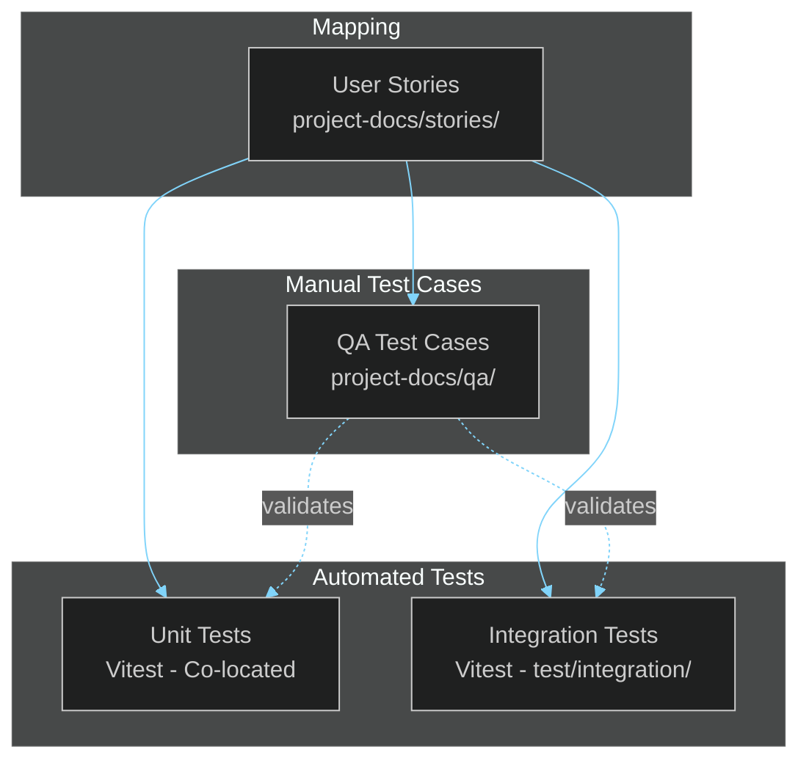

# QA Test Cases

> **[Template]** This covers the base template feature. Extend or modify for your project.

> Comprehensive test case documentation covering all application features, organized by functional area.

---

## Overview

This section contains approximately 140 test cases across 9 functional areas. Each test case is uniquely identified and linked to user stories for full traceability. Test cases cover positive flows, negative flows, edge cases, and security scenarios.

---

## Test Case Format

Each test case follows this template:

```
### TC-{AREA}-NNN: Test Case Title

**Priority:** Critical | High | Medium | Low
**Type:** Functional | Security | Performance | Usability
**Related Story:** US-{AREA}-NNN

**Preconditions:**
- Precondition 1
- Precondition 2

**Steps:**
1. Step 1
2. Step 2
3. Step 3

**Expected Result:**
- Expected outcome 1
- Expected outcome 2

**Status:** Pass | Fail | Blocked | Not Run
```

### ID Scheme

Test case IDs follow the pattern `TC-{AREA}-NNN` where:

| Component | Description |
|-----------|-------------|
| `TC` | Test Case prefix |
| `{AREA}` | Functional area code (matches user story area codes) |
| `NNN` | Sequential number within the area (001, 002, ...) |

### Area Codes

| Code | Area | Description |
|------|------|-------------|
| `AUTH` | Authentication | Registration, login, password management |
| `MFA` | Multi-Factor Auth | TOTP setup, verification, backup codes |
| `SESS` | Sessions | Session management, device tracking |
| `RBAC` | Role-Based Access | Roles, permissions, assignments |
| `ADM` | Administration | User management, system settings |
| `AKEY` | API Keys | API key lifecycle management |
| `PKI` | PKI / CA | Certificate authority and certificate management |
| `NOTF` | Notifications | Email notifications, in-app alerts |
| `FE` | Frontend | UI components, navigation, theming |

---

## Test Case Files

| File | Area | Test Cases | Description |
|------|------|------------|-------------|
| [`auth.md`](./auth.md) | AUTH | 25 | Registration validation, login flows, password reset, email verification, lockout |
| [`mfa.md`](./mfa.md) | MFA | 16 | TOTP setup, QR code generation, code verification, backup codes, disable flow |
| [`session.md`](./session.md) | SESS | 12 | Session listing, revocation, expiry, concurrent sessions, password change invalidation |
| [`rbac.md`](./rbac.md) | RBAC | 18 | Role CRUD, permission assignment, role hierarchy, access enforcement |
| [`admin.md`](./admin.md) | ADM | 20 | User management CRUD, search, filters, bulk actions, audit log |
| [`api-keys.md`](./api-keys.md) | AKEY | 14 | Key generation, scoping, revocation, rate limiting, expiry |
| [`pki.md`](./pki.md) | PKI | 16 | CA creation, certificate issuance, revocation, CSR signing, chain validation |
| [`notifications.md`](./notifications.md) | NOTF | 8 | Email delivery, template rendering, retry logic, bounce handling |
| [`frontend.md`](./frontend.md) | FE | 11 | Layout rendering, dark mode toggle, responsive breakpoints, error states |

---

## Summary Table

| Area | Code | Total | Critical | High | Medium | Low |
|------|------|-------|----------|------|--------|-----|
| Authentication | AUTH | 25 | 6 | 10 | 7 | 2 |
| Multi-Factor Auth | MFA | 16 | 3 | 6 | 5 | 2 |
| Sessions | SESS | 12 | 2 | 5 | 4 | 1 |
| RBAC | RBAC | 18 | 4 | 7 | 5 | 2 |
| Administration | ADM | 20 | 3 | 8 | 7 | 2 |
| API Keys | AKEY | 14 | 2 | 5 | 5 | 2 |
| PKI / CA | PKI | 16 | 3 | 6 | 5 | 2 |
| Notifications | NOTF | 8 | 1 | 3 | 3 | 1 |
| Frontend | FE | 11 | 1 | 4 | 4 | 2 |
| **Total** | | **140** | **25** | **54** | **45** | **16** |

---

## Test Coverage by Type

| Test Type | Count | Description |
|-----------|-------|-------------|
| Functional | 85 | Core feature behavior verification |
| Security | 30 | Authentication, authorization, injection, XSS |
| Edge Case | 18 | Boundary conditions, race conditions, concurrency |
| Performance | 4 | Response time, throughput under load |
| Usability | 3 | Accessibility, responsive design |

---

## Test Execution Matrix



---

## Running Tests

### Automated Tests

```bash
pnpm test              # Run all tests
pnpm test:api          # Run API tests only
pnpm test:web          # Run web tests only
pnpm --filter api test:watch  # Watch mode for API tests
```

### Manual Test Execution

1. Select test cases by area or priority from the files above
2. Ensure preconditions are met (dev server running, seeded database)
3. Execute steps in order
4. Record pass/fail status and any defects found
5. Link defects to the relevant test case ID (`TC-{AREA}-NNN`)

---

## Traceability

Each test case links back to:
- **User stories** in [`../stories/`](../stories/README.md) via `US-{AREA}-NNN` IDs
- **API endpoints** documented in [`../api/endpoints/`](../api/endpoints/)
- **Automated tests** in `apps/api/src/**/*.test.ts` and `apps/api/test/integration/`

---

## Related Documentation

- [User Stories](../stories/README.md) - Requirements that test cases validate
- [Developer Testing Guide](../developer/testing/) - How to write automated tests
- [Feature Tracker](../product/feature-tracker.md) - Implementation status
- [API Reference](../api/README.md) - Endpoint documentation
