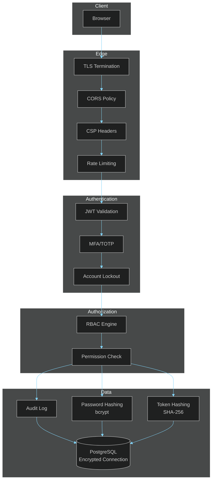

# Security Documentation

> **[Template]** This covers the base template feature. Extend or modify for your project.

> Security policies, audit findings, threat modeling, and data protection documentation.

---

## Overview

Security is a foundational concern for this project. This section documents the security posture, known risks, mitigations, and ongoing security practices. It covers authentication security, data protection, dependency management, and compliance considerations.

---

## Sections

### Audit Report

> [`audit-report.md`](./audit-report.md)

Security audit findings and remediation:
- Audit methodology and scope
- Findings categorized by severity (Critical, High, Medium, Low)
- Remediation status for each finding
- Compliance gaps and action items
- Historical audit results

---

### Security Policy

> [`security-policy.md`](./security-policy.md)

Organizational security policies:
- Responsible disclosure process
- Vulnerability reporting
- Security update policy
- Supported versions
- Security contact information

---

### Threat Model

> [`threat-model.md`](./threat-model.md)

Threat modeling using STRIDE methodology:
- System boundaries and trust zones
- Threat identification (Spoofing, Tampering, Repudiation, Information Disclosure, Denial of Service, Elevation of Privilege)
- Risk assessment matrix
- Mitigations for each identified threat
- Attack surface analysis

---

### Dependency Management

> [`dependency-management.md`](./dependency-management.md)

Dependency security practices:
- Dependency audit process (`pnpm audit`)
- Automated vulnerability scanning
- Update strategy and cadence
- License compliance
- Supply chain security measures
- Lock file integrity

---

### Authentication Security

> [`authentication-security.md`](./authentication-security.md)

Deep-dive into authentication security implementation:
- Password hashing (bcrypt, 12 rounds)
- JWT token security (short-lived access, httpOnly refresh cookies)
- Token type discrimination and validation
- Refresh token rotation and hashing (SHA-256)
- MFA/TOTP implementation security
- Account lockout mechanics (progressive lockout)
- Session invalidation on password change
- Brute force protection

---

### Data Protection

> [`data-protection.md`](./data-protection.md)

Data handling and protection:
- Data classification (public, internal, confidential, restricted)
- Encryption at rest and in transit
- PII handling and minimization
- Database security (connection encryption, credential management)
- Object storage security (S3/MinIO access policies)
- Audit logging for sensitive operations
- Data retention and deletion policies

---

## Security Architecture

---

## Security Quick Reference

| Concern | Implementation |
|---------|---------------|
| Password storage | bcrypt (12 rounds) |
| Access tokens | JWT, short-lived (15 min default) |
| Refresh tokens | httpOnly cookies, SHA-256 hashed, rotated on use |
| MFA | TOTP with encrypted secrets, backup codes (single-use) |
| Rate limiting | Per-endpoint limits, stricter on auth routes |
| Account lockout | Progressive delays after failed login attempts |
| Session management | Database-backed, revocable, invalidated on password change |
| Audit logging | All sensitive operations logged with actor, action, target |
| RBAC | Role-based with granular permissions |
| Input validation | Zod v4 schemas on all endpoints |

---

## Related Documentation

- [Permissions Model](../../docs/architecture/PERMISSIONS.md) - RBAC and authorization architecture
- [Authentication API](../api/authentication.md) - Auth endpoint documentation
- [Operations](../operations/README.md) - Infrastructure security
- [Production Checklist](../operations/production-checklist.md) - Security verification steps
