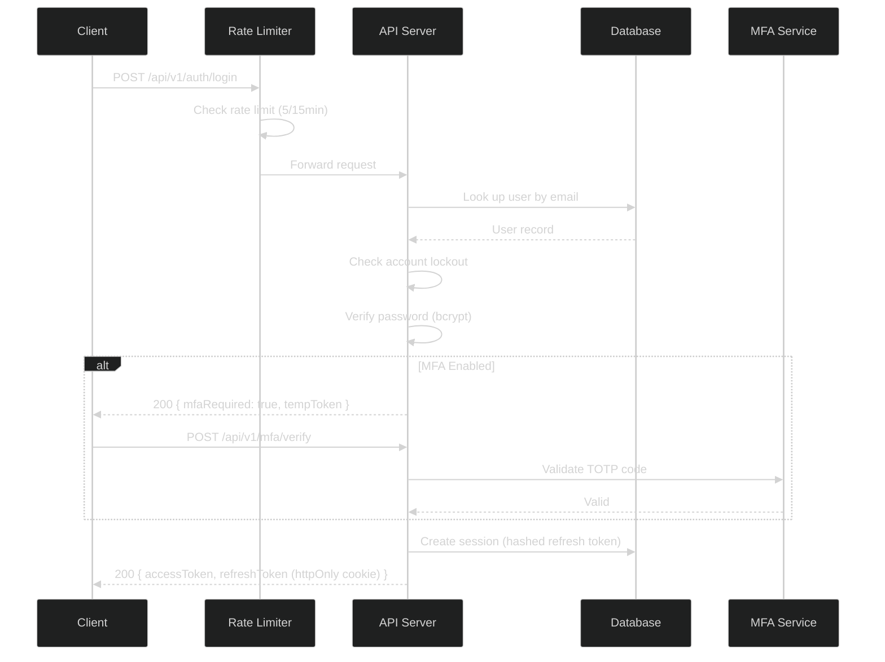
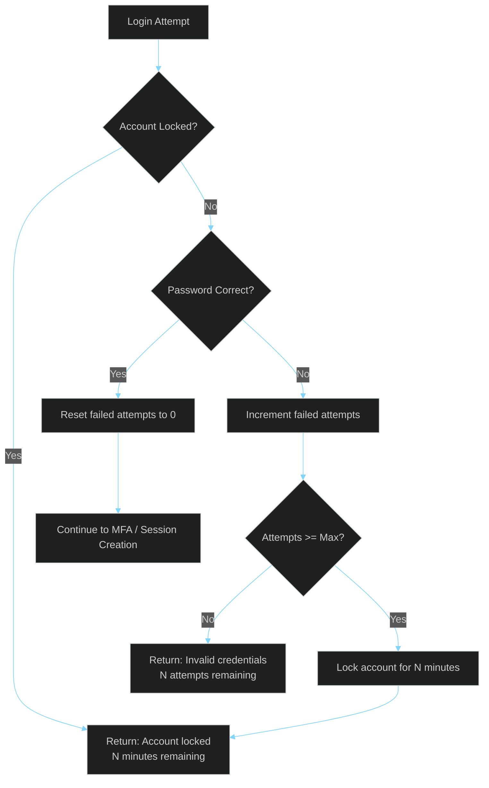
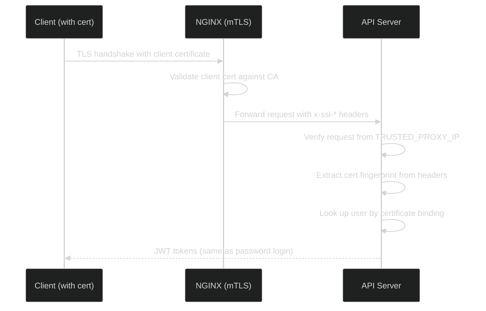

# Authentication Security

> **[Template]** This covers the base template feature. Extend or modify for your project.

> Deep dive into password policy, account lockout, JWT security, MFA, session management, certificate-based auth, and rate limiting.

---

## Overview

The application implements a layered authentication system combining password-based auth with JWT tokens, optional multi-factor authentication (TOTP), certificate-based login, and API key access. Each layer is designed with defense-in-depth principles.

---

## Authentication Flow



---

## Password Policy

### Requirements

| Rule | Specification | Implementation |
|------|--------------|----------------|
| **Minimum length** | 8 characters | Zod validation in registration/password-change schemas |
| **Maximum length** | 128 characters | Prevents bcrypt DoS (bcrypt truncates at 72 bytes) |
| **Uppercase required** | At least 1 uppercase letter | Zod regex validation |
| **Number required** | At least 1 digit | Zod regex validation |
| **Special characters** | Allowed but not required | No restriction on character set |

### Password Storage

| Property | Value |
|----------|-------|
| **Algorithm** | bcrypt |
| **Rounds** | 12 (configurable via `SALT_ROUNDS` constant) |
| **Storage** | `password_hash` column in `users` table |
| **Plaintext** | Never stored, never logged, never returned in API responses |

### Password Change Behavior

When a user changes their password:
1. Current password is verified against stored hash
2. New password is validated against the policy
3. New hash is generated with bcrypt (12 rounds)
4. All existing sessions for the user are invalidated
5. A new session is created for the current device
6. Audit log entry is created

---

## Account Lockout

### Configuration

Managed via database settings (modifiable through Admin UI):

| Setting | Default | Description |
|---------|---------|-------------|
| `security.max_login_attempts` | `5` | Failed attempts before lockout |
| `security.lockout_duration_minutes` | `15` | Lockout window in minutes |

### Lockout Flow



### Implementation Details

- `failedLoginAttempts` counter is stored on the `users` table
- `lockedUntil` timestamp is set when the threshold is reached
- Counter is reset on successful login
- Lock expires automatically after the configured duration
- Admin can manually unlock accounts via the API:
  ```sql
  UPDATE users SET failed_login_attempts = 0, locked_until = NULL WHERE email = '...';
  ```

---

## JWT Security

### Token Architecture

| Token | Lifetime | Storage | Content |
|-------|----------|---------|---------|
| **Access Token** | 15 minutes (configurable via `JWT_ACCESS_EXPIRES_IN`) | Client memory (JavaScript variable) | userId, email, isAdmin, permissions |
| **Refresh Token** | 7 days (configurable via `JWT_REFRESH_EXPIRES_IN`) | httpOnly cookie + SHA-256 hash in database | Random bytes, session binding |
| **MFA Temp Token** | Short-lived | Client memory | userId, pending MFA verification |

### Access Token

- Signed with `JWT_SECRET` (minimum 32 characters, validated at startup)
- Contains minimal claims: `sub` (userId), `email`, `isAdmin`, `permissions`
- Stateless validation (no database lookup required)
- Short TTL (15 minutes) limits exposure window

### Refresh Token

- Generated as random bytes, not a JWT
- Stored in an httpOnly, secure cookie (prevents XSS access)
- SHA-256 hashed before database storage (prevents exposure if DB is compromised)
- One-to-one mapping with a session record
- Session tracks user agent, IP address, last used time, and expiry

### Token Refresh Flow

1. Client sends refresh token cookie to `POST /api/v1/auth/refresh`
2. Server hashes the received token with SHA-256
3. Server looks up the session by hashed token
4. If valid and not expired: issue new access token, update `lastUsedAt`
5. If expired or invalid: return 401, client must re-authenticate

### Security Properties

| Property | Implementation |
|----------|---------------|
| Token cannot be forged | Signed with secret (HS256) |
| Stolen access token limited impact | 15-minute expiry |
| Stolen refresh token limited impact | httpOnly cookie, hashed in DB, revocable |
| Token reuse detection | Session binding, one refresh token per session |
| Cross-site access prevented | httpOnly + SameSite cookies, CORS |

---

## Multi-Factor Authentication (MFA)

### TOTP Implementation

| Property | Value |
|----------|-------|
| **Algorithm** | TOTP (RFC 6238) via `otpauth` library |
| **Period** | 30 seconds |
| **Digits** | 6 |
| **Secret storage** | Encrypted at rest (AES-256-GCM via application encryption) |
| **QR code** | Generated server-side, returned as data URL |
| **Backup codes** | 10 codes, single-use, bcrypt-hashed (10 rounds) |

### MFA Setup Flow

1. User requests TOTP setup: `POST /api/v1/mfa/setup`
2. Server generates a random secret, encrypts it, stores it with `isEnabled: false`
3. Server returns the secret and QR code data URL
4. User scans QR code with authenticator app
5. User submits a verification code: `POST /api/v1/mfa/enable`
6. Server verifies the code, sets `isEnabled: true`, returns 10 backup codes
7. Backup codes are hashed with bcrypt and stored

### MFA Verification Security

- Encrypted TOTP secrets are decrypted only at verification time
- Legacy plaintext secrets are automatically encrypted on next write
- Backup codes are single-use (marked as used after successful verification)
- Each backup code is independently bcrypt-hashed
- Failed MFA attempts are logged but do not trigger account lockout (separate from password lockout)

---

## Session Management

### Session Storage

Sessions are stored in the `sessions` table:

| Column | Type | Description |
|--------|------|-------------|
| `id` | UUID | Primary key |
| `user_id` | UUID | Foreign key to users (CASCADE delete) |
| `refresh_token` | VARCHAR(500) | SHA-256 hash of the actual refresh token |
| `user_agent` | VARCHAR(500) | Browser/client user agent string |
| `ip_address` | VARCHAR(45) | Client IP address (IPv4 or IPv6) |
| `last_used_at` | TIMESTAMP | Last token refresh time |
| `expires_at` | TIMESTAMP | Session expiration (7 days from creation) |
| `created_at` | TIMESTAMP | Session creation time |

### Session Features

- **Multi-device:** Users can have multiple active sessions
- **Session listing:** Users can view all their active sessions
- **Selective revocation:** Users can revoke individual sessions
- **Bulk revocation:** Password change invalidates all sessions
- **Admin revocation:** Admins can terminate any user's sessions
- **Auto-cleanup:** Expired sessions can be cleaned up via scheduled job

### Session Invalidation Triggers

| Trigger | Scope | Mechanism |
|---------|-------|-----------|
| Password change | All user sessions | Service deletes all sessions for user |
| User deactivation | All user sessions | Session lookup checks `isActive` flag |
| Manual revocation | Single session | User or admin deletes specific session |
| Token expiry | Single session | Refresh fails, session becomes unusable |
| Account deletion | All user sessions | CASCADE delete from users table |

---

## Certificate-Based Authentication

### mTLS Flow



### Security Measures

| Measure | Implementation |
|---------|---------------|
| **Header trust** | `x-ssl-*` headers only accepted from `TRUSTED_PROXY_IP` |
| **Header stripping** | `stripSslHeaders` middleware removes SSL headers from untrusted sources |
| **Certificate binding** | Certificates bound to user accounts via `user_certificates` table |
| **Revocation checking** | Certificate status verified against the CRL |
| **Cert attach codes** | One-time codes for binding a certificate to an account |

---

## Rate Limiting

### Rate Limit Configuration

| Endpoint Category | Window | Max Requests | Key |
|-------------------|--------|-------------|-----|
| **Login** (`authRateLimiter`) | 15 minutes | 5 | IP address |
| **Registration** (`registrationRateLimiter`) | 1 hour | 5 | IP address |
| **Password Reset** (`passwordResetRateLimiter`) | 1 hour | 3 | IP address |
| **General API** (`apiRateLimiter`) | 1 minute | 100 | IP address |
| **API Key Auth** (`apiKeyRateLimiter`) | 1 minute | 60 | API key ID or IP |

### Rate Limit Headers

When `standardHeaders: true` is enabled, responses include:

| Header | Description |
|--------|-------------|
| `RateLimit-Limit` | Maximum requests allowed in the window |
| `RateLimit-Remaining` | Remaining requests in the current window |
| `RateLimit-Reset` | Seconds until the window resets |

### Rate Limit Response

When the limit is exceeded, a `429 Too Many Requests` response is returned:

```json
{
  "success": false,
  "error": "Too many login attempts. Please try again in 15 minutes."
}
```

---

## API Key Authentication

### Key Generation and Storage

| Property | Value |
|----------|-------|
| **Key format** | `<prefix>.<random-bytes>` |
| **Prefix** | 8-character random string (stored in clear for identification) |
| **Key storage** | SHA-256 hash only (original key shown once at creation) |
| **Permissions** | Scoped subset of the creating user's permissions |
| **Expiration** | Optional expiry timestamp |
| **Revocation** | `isActive` flag, instant effect |
| **Rate limiting** | Separate rate limiter (60 req/min per key) |

---

## Related Documentation

- [Security Policy](./security-policy.md) - Vulnerability reporting
- [Threat Model](./threat-model.md) - STRIDE analysis covering auth threats
- [Data Protection](./data-protection.md) - Encryption details for tokens and keys
- [Admin Guide](../product/admin-guide.md) - Managing users, sessions, and MFA
