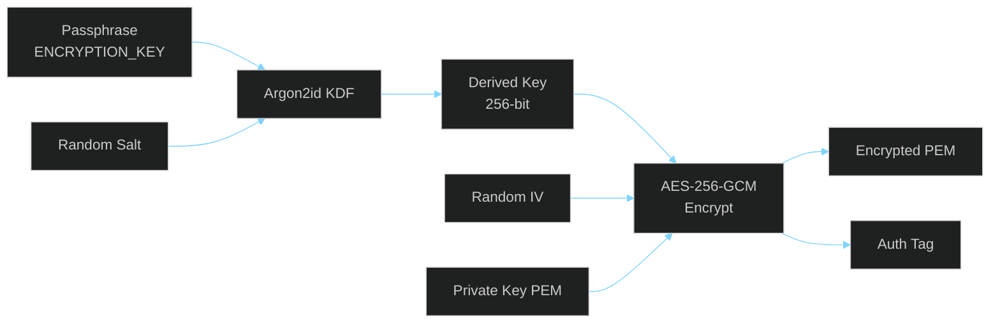

# Data Protection

> **[Template]** This covers the base template feature. Extend or modify for your project.

> Encryption at rest, password storage, PII handling, token security, and HTTPS/CORS configuration.

---

## Overview

The application handles multiple categories of sensitive data: passwords, cryptographic keys, authentication tokens, personally identifiable information (PII), and configuration secrets. Each category has specific protection mechanisms appropriate to its sensitivity level. This document details those protections and the policies governing data handling.

---

## Data Classification

| Classification | Examples | Protection Requirements |
|---------------|----------|------------------------|
| **Restricted** | PKI private keys, `JWT_SECRET`, `ENCRYPTION_KEY`, database credentials | Encrypted at rest, never logged, access audited, rotated regularly |
| **Confidential** | Passwords, MFA secrets, API keys, refresh tokens | Hashed or encrypted, never logged, access controlled |
| **Internal** | Email addresses, IP addresses, user agents, audit logs | Access controlled via RBAC, minimized in logs |
| **Public** | Health check response, application version | No special protection needed |

---

## Encryption at Rest

### PKI Private Keys (AES-256-GCM + Argon2id)

Private keys for Certificate Authorities and certificates are encrypted before storage using the strongest available encryption:



| Component | Storage Column | Description |
|-----------|---------------|-------------|
| Encrypted private key | `encrypted_private_key_pem` | AES-256-GCM ciphertext |
| KDF salt | `kdf_salt` | Random salt for Argon2id |
| IV (nonce) | `kdf_iv` | Random initialization vector for AES-GCM |
| Auth tag | `kdf_tag` | GCM authentication tag for integrity verification |
| Public key | `public_key_pem` | Stored in clear (public information) |
| Key fingerprint | `key_fingerprint` | SHA-256 hash for key identification |

**Decryption requires the `ENCRYPTION_KEY` environment variable.** If this key is lost, encrypted private keys cannot be recovered. This is by design.

### MFA TOTP Secrets

TOTP secrets must be decryptable (to generate/verify codes), so they use symmetric encryption:

| Property | Value |
|----------|-------|
| **Algorithm** | Application-level encryption (AES-256-GCM) |
| **Key** | Derived from `ENCRYPTION_KEY` (or `JWT_SECRET` fallback) |
| **Migration** | Legacy plaintext secrets are encrypted on next write |
| **Backup codes** | Separately bcrypt-hashed (10 rounds), not encrypted |

---

## Password Storage

| Property | Value |
|----------|-------|
| **Algorithm** | bcrypt |
| **Cost factor** | 12 rounds |
| **Storage** | `password_hash` column, VARCHAR(255) |
| **Null allowed** | Yes (service accounts and cert-only users may have no password) |

### Security Properties

- bcrypt includes a per-password random salt (no separate salt storage needed)
- 12 rounds provides approximately 50ms hash time, resistant to GPU cracking
- bcrypt truncates input at 72 bytes (maximum password length of 128 characters enforced by validation to prevent ambiguity)
- Passwords are never logged, returned in API responses, or included in error messages

---

## Token Storage

### Refresh Tokens

| Property | Value |
|----------|-------|
| **Generation** | `crypto.randomBytes()` |
| **Storage** | SHA-256 hash in `sessions.refresh_token` column |
| **Client delivery** | httpOnly, secure cookie |
| **Lookup** | Hash the presented token, compare against stored hash |

### Email Verification Tokens

| Property | Value |
|----------|-------|
| **Generation** | `crypto.randomBytes()` |
| **Storage** | SHA-256 hash in `email_verification_tokens` table |
| **Delivery** | Sent via email as URL parameter |
| **Expiry** | Time-limited (configurable) |

### API Keys

| Property | Value |
|----------|-------|
| **Format** | `<prefix>.<random-bytes>` |
| **Prefix storage** | 8-character prefix stored in clear (for identification in UI) |
| **Key storage** | SHA-256 hash in `api_keys.key_hash` column |
| **Lookup** | Hash the presented key, compare against stored hash |
| **Exposure** | Full key shown only once at creation; never retrievable again |

---

## PII Handling

### Data Collected

| Data Type | Location | Purpose | Minimization |
|-----------|----------|---------|-------------|
| **Email address** | `users.email` | Authentication, communication | Required for account |
| **IP address** | `sessions.ip_address`, `audit_logs` | Security monitoring, lockout | Stored for session/audit duration |
| **User agent** | `sessions.user_agent` | Session identification | Stored for session duration |
| **Failed login count** | `users.failed_login_attempts` | Account lockout | Reset on success |

### PII in Audit Logs

Audit logs contain PII (email, IP address) for security monitoring purposes. Access to audit logs is restricted via the `audit:read` permission. Consider:

- Setting retention policies for audit logs (e.g., 90 days, 1 year)
- Anonymizing old audit entries if required by privacy regulations
- Providing data export and deletion capabilities for GDPR compliance

### PII in Application Logs

The application uses Pino for structured logging. Sensitive data handling:

| Data | Logged? | Notes |
|------|---------|-------|
| Passwords | Never | Not included in any log context |
| JWT tokens | Never | Not logged |
| API keys | Never | Only prefix may appear in debug logs |
| Email addresses | Selectively | May appear in info-level auth logs; consider redaction for production |
| IP addresses | Yes | Included in request logs (pino-http) |
| Request bodies | No | Not logged by default |

### Pino Redaction (Recommended for Production)

```typescript
const logger = pino({
  level: config.LOG_LEVEL,
  redact: {
    paths: ['req.headers.authorization', 'req.headers.cookie', 'email'],
    censor: '[REDACTED]',
  },
});
```

---

## HTTPS / TLS Requirements

### Development

- HTTP is acceptable for local development (`http://localhost`)
- MinIO S3 accessed over HTTP locally

### Staging / Production

| Requirement | Configuration |
|-------------|--------------|
| **TLS version** | TLS 1.2 minimum, TLS 1.3 preferred |
| **Certificate** | Valid certificate from trusted CA (Let's Encrypt, etc.) |
| **HSTS** | Enabled via Helmet (`Strict-Transport-Security` header) |
| **Database SSL** | `DATABASE_SSL=true` for non-local connections |
| **S3 encryption** | HTTPS endpoint for S3/object storage |
| **Cookie security** | `Secure` flag on all auth cookies |

### Helmet Security Headers

The application uses Helmet middleware, which sets:

| Header | Value | Purpose |
|--------|-------|---------|
| `Strict-Transport-Security` | `max-age=15552000; includeSubDomains` | Force HTTPS |
| `X-Content-Type-Options` | `nosniff` | Prevent MIME sniffing |
| `X-Frame-Options` | `DENY` | Prevent clickjacking |
| `X-XSS-Protection` | `0` | Disable legacy XSS filter (CSP preferred) |
| `Content-Security-Policy` | Default Helmet CSP | Prevent XSS, injection |

---

## CORS Configuration

### Current Configuration

```typescript
cors({
  origin: config.FRONTEND_URL,   // Single allowed origin
  credentials: true,              // Allow cookies (refresh token)
})
```

| Environment | `FRONTEND_URL` | Notes |
|-------------|----------------|-------|
| Development | `http://localhost:5173` | Vite dev server |
| Staging | `https://staging.app.example.com` | Staging frontend |
| Production | `https://app.example.com` | Production frontend |

### CORS Security Properties

- Only the configured frontend origin can make credentialed requests
- Preflight requests (`OPTIONS`) are handled automatically
- `credentials: true` required for httpOnly cookie delivery
- Wildcard (`*`) origins are never used with credentials

---

## Secret Management Summary

| Secret | Storage | Protection | Rotation |
|--------|---------|-----------|----------|
| `JWT_SECRET` | Environment variable | Vault/secrets manager | Quarterly (causes session invalidation) |
| `ENCRYPTION_KEY` | Environment variable | Vault/secrets manager | Requires data re-encryption |
| Database password | Environment variable | Vault/secrets manager | Quarterly |
| S3 credentials | Environment variable | Vault/secrets manager | Quarterly |
| SMTP credentials | Environment variable | Vault/secrets manager | Per provider policy |
| AWS credentials | Environment variable | Vault/IAM role | Per AWS policy |

---

## Data Retention

### Recommended Retention Policies

| Data | Retention | Rationale |
|------|-----------|-----------|
| Audit logs | 1-7 years | Compliance requirements |
| PKI audit logs | 7+ years | PKI compliance (CA/B Forum) |
| Expired sessions | 30 days after expiry | Forensic analysis window |
| Email verification tokens | 24 hours | Auto-expire |
| Failed login attempts | Reset on success | No long-term retention needed |
| Revoked certificates | Lifetime of CA | CRL generation requirement |
| Application logs | 30-90 days | Troubleshooting window |

---

## Related Documentation

- [Authentication Security](./authentication-security.md) - Auth-specific security details
- [Threat Model](./threat-model.md) - Information disclosure threats
- [Environment Configuration](../operations/environment-config.md) - Secret management
- [Backup & Restore](../operations/database/backup-restore.md) - Backup encryption
