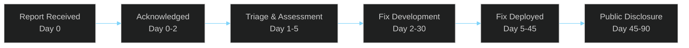

# Security Policy

> **[Template]** This covers the base template feature. Extend or modify for your project.

> Vulnerability reporting, responsible disclosure, security update policy, and contacts.

---

## Overview

This document defines the security policy for the application, including how to report vulnerabilities, how security updates are handled, and the responsible disclosure process. Security is treated as a first-class concern, and contributions that improve security posture are always welcome.

---

## Supported Versions

| Version | Supported | Notes |
|---------|-----------|-------|
| Latest (main branch) | Yes | Actively maintained |
| Previous minor release | Security patches only | For 90 days after new release |
| Older releases | No | Upgrade to latest |

---

## Reporting a Vulnerability

### Do

- Report vulnerabilities privately via the channels listed below
- Provide as much detail as possible (steps to reproduce, affected versions, impact assessment)
- Allow a reasonable timeframe for the team to investigate and remediate
- Follow responsible disclosure practices

### Do Not

- Open public GitHub issues for security vulnerabilities
- Exploit vulnerabilities beyond what is necessary to demonstrate the issue
- Access, modify, or delete data belonging to other users
- Perform denial-of-service attacks against production systems

### Report Channels

| Channel | Contact | Response Time |
|---------|---------|--------------|
| **Email** | `security@<your-domain.com>` | Within 48 hours |
| **GitHub Security Advisories** | Via repository's "Security" tab | Within 48 hours |

### What to Include in a Report

1. **Description:** Clear description of the vulnerability
2. **Steps to Reproduce:** Detailed steps to reproduce the issue
3. **Impact:** Your assessment of the severity and potential impact
4. **Affected Component:** Which part of the system is affected (API, frontend, database, PKI, etc.)
5. **Environment:** Version, configuration, and any relevant environment details
6. **Proof of Concept:** Screenshots, logs, or code snippets demonstrating the vulnerability (if available)

---

## Responsible Disclosure Timeline

| Phase | Timeframe | Description |
|-------|-----------|-------------|
| **Acknowledgment** | 0-2 business days | Confirm receipt and assign a tracking ID |
| **Triage** | 1-5 business days | Assess severity, confirm reproduction, determine scope |
| **Remediation** | Varies by severity | Develop, test, and deploy a fix |
| **Notification** | With fix release | Notify the reporter that the fix is deployed |
| **Public Disclosure** | 45-90 days after report | Publish advisory (coordinated with reporter) |

### Severity-Based Response Times

| Severity | Initial Response | Fix Target |
|----------|-----------------|------------|
| **Critical** (CVSS 9.0-10.0) | Same business day | 24-72 hours |
| **High** (CVSS 7.0-8.9) | 1 business day | 1-2 weeks |
| **Medium** (CVSS 4.0-6.9) | 2 business days | 2-4 weeks |
| **Low** (CVSS 0.1-3.9) | 5 business days | Next release cycle |

---

## Security Update Policy

### Update Types

| Type | Description | Release Process |
|------|-------------|----------------|
| **Emergency patch** | Critical vulnerability fix | Immediate release, out-of-band |
| **Security release** | High/medium vulnerability fixes | Scheduled release within SLA |
| **Dependency update** | Fix for vulnerable dependency | Included in next regular release |

### Notification Channels

Security updates are communicated through:
- GitHub release notes (tagged as "security")
- Security advisory on the repository
- Direct notification to the reporter
- Changelog entry with "Security" section

---

## Dependency Scanning

### Automated Scanning

| Tool | Frequency | Scope |
|------|-----------|-------|
| `pnpm audit` | Every CI build | Direct and transitive npm dependencies |
| GitHub Dependabot | Continuous | All dependencies, automatic PRs |
| Snyk (if configured) | Continuous | Dependencies, container images, IaC |

### Manual Review

- **Monthly:** Review `pnpm audit` output and address all critical/high findings
- **Quarterly:** Review all dependency versions, check for EOL libraries
- **Per release:** Full dependency audit before production deployment

See [Dependency Management](./dependency-management.md) for the complete dependency security workflow.

---

## Security Contacts

| Role | Responsibility | Contact |
|------|---------------|---------|
| Security Lead | Vulnerability triage and response coordination | `security@<your-domain.com>` |
| Engineering Lead | Technical remediation | [Configure] |
| Project Owner | Disclosure decisions and communication | [Configure] |

---

## Security-Related Configuration

The following settings affect the application's security posture and should be reviewed during deployment:

| Setting | Location | Impact |
|---------|----------|--------|
| `JWT_SECRET` | Environment variable | Token signing -- compromise invalidates all auth |
| `ENCRYPTION_KEY` | Environment variable | At-rest encryption of PKI keys and MFA secrets |
| `security.max_login_attempts` | System settings (DB) | Account lockout threshold |
| `security.lockout_duration_minutes` | System settings (DB) | Lockout window |
| `CORS_ORIGIN` / `FRONTEND_URL` | Environment variable | Cross-origin request restrictions |
| `TRUST_PROXY` | Environment variable | Correct client IP for rate limiting |
| `TRUSTED_PROXY_IP` | Environment variable | mTLS header trust validation |

---

## Related Documentation

- [Threat Model](./threat-model.md) - STRIDE analysis and mitigations
- [Authentication Security](./authentication-security.md) - Auth implementation details
- [Data Protection](./data-protection.md) - Encryption and data handling
- [Dependency Management](./dependency-management.md) - Dependency security practices
- [Audit Report](./audit-report.md) - Security audit findings
