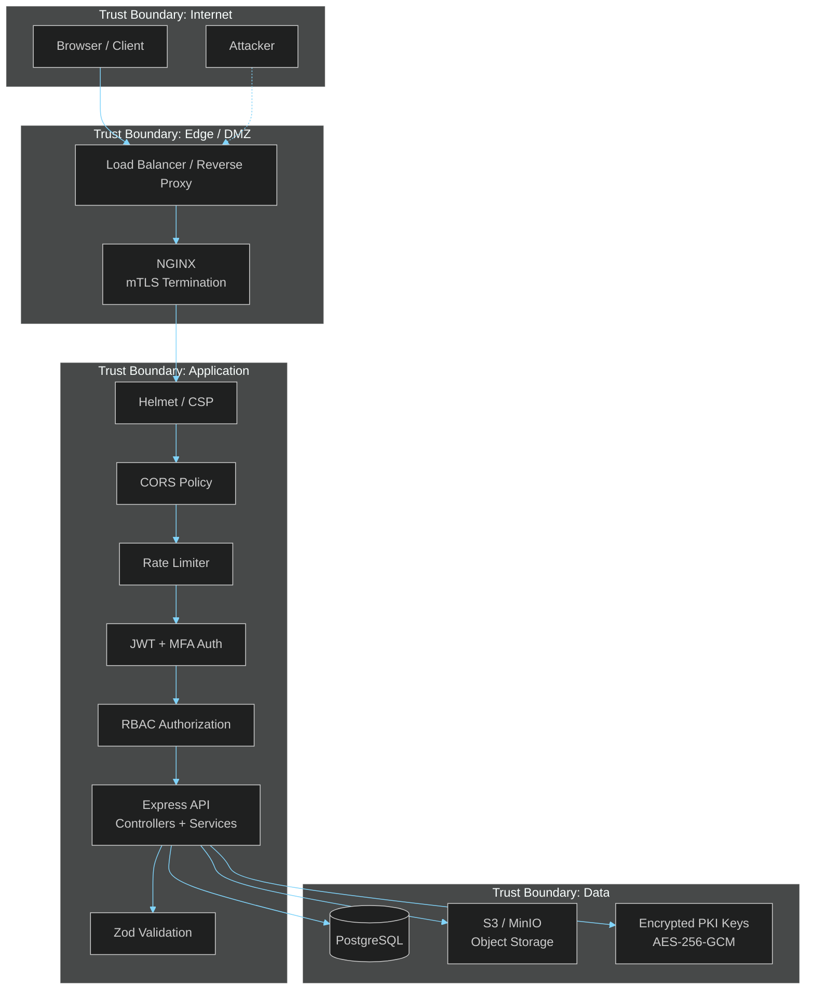
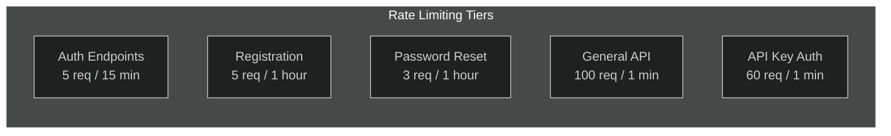
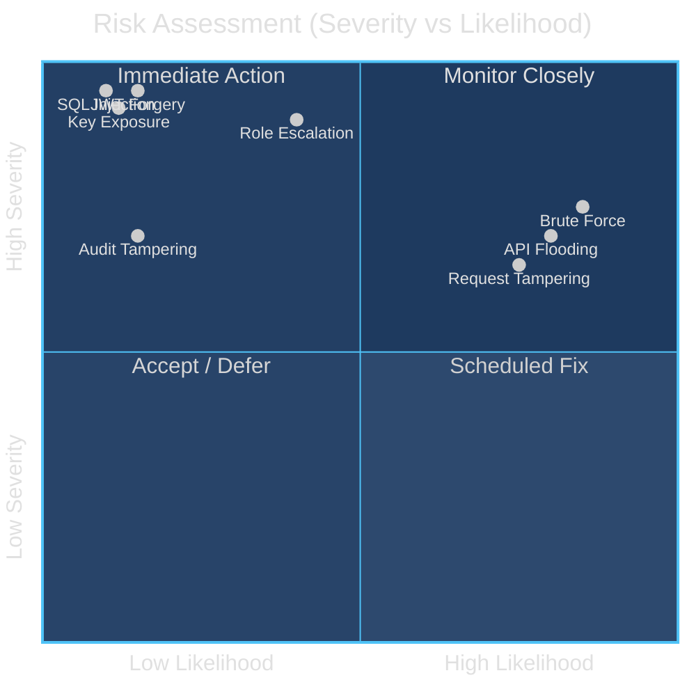

# Threat Model

> **[Template]** This covers the base template feature. Extend or modify for your project.

> STRIDE threat analysis with data flow diagrams, trust boundaries, and mitigation mapping.

---

## Overview

This document applies the STRIDE threat modeling framework to identify, categorize, and mitigate threats against the application. STRIDE stands for Spoofing, Tampering, Repudiation, Information Disclosure, Denial of Service, and Elevation of Privilege. Each category is analyzed against the application's architecture, with specific mitigations documented.

---

## System Data Flow Diagram

---

## STRIDE Analysis

### S -- Spoofing (Identity)

Threats related to an attacker pretending to be a legitimate user or system component.

| Threat ID | Threat | Severity | Likelihood | Mitigation |
|-----------|--------|----------|------------|------------|
| S-1 | JWT token forgery | Critical | Low | JWT signed with HS256 using 32+ character secret; secret validated at startup via Zod schema |
| S-2 | Session hijacking via stolen refresh token | High | Medium | Refresh tokens stored as SHA-256 hashes in database; httpOnly cookies prevent XSS access; tokens bound to user agent and IP |
| S-3 | Password brute force | High | High | Account lockout after 5 failed attempts (configurable); 15-minute lockout window; rate limiting on auth endpoints (5 req/15 min) |
| S-4 | Stolen API key usage | High | Medium | API keys stored as SHA-256 hashes; only 8-character prefix visible; per-key rate limiting; keys can be revoked instantly |
| S-5 | Certificate-based auth spoofing | High | Low | mTLS headers validated against `TRUSTED_PROXY_IP`; SSL headers stripped from non-trusted sources via `stripSslHeaders` middleware |
| S-6 | Email impersonation during registration | Medium | Medium | Email verification flow with time-limited tokens; token hashed in database |

**Key Mitigations:**
- Passwords hashed with bcrypt (12 rounds)
- JWT tokens are short-lived (15 minutes access, 7 days refresh)
- httpOnly, secure cookies for refresh tokens
- IP and user agent tracking on sessions
- Account lockout with configurable thresholds
- Rate limiting on all authentication endpoints

---

### T -- Tampering (Data Integrity)

Threats related to unauthorized modification of data in transit or at rest.

| Threat ID | Threat | Severity | Likelihood | Mitigation |
|-----------|--------|----------|------------|------------|
| T-1 | Request body manipulation | High | High | All request bodies validated with Zod v4 schemas; invalid input rejected with 400 |
| T-2 | SQL injection | Critical | Low | Drizzle ORM parameterizes all queries; no raw SQL interpolation |
| T-3 | Cross-site request forgery (CSRF) | Medium | Medium | CORS restricted to `FRONTEND_URL`; credentials require `withCredentials`; SameSite cookies |
| T-4 | Response header injection | Medium | Low | Helmet middleware sets security headers (CSP, X-Frame-Options, etc.) |
| T-5 | PKI private key tampering | Critical | Low | Private keys encrypted with AES-256-GCM + Argon2id KDF; encryption key required to decrypt |
| T-6 | Audit log modification | High | Low | Audit logs are append-only; no update/delete endpoints exposed; database-level protection recommended |

**Key Mitigations:**
- Zod v4 validation on every endpoint
- Helmet security headers
- CORS restricted to specific origin
- Drizzle ORM prevents SQL injection
- PKI keys encrypted at rest

---

### R -- Repudiation (Non-repudiation)

Threats related to users denying they performed an action.

| Threat ID | Threat | Severity | Likelihood | Mitigation |
|-----------|--------|----------|------------|------------|
| R-1 | User denies performing admin action | Medium | Medium | All sensitive operations logged to `audit_logs` with actor ID, action, target, IP address, and timestamp |
| R-2 | PKI operation repudiation | High | Low | Dedicated `pki_audit_logs` table tracks all CA, certificate, and CRL operations with full context |
| R-3 | Audit log tampering | High | Low | Append-only design; no API endpoints for audit modification; consider database triggers for additional protection |
| R-4 | Login/logout event denial | Low | Low | Session creation and destruction logged with IP and user agent |

**Key Mitigations:**
- Comprehensive audit logging for all sensitive operations
- Separate PKI audit trail
- Request ID tracking for log correlation
- IP address and user agent captured on all sessions

---

### I -- Information Disclosure

Threats related to unauthorized access to sensitive data.

| Threat ID | Threat | Severity | Likelihood | Mitigation |
|-----------|--------|----------|------------|------------|
| I-1 | JWT token content exposure | Medium | Medium | JWTs contain minimal claims (userId, email, isAdmin); no sensitive data in token payload |
| I-2 | API key leakage | High | Medium | Full API key shown only once at creation; only 8-char prefix stored in clear; key itself stored as SHA-256 hash |
| I-3 | PKI private key exposure | Critical | Low | Private keys encrypted with AES-256-GCM; Argon2id KDF derives encryption key from passphrase; salt, IV, and auth tag stored separately |
| I-4 | MFA secret exposure | High | Low | TOTP secrets encrypted at rest using application-level encryption; backup codes stored as bcrypt hashes |
| I-5 | Password exposure via logs | High | Low | Pino logger used exclusively (never `console.log`); passwords not logged; structured logging prevents accidental inclusion |
| I-6 | Database credential exposure | Critical | Low | Connection string via environment variable; validated at startup; not logged |
| I-7 | Error message information leakage | Medium | Medium | Generic error messages returned to clients; detailed errors logged server-side only |
| I-8 | PII in audit logs | Medium | Medium | Audit logs contain email and IP; access restricted via `audit:read` permission |

**Key Mitigations:**
- AES-256-GCM encryption for PKI private keys
- Argon2id key derivation function
- bcrypt for passwords (12 rounds) and MFA backup codes (10 rounds)
- SHA-256 hashing for tokens and API keys
- Structured Pino logging with no `console.log` usage
- Minimal JWT claims

---

### D -- Denial of Service

Threats related to making the system unavailable.

| Threat ID | Threat | Severity | Likelihood | Mitigation |
|-----------|--------|----------|------------|------------|
| D-1 | Login brute force (resource exhaustion) | High | High | Auth rate limiter: 5 requests per 15 minutes per IP |
| D-2 | API request flooding | High | High | General rate limiter: 100 requests per minute per IP |
| D-3 | Registration spam | Medium | Medium | Registration rate limiter: 5 per hour per IP |
| D-4 | Password reset flooding | Medium | Medium | Password reset rate limiter: 3 per hour per IP |
| D-5 | Large request body | Medium | Medium | Express body parser limited to 1MB (`json({ limit: '1mb' })`) |
| D-6 | Database connection exhaustion | High | Medium | Connection pooling via pg driver; monitor pool usage |
| D-7 | Bcrypt CPU exhaustion | Medium | Low | Rate limiting prevents mass password hashing; 12 rounds is a deliberate CPU cost tradeoff |

**Key Mitigations:**
- Tiered rate limiting (auth, registration, password reset, general API, API key)
- Request body size limits
- Compression middleware (threshold: 1KB)
- Database connection pooling
- Health check endpoint for load balancer probing

---

### E -- Elevation of Privilege

Threats related to gaining unauthorized access or permissions.

| Threat ID | Threat | Severity | Likelihood | Mitigation |
|-----------|--------|----------|------------|------------|
| E-1 | Role escalation via API manipulation | Critical | Medium | Role assignments require `users:update` permission; Super Admin role is system-protected (`isSystem: true`) |
| E-2 | Permission bypass | Critical | Low | Permission middleware checks on every protected endpoint; permission list resolved from database, not token claims |
| E-3 | Admin flag manipulation | High | Low | `isAdmin` field cannot be set via user-facing API; only modifiable through admin endpoints requiring admin authorization |
| E-4 | System role deletion | High | Low | System roles (`isSystem: true`) cannot be deleted; enforced at service layer |
| E-5 | API key permission escalation | High | Medium | API key permissions are a subset of the creating user's permissions; cannot exceed creator's access |
| E-6 | Service account privilege abuse | Medium | Low | Service accounts have explicit permission assignments; tracked in audit logs; require `service_accounts:create` permission |
| E-7 | Horizontal privilege escalation (accessing other users' data) | High | Medium | Service layer enforces ownership checks; admin-only endpoints require specific permissions |

**Key Mitigations:**
- RBAC with granular permissions (35 permissions across 12 resources)
- Permission middleware on all protected routes
- System role protection (cannot be modified or deleted)
- API key permissions scoped to creator's permissions
- Audit logging of all privilege-related operations
- Ownership validation in service layer

---

## Trust Boundaries

| Boundary | Components Inside | Protection |
|----------|-------------------|-----------|
| **Internet** | Browser, external clients | TLS encryption, certificate validation |
| **Edge / DMZ** | Load balancer, NGINX | mTLS termination, header validation, DDoS protection |
| **Application** | Express API, middleware chain | Authentication, authorization, rate limiting, input validation |
| **Data** | PostgreSQL, S3, encrypted keys | Encrypted connections, at-rest encryption, access control |

---

## Risk Matrix

---

## Review Schedule

| Activity | Frequency | Owner |
|----------|-----------|-------|
| Threat model review | Quarterly | Security Lead |
| New feature threat assessment | Per feature | Development Team |
| Penetration testing | Annually | External assessor |
| Dependency vulnerability review | Monthly | Engineering Lead |

---

## Related Documentation

- [Security Policy](./security-policy.md) - Vulnerability reporting and response
- [Authentication Security](./authentication-security.md) - Auth implementation details
- [Data Protection](./data-protection.md) - Encryption and data handling
- [Audit Report](./audit-report.md) - Security audit findings and remediations
