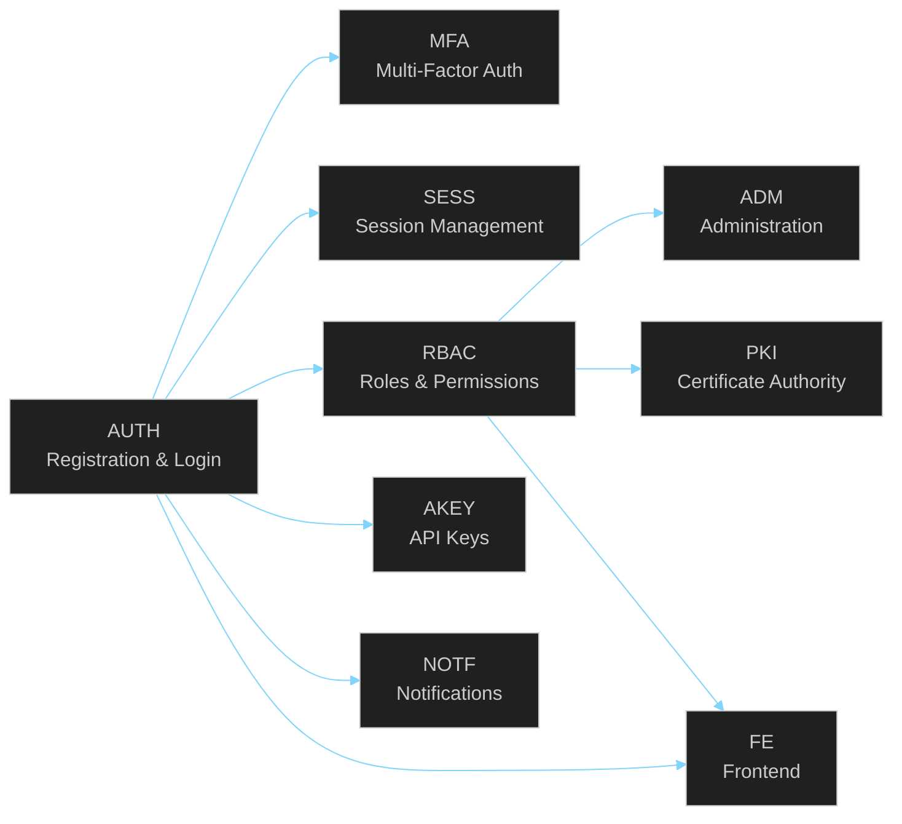

# User Stories

> **[Template]** This covers the base template feature. Extend or modify for your project.

> Comprehensive user stories covering all application features, organized by functional area.

---

## Overview

This section contains 42 user stories across 9 functional areas. Each story follows a consistent format and is uniquely identified for traceability from requirements through implementation and testing.

---

## Story Format

Each user story follows this template:

```
### US-{AREA}-NNN: Story Title

**As a** [role],
**I want to** [action],
**So that** [benefit].

**Acceptance Criteria:**
- [ ] Criterion 1
- [ ] Criterion 2
- [ ] Criterion 3

**Priority:** Critical | High | Medium | Low
**Status:** Complete | In Progress | Planned
**Related:** TC-{AREA}-NNN (test cases), US-{AREA}-NNN (dependent stories)
```

### ID Scheme

Story IDs follow the pattern `US-{AREA}-NNN` where:

| Component | Description |
|-----------|-------------|
| `US` | User Story prefix |
| `{AREA}` | Functional area code (see table below) |
| `NNN` | Sequential number within the area (001, 002, ...) |

### Area Codes

| Code | Area | Description |
|------|------|-------------|
| `AUTH` | Authentication | Registration, login, password management |
| `MFA` | Multi-Factor Auth | TOTP setup, verification, backup codes |
| `SESS` | Sessions | Session management, device tracking |
| `RBAC` | Role-Based Access | Roles, permissions, assignments |
| `ADM` | Administration | User management, system settings |
| `AKEY` | API Keys | API key lifecycle management |
| `PKI` | PKI / CA | Certificate authority and certificate management |
| `NOTF` | Notifications | Email notifications, in-app alerts |
| `FE` | Frontend | UI components, navigation, theming |

---

## Story Files

| File | Area | Stories | Description |
|------|------|---------|-------------|
| [`auth.md`](./auth.md) | AUTH | 7 | Registration, login, logout, password reset, email verification, account lockout |
| [`mfa.md`](./mfa.md) | MFA | 4 | TOTP setup, login with MFA, backup codes, disable MFA |
| [`session.md`](./session.md) | SESS | 4 | View sessions, revoke session, session expiry, invalidation on password change |
| [`rbac.md`](./rbac.md) | RBAC | 5 | Create roles, assign permissions, assign roles, check permissions, manage role hierarchy |
| [`admin.md`](./admin.md) | ADM | 6 | User list, user detail, edit user, disable user, system settings, audit log review |
| [`api-keys.md`](./api-keys.md) | AKEY | 4 | Create API key, list keys, revoke key, scoped access |
| [`pki.md`](./pki.md) | PKI | 5 | Create CA, issue certificate, revoke certificate, CSR signing, certificate chain |
| [`notifications.md`](./notifications.md) | NOTF | 3 | Email verification, password reset email, account lockout notification |
| [`frontend.md`](./frontend.md) | FE | 4 | Dashboard layout, dark mode, responsive design, error handling UI |

---

## Summary Table

| Area | Code | Story Count | Priority Breakdown |
|------|------|-------------|-------------------|
| Authentication | AUTH | 7 | 3 Critical, 2 High, 2 Medium |
| Multi-Factor Auth | MFA | 4 | 1 Critical, 2 High, 1 Medium |
| Sessions | SESS | 4 | 1 Critical, 2 High, 1 Medium |
| RBAC | RBAC | 5 | 2 Critical, 2 High, 1 Medium |
| Administration | ADM | 6 | 1 Critical, 3 High, 2 Medium |
| API Keys | AKEY | 4 | 1 High, 2 Medium, 1 Low |
| PKI / CA | PKI | 5 | 1 Critical, 2 High, 2 Medium |
| Notifications | NOTF | 3 | 1 High, 1 Medium, 1 Low |
| Frontend | FE | 4 | 1 High, 2 Medium, 1 Low |
| **Total** | | **42** | **10 Critical, 16 High, 13 Medium, 3 Low** |

---

## Story Dependency Graph



---

## Traceability

Each user story maps to:
- **Test cases** in [`../qa/`](../qa/README.md) via `TC-{AREA}-NNN` IDs
- **Feature tracker** entries in [`../product/feature-tracker.md`](../product/feature-tracker.md)
- **API endpoints** documented in [`../api/endpoints/`](../api/endpoints/)

---

## Related Documentation

- [QA Test Cases](../qa/README.md) - Test cases mapped to user stories
- [Feature Tracker](../product/feature-tracker.md) - Implementation status
- [API Reference](../api/README.md) - Endpoint documentation
- [Template Features](../../docs/features/README.md) - Feature specifications
